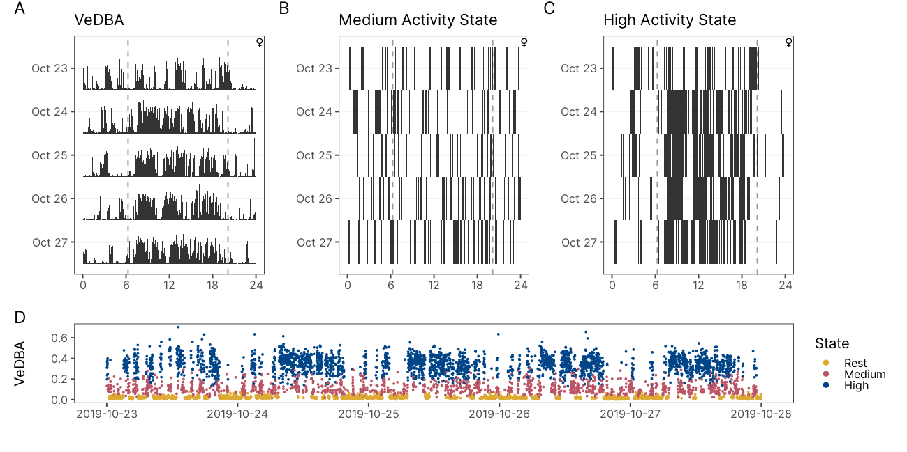

# Daily activity patterns in the Anillaco Tuco-tuco (*Ctenomys sp.*)

```{r load-packages, include=FALSE}
library(coppedown)
library(knitr)
library(ggplot2)
library(patchwork)
library(data.table)
library(dplyr)
library(momentuHMM)
library(maptools)
```

```{r review-only, include=FALSE}
source(file = "tuco_theme.R") # Set Theme and Color Pallete

# Set LaTeX tables styling
if(knitr::is_latex_output()){
  library(kableExtra)
  kable = function(data, caption = NULL){
    knitr::kable(data,
                 booktabs = TRUE,
                 digits = 3,
                 align = "c",
                 caption = caption) %>% 
    kable_styling(position = "center", 
            latex_options = "hold_position")
  }
}else{
    library("magick")
    library("webshot")
    library(flextable)
    kable = function(data, caption = "NULL"){
      flextable::flextable(data) %>% 
        flextable::set_caption(caption) %>% 
        colformat_double(digits = 2) %>% 
        plot(zoom = 2, expand = 10)
    }
}

# Set Global Chunk Options
knitr::opts_chunk$set(
    fig.align = "center",
    echo = FALSE, 
    message = FALSE,
    warning = FALSE
    )
```

```{r read-data}
tuco = readRDS("../01_data/activity_processed/tuco_processed.rds")
tuco.metadata = fread("../01_data/animals/animal_metadata.csv")
source(file = "tuco_theme.R") # Set Theme and Color Pallete
```

```{r decode-state}
# Read Models
m1 = readRDS("../03_analysis/hmm/m1.rds")  # modelo vazio
m2 = readRDS("../03_analysis/hmm/m2.rds") # modelo com 

# Viterbi State Decoding
decoded = viterbi(m2)
tuco$state = factor(decoded, labels = c("rest","medium","high"))

# Widen State Column, so its a little bit easier to index by state.
tuco = tuco %>% 
    mutate(rest = ifelse(state == "rest", T, F),
           medium = ifelse(state == "medium", T, F),
           high = ifelse(state == "high", T, F))
```

```{r sunrise}
# Calculate Sunrise and Sunset Times
anillaco = matrix(c(-66.95, -28.8), nrow = 1) 
sunriset = tuco %>% select(ID, season, datetime) %>%
  group_by(ID, season) %>% 
  summarise(datetime = median(datetime))

sunriset$dawn = maptools::crepuscule(crds = anillaco,
                                    dateTime = sunriset$datetime,
                                    solarDep = 6, 
                                    direction = "dawn", 
                                    POSIXct.out=TRUE)$day_frac  * 1440

sunriset$dusk = maptools::crepuscule(crds = anillaco,
                                    dateTime = sunriset$datetime,
                                    solarDep = 6,
                                    direction = "dusk",
                                    POSIXct.out=TRUE)$day_frac  * 1440

sunriset_season = sunriset %>%
  group_by(season) %>% 
  summarise(dawn = median(dawn), dusk = median(dusk))
```

## Introduction

-   Contexto:
-   Síntese do conhecimento:O que se sabe sobe o tema central?
-   Como a questão investigada se encaixa nesse contexto teórico?
-   Rever anotações

objetivos:
- tbm testar a necessidade de classificar para ritmicidade

## Methods

-   Adicionar descrição da estatistica
-   Adicionar Kernel Density Estimation para os padrões

### Study Species

The studied *Ctenomys* population lacks a formal phylogenetic and taxonomic classification but there are some lines of evidence suggesting that the study area is occupied by a single unidentified species [@amaya2016]. In other studies this *Ctenomys'* species has been referred informally as the Anillaco tuco-tuco [@amaya2016] and as *Ctenomys* aff. *knightii* [@tomotani2012] or *Ctenomys* cf. *knightii* [@valentinuzzi2009].

### Study Site

Field work was conducted at a site located approximately 5km away from the village of Anillaco, in the province of La Rioja, northwest of Argentina. The study site (-66.95°, -028.80, 1325m; Fig. \@ref(fig:methods-map)) is a relatively undisturbed natural area, with little human disturbance and no artificial light source. The area is surrounded by the Sierra de Velasco moutain range, located within the Monte Desert biome. The Monte Desert is characterized as an open shrubland dominated by Zygophyllaceae (*Larrea cuneifolia* Cav., *Tricomaria usillo*), Fabaceae (*Prosopis torquata*, *Senna aphylla*) and Cactaceae (*Trichocereus* spp, *Tephrocactus* spp) [@abraham2009; @fracchia2011; @aranda-rickert2011a]. At the study site a non-extensive survey of the plant community divided in three transects showed a dominance of the families Zygophyllaceae (*Larrea cuneifolia*, *Tricomaria usillo*), Poaceae (*Microchloa indica*, *Aristida mendocina*) and Fabaceae (*Zuccagnia punctata*) (Fig. \@ref(fig:appendix-plants)). The climate is arid with marked daily cycle and seasonality in temperature and rainfall (Fig. \@ref(fig:appendix-weather)). The mean annual temperature is 16.6°C [@fracchia2011], with clear differences in the daily range and between summer and winter months [@abraham2009]. The mean annual rainfall ranges from 145 to 380mm concentrated almost exclusively in the summer months [@fracchia2011].

```{r methods-map, echo=F, out.width = "100%", fig.cap="Study site location (orange icon) at the Monte Desert, approximately 5km away form the village of Anillaco, northwest of Argentina"}

include_graphics("../04_figures/map/tuco_map.png")
```

### Animal Capture and Handling

A total of 47 tuco-tucos were captured between March 2019 and March 2020. Out of these, 30 were part of the present study. Trapping was conducted in four different campaigns to the study site. Three campaigns were done in 2019 during March-April, July and October. A fourth campaign was done in February 2020. A fifth campaign was planned to occur in May 2020 but had to be canceled due to the COVID outbreak. Tuco-tucos were captured using a custom-made PVC tubing trap (35cm length, 10cm diameter) with a spring-loaded aluminum door at one end and a cul-de-sac at the other. Before setting the traps the study site was scouted for active tuco-tuco's burrows. Active burrows could be identified by the presence of freshly excavated soil mounds at the burrow's entrance. Once found burrows were excavated to open the access to the underground tunnels and a trap was placed horizontally at the burrow's entrance following the tunnel's orientation. Traps were placed at all active burrows found at the study site, limited to a max of 20 traps available. Traps were set in the field during the morning and checked every 2 hours, when they were reset if they had been plugged with soil or if they had been activated without any tuco-tuco capture. Traps were checked for a last time at dusk and then taken out if no animal had been caught.

After capture, adult tucos (\>120g) were first lightly anesthetized in order to be carefully examined and receive a biologging collar. We used a clear plastic anesthesia chamber (318.5cm³) with a clip-on lid and a cotton ball inside. The cotton ball received approximately 0.5 mL of isoflurane (***REF***) before transferring the animal from the trap to the chamber. While in the chamber animals were observed for breathing, blinking and loss of righting reflex. Once the tuco-tucos could not right themselves they were removed from the chamber. Anesthetized animals were weighted (CSseries, OHAUS, ± 1 g precision), sexed, assesed for reproductive status, marked with a subcutaneous identification PITTag (Passive Integrative Transponder. Allflex, Brasil) and fitted with a collar bearing biologgers (See Activity Sensors).

Animals were released in the same burrow they were originally captured. They were left in the field for 5-18 days before being recaptured for collar recovery. The telemetry transmitter were used to maximize the animals relocation, thus avoiding the loss of the other devices. All animal captures, procedures and animal handling were authorized by the local authorities at *Dirección General de Ambiente y Desarrollo Sustentable -- Secretaría de Ambiente del Ministerio de Producción y Desarollo Local* -- La Rioja, Argentina (\#00501-17). All procedures were also approved by the Ethics Committee at the *Instituto de Biociências* (\#308-2018) and *Faculdade de Medicina Veterinária* (\#2045300519) of the *Universidade de São Paulo*.

### Activity Sensors

Accelerometers (Axy-4, TechnoSmart, Italy) and lightloggers (W65, Migrate Technology, UK) were used to record general motor activity and light exposure, respectively. These biologgers were attached to a collar made of a cable tie inserted through silicon tubing [@jannetti2019; @williams2014]. A telemetry transmitter (SOM-2011. Wildlife Materials, USA) was also attached to the collar to assist in animal location during recapture and minimize sensor's loss. The complete collar setup (accelerometer, lightlogger and telemetry) weighted approximately a total of 6g. Collars without the lightlogger weighted 5.3g. All accelerometers recorded tri-axial acceleration at a 10Hz sampling frequency with a 4G sensitivity. Lightloggers were set to sample light every minute but only recorded the maximum sampled value each 5 minutes.

```{r methods-collar, echo=F, out.width = "100%", fig.cap="Collar setup and example of field deployment. Upper photo shows the complete collar setup with accelerometer, lightlogger and the telemetry transmitter. Bottom photo shows a tuco-tuco wearing a collar. In the bottom photo it is possible to see the acceleromer and the lightlogger attached to the collar."}

include_graphics("../04_figures/collar/collar_tuco.png")
```

### Data Processing

Data were recorded on board of the sensors and later downloaded and converted to raw text files using the software provided by the logger manufacturers. Acceleration data was used to measure gross motor activity. Tri-axial acceleration data was first reduced to one dimension using the Vectorial Dynamic Body Acceleration [VeDBA, @qasem2012]. VeDBA is commonly used as a proxy for the animal's activity level and energy expenditure (**REFS**). VeDBA was calculated by: (i) Estimating the effect of the gravitational force over the accelerometer, also known as static acceleration. The static acceleration can be estimated by applying a moving average over the raw acceleration data. There is not a consensus over the the number of points to calculate the moving average with, which can be dependent on the study species and device's recording frequency. In this study we used a 4-second moving average after following the methodology proposed by [@shepard2008, Fig. \@ref(fig:appendix-smooth-window)]. (ii) Calculating the acceleration correspondent to the animal's movement, also know as Dynamic Body Acceleration (DBA). The DBA was calculated by subtracting the static acceleration from the raw data. (iii) Lastly, we calculate the VeDBA by the vectorial sum of the DBA over the device's axes.

$$ VeDBA = \sqrt{Xd^2 + Yd^2 + Zd^2} $$

Once VeDBA was calculated, the 1Hz acceleration data was downsampled by taking the median over a 1 minute non-overlapping sliding window. All VeDBA datapoints were classified as occuring during the daytime or nighttime based on the daylength of recording dates. Daylength was calculated using the *maptools* package in R [@bivand2020], which uses the National Oceanic and Atmospheric Administration (NOAA) equations for estimating Twilight times. We used Civil Twilight times, defined as the times in which the center of the sun is 6° below the horizon, as thresholds to calculate daylength and classify datapoints as occuring during the day or nighttime. Daylength change along the year can be seen in the Appendix (\@ref(fig:appendix-daylenght)).

Light exposure data was used to further classify VeDBA data points as above or below ground. The threshold for considering a data point as being aboveground was 2 lux, consistent with what has been done in @jannetti2019.

Accelerometer and lightlogger data were merged accordingly to the date and times of recordings using purposely written R scripts [@rcoreteam2020]. Time of recordings between both devices were not synchronized to the minute. Consequently, we had to round lightlogger recording times to the nearest 5 minutes in order to merge both data streams.

In order exclude any effects that capture and recapture can have in the first days of recordings we removed the first and last days of all dataset. In cases where the recapture took longer than one day we also excluded these days. This corresponds to the last 5 days of two animals in February (FEV05 and JUL16); and the last 2 days of one animal in July (JUL23).

### Hidden Markov Models

In order to further analyze and classify the 1-minute VeDBA data we used Hidden Markov Models (HMMs). HMMs are a type of time series model, therefore, they take into account the temporal dependency of the observations [@leosbarajas2017]. Consequently HMMs are well suited to model accelerometer data given their natural temporal dependency [@leosbarajas2017; @patterson2019]. HMMs are composed of two time series: the observable *state-dependent process* ($X_t$), VeDBA in our case, and an underlying, or hidden, *state process* ($S_t$). The *state process* is what drives the observations and what we are interested in estimating, which roughly corresponds to behavioral states (Fig. \@ref(fig:hmm-formulation)). We determined *a priori* a possible number of three different states. This decision was made based on our research question, in the VeDBA distributions (Fig. \@ref(fig:appendix-eda)) and in the biological interpretability of the states.

The *state process* follows the Markov Property and take temporal dependency into account [@zucchini2016]. The Markov property denotes that a state $S_t$ depends only on the previous state $S_{t-1}$ [@zucchini2016]. In the case of accelerometer and animal movement studies the states are representations of the animals' behavior and can take on finite number ($N$) of possible values. The number of states can be chosen *a priori* or based on model selection [@pohle2017]. The changes in probabilities between states are also part of the of HMM formulation, summarized by a Transition Probability Matrix that gives the probability of transitioning from the current state to a possible future state.

In the basic HMM formulation the observable *state-dependent process* comes from a mixture of $N$ distributions, one for each state. These distributions come from a common family (e.g. Normal, Weibull or Gamma) and each one have their own set of parameter values. The active distribution is determined by the state the system is in at a given time $t$. The observations therefore are a realization from one of these distributions. The distribution parameters, state transition probabilities and other model parameters can be estimated by numerical maximization of the Likelihood [@zucchini2016]. With the model parameters in hand, the most probable state sequence can be found by the Viterbi algorithm [@mcclintock2020; @zucchini2016].

```{tikz, hmm-formulation, fig.cap = "Basic dependence structure for a Hidden Markov Model", fig.ext = "pdf", fig.width = 4, fig.height = 4, fig.align = 'center', echo = FALSE}
  \usetikzlibrary{automata,positioning}
  \begin{tikzpicture}
  \tikzstyle{main}=[circle, minimum size = 5mm, thick, draw =black!80, node distance = 10mm]
  \tikzstyle{connect}=[-latex, thick]
  \tikzstyle{box}=[rectangle, draw=black!100]
    \node[box,draw=white!100] (Observed) {\textbf{Observed}};
    \node[main] (X1) [right=of Observed] {$X_1$};
    \node[main] (X2) [right=of X1] {$X_2$};
    \node[main] (X3) [right=of X2] {$X_3$};
    \node[main] (Xt) [right=of X3] {$X_t$};
    \node[box,draw=white!100] (Latent) [below=of Observed] {\textbf{Hidden}};
    \node[main,fill=black!10] (S1) [right=of Observed,below=of X1] {$S_1$};
    \node[main,fill=black!10] (S2) [right=of X1,below=of X2] {$S_2$};
    \node[main,fill=black!10] (S3) [right=of X2,below=of X3] {$S_3$};
    \node[main,fill=black!10] (St) [right=of X3,below=of Xt] {$S_t$};
    \path (X3) -- node[auto=false]{\ldots} (Xt);
    \path (S1) edge [connect] (S2)
          (S2) edge [connect] (S3)
          (S3) -- node[auto=false]{\ldots} (St);
    \path (S1) edge [connect] (X1);
    \path (S2) edge [connect] (X2);
    \path (S3) edge [connect] (X3);
    \path (St) edge [connect] (Xt);
    \draw[dashed]  [below=of S1,above=of X1];
  \end{tikzpicture}
```

### Model Formulation and State Classification

In our models we have chosen VeDBA as our activity metric. To model the VeDBA we determined *a priori* that the hidden *state-process* could assume three different states ($N=3$). It is important to note that states do not correspond directly to specific behaviors (e.g. feeding, foraging or digging) but can be assumed to roughly correspond to behavioral states (e.g. activity levels) that can encompass a range of different behaviors [@leosbarajas2017; @papastamatiou2018]. We labelled the states as roughly corresponding to "Rest","Medium Intensity Activity" and "High Intensity Activity".

HMMs can be fitted individually [e.g. @vandekerk2015] or to a pool of animals [@langrock2012]. The models can also include covariate effects that modify either the *state-dependent* distribution parameters or the transition probabilities [@patterson2009; @langrock2012]. We fitted a 3-state HMM to the 1-minute VeDBA data using a 'complete pooling' approach. This means that the *state-dependent* distribution parameters are common to all animals. Therefore we assume that individuals are independent and behaviors are the same to all individuals and across the year. However, given that the season/month of the year seems to be an important feature influencing the VeDBA distribution (Fig. \@ref(fig:appendix-eda)) we included season as a covariate in the *state process*. Hence we let the probability of changing from one state to another vary in relation to the season/month of the year. We also fitted an empty model, with no covariate effects, and used Akaike's Information Criteria (AIC) to select the model with best fit to the data [@burnham2002].

Models were fitted using the momentuHMM package in R [@mcclintock2021]. We used the gamma distribution, parametrized with mean and standard deviation, to model VeDBA. The gamma distribution is a flexible distribution, usually used in movement studies (**REFS**), that accommodates positive right-skewed data. Appropriate starting values for likelihood maximization of model's parameters were found by following procedures suggested by @michelot2019. Season was included as a categorical variable, its influence over the transition probabilities was summarized using stationary probabilities plots [@leosbarajas2017]. The most probable state sequence was decoded using the Viterbi algorithm [@zucchini2016]. The decoded sequence was then used to conducted other *post-hoc* analysis of diurnality and rhythmicity. We checked model assumptions and goodness of fit by visual inspection of the pseudo-residuals [@zucchini2016].

-   michelot 2 017 - Estimation and simulation of foraging trips in land-based marine predators. Ecology 98, 1932--1944. [doi.org/10.1002/ecy.1880](https://doi.org/10.1002/ecy.1880)

### Diurnality Index

We defined diurnality as the percentage of daytime the animals spent in one of the states in relation to the total time spent in the same state during both daytime and night-time. This is also corrected by the daylength of each season following @activity2000 and @jannetti2019. The formula for the calculation of diurnality is shown below, where $ts_day$ and $ts_night$ are the time spent in the state during the day and night respectively. $D_L$ and $N_L$ are the daylength and night-length, determined by the civil twilight.

$$
Diurnality = \frac{ts_{day}/D_L}{ts_{day}/D_L + ts_{night}/N_L}
$$

### Circadian Rhythmicity and Period Estimation

We used autocorrelation analysis [@levine2002; @dowse2009] and Lomb-Scargle periodograms to asses the strength and periodicity of activity rhythms. The autocorellation was calculated by comparing the data to itself lagged by a unit of time. The autocorrelation coefficient ranges from 0 to 1 and it is higher as the two time series are more similar to each other. When visually analyzing the autocorrelation plot, recurring peaks indicates that the data is periodic. The height of the peak shows how robust the rhythms is [@dowse2009]. The robustness of the rhythm, also referred as the Rhythmicity Index (RI), is defined as the autocorrelation coefficient at the third peak of the autocorrelation plot (i.e. the height of the third peak).

We calculated the RI for the for the medium and high state-labelled data. For comparison we also calculated the RI for the unlabelled VeDBA data. 

Before estimating the RI, we applied a 3-hour low-pass Butterworth filter to remove periodicity lower than 3 hour in the data. Autocorrelation plots were first visually analysed. Plots that showed recurring peaks in the 24-hour range were labeled as rhythmic. Animals that showed no recurring peaks were classified as arhythmic in the circadian range. Next, we estimated the period of each behavioral state, for animals that were classified as rhythmic, using the Lomb-Scargle periodogram [@leise2017].

All analysis were done in R [@rcoreteam2020]. Butterworth filtering was done using the the *dlpR* package [@bunn2008]. Autocorrelation function and plots were done in base R. The peaks in the autocorrelation plots were found using the *pracma* package [@hansw.borchers2019]. Lomb-Scargle periodograms were calculated using the *lomb* package [@ruf1999].

### Statistical Analysis

All analysis were done in R using the base packages [@rcoreteam2020]. We tested for seasonal differences in mean daily VeDBA, time spent in each state and diurnality using ANOVA followed by post-hoc Tukey-Kramer's test. Daily Activity patterns were visualized using Gaussian kernel density estimates.

The percentage of animals classified as Rhythmic and the values for RI were compared between states only, no seasonal analysis was done for these data. Given that some animals were classified as arrhythmic the sample number for each season was too low to perform any meaningful statistical analysis. 

## Results

-   Ao adicionar numero de animais tbm comentar da dificuldade em recapturar e em alguns casos capturar machos! Legal para futuras referencias. (Talvez nos resultados?)

During 2019-2020, we captured 30 tucos, 20 females and 10 males. Each tuco received a biologging collar, mostly containing an accelerometer and a lightlogger. We were able to recapture 24 tucos and recover 21 collars (Table \@ref(tab:table-captures)). One collar was lost because one tuco got predated and the collar was found malfunctioning. The other two lost collar fell or were taken out of the tuco's neck between the time of capture and recapture. All 21 animals that were recapture received a collar containing an accelerometer. However, only 13 also received a lightlogger (Table \@ref(tab:table-captures)). In total we have 13 complete datasets, with acceleration and light exposure data, and 8 datasets with only acceleration data.

```{r calculate-captures, include=FALSE}
# Since the tables have nested columns I couldn't generate them using R and opt to generated in LaTeX.
# The code to calculate the sums are the following:
tuco.metadata %>%
          group_by(Month = season) %>%
          summarise("Captured" = length(ID),
                    "Recaptured" = sum(recaptured),
                    "Collar Recovered" = sum(collar_recovered))
          #bind_rows(colSums(.[2:4]))

tuco.metadata %>%
          group_by(Month = season) %>%
          summarise(Females = sum(sex == "f" & collar_recovered),
                    Males = sum(sex == "m" & collar_recovered),
                    Accelerometers = sum(acc & collar_recovered),
                    Lightloggers = sum(lux & collar_recovered))
```

```{=tex}
\begin{table}[h]
\centering
\caption{Number of captured animals and sensors deployed in the field. There was a higher number of females captured independent of the season. Recapture rates in February 2021 are lower because field work had to be interrupted due to the covid outbreak. Not all recaptured tucos still had their collars. Some collar were taken out by the animals between the time of captured and recaptured. One tuco was predated and the collar was found 1km away from the initial capture burrow malfunctioning.}
\label{tab:table-captures}
\resizebox{\textwidth}{!}{%
\begin{tabular}{llllllll} 
\toprule
         & \multicolumn{2}{c}{Captured}                            & \multicolumn{2}{c}{Recaptured}                          &                                       &                                    &                                   \\ 
\cmidrule{2-5}
    & \multicolumn{1}{c}{Males} & \multicolumn{1}{c}{Females} & \multicolumn{1}{c}{Males} & \multicolumn{1}{c}{Females} & \multicolumn{1}{c}{Recovered Collars} & \multicolumn{1}{c}{Accelerometers} & \multicolumn{1}{c}{Lightloggers}  \\ 
\midrule
February & 3                         & 7                           & 2                         & 5                           & 5                                     & 5                                  & 5                                 \\
July     & 4                         & 5                           & 4                         & 5                           & 8                                     & 8                                  & 6                                 \\
March    & 0                         & 2                           & 0                         & 2                           & 2                                     & 2                                  & 0                                 \\
October  & 3                         & 6                           & 1                         & 5                           & 6                                     & 6                                  & 2                                 \\
\bottomrule
\end{tabular}
}
\end{table}
```
### Daily Activity Levels

Tuco's activity levels are significantly lower during July in comparison to other months. Accelerometer data was used to calculated the Vectorial Dynamic Body Acceleration (VeDBA) that we use as a proxy for animal activity. Tuco's daily activity levels (24h average), measured by VeDBA, are significantly different across the year (ANOVA; F = 7.182, p \< 0.01; Fig. \@ref(fig:vedba-boxplot)). Post hoc comparisons using Tukey-Kramer's Test shows significant group differences between July-October and July-February (p \< 0.05). In both pairwise comparisons July Daily VeDBA levels are lower, showing a difference in means of 0.029g and 0.019g in comparison to October and February, respectively. In sum, daily VeDBA activity levels are lower in July in comparison to October and February (Fig \@ref(fig:vedba-boxplot)).

-   Tirar?:

The daytime VeDBA (Light Phase Average) is also significantly different between Months (ANOVA; F = 7.282, p \< 0.001). Post hoc comparisons using Tukey-Kramer's Test shows a difference in mean of 0.035 between October-July (p \< 0.05). However, daytime activity levels are only significantly different between July and October.

```{r vedba-boxplot, fig.width=10, fig.asp = 0.4, out.width="100%", fig.cap="Tuco-tuco's Daily VeDBA levels. (A) VeDBA was binned by hour (0-23). Background lines show data for individual animals. Thick lines show mean hourly VeDBA. (B) Points show daily (24h) VeDBA mean for each animal. In July Tuco-tuco's exhibited lower Daily VeDBA than October and February. Dashed lines in Panel A shows time of civil dawn and dusk."}

# BOXPLOT -----------------------------------
vedba_daily = tuco %>% 
    group_by(ID, season, date = lubridate::date(datetime)) %>% 
    summarise(vedba = mean(vedba)) %>% 
    group_by(ID, season) %>% 
    summarise(vedba = mean(vedba))

vedba_boxplot = ggplot(data = vedba_daily,
                       aes(x = season,
                           y = vedba,
                           color = season)) +
    gghalves::geom_half_point() +
    gghalves::geom_half_boxplot(nudge = 0.05,
                              outlier.color = NA) +
    scale_x_discrete(labels = c("Mar","Jul","Oct","Feb")) +
    xlab("") +
    ylab("Daily Mean VeDBA") +
    theme(legend.position = "none", 
          panel.grid.major.y = element_line(color = "grey90",
                                            linetype = "dotted")) +
    scale_color_viridis_d() +
    scale_fill_viridis_d()


df1 = data.frame(x = c(1.9, 3), y = c(0.16,0.16))
df2 = data.frame(x = c(1.9, 4), y = c(0.167, 0.167))
vedba_boxplot = vedba_boxplot +
   geom_line(data = df1, mapping = aes(x,y, group = 1), color = "grey60") +
   annotate("text", x = 2.5, y = 0.162, label = "*", size = 4, color = "grey60") +
   geom_line(data = df2, mapping = aes(x,y, group = 1), color = "grey60") +
   annotate("text", x = 3, y = 0.169, label = "*", size = 4, color = "grey60")

# Daily VeDBA Patterns ----------------------------------
tuco_hourly = tuco %>%
    mutate(time = lubridate::floor_date(datetime,
                                        unit = "hour")) %>%
    mutate(time = lubridate::hour(time)*60+lubridate::minute(time)) %>% 
    group_by(ID, season, time) %>% 
    summarize(mean_vedba = mean(vedba)) %>% 
    ungroup()

tuco_hourly_mean = tuco_hourly %>%
    group_by(season, time) %>% 
    summarize(mean_vedba = mean(mean_vedba)) %>% 
    ungroup()

graph_hourly = 
    ggplot(data = tuco_hourly_mean,
           aes(x = time,y = mean_vedba, col = season)) +
    geom_line(data = tuco_hourly,
              aes(x = time, y = mean_vedba, fill = ID),
              size = 0.4,
              alpha = 0.1) +
    geom_point(size = 0.9) +
    geom_line(size = 0.9) +
    geom_vline(data = sunriset_season,
               aes(xintercept = dawn), 
               linetype = "dotted",
               color = "grey70") +
    geom_vline(data = sunriset_season,
               aes(xintercept = dusk),
               linetype = "dotted",
               color = "grey70") +
    geom_text(data = data.frame(x = 65, y = 0.29),
              aes(x,y, label = c("n = 2","n = 8","n = 6","n = 5")),
              size = 3,
              color = "grey60") +
    scale_x_continuous(breaks = c(0,360,720,1080,1440),
                       labels = c(0,6,12,18,24))+
    facet_wrap(~season, ncol = 2) +
    theme(legend.position = "none") +
    xlab("") +
    ylab("Hourly Mean VeDBA")+
    scale_color_viridis_d() +
    scale_fill_viridis_d()

# Compose Plot
graph_hourly + vedba_boxplot +
    plot_annotation(tag_levels = "A") +
    plot_layout(ncol = 2, widths = c(1.5,1))
```

### State Classification

We modeled and classified VeDBA into three distinct behavioral states using Hidden Markov Models (HMM). We fitted two different models, one empty model, with no covariates, and a second one with *'season'* as a covariate in the transition probability matrix. The second model was selected based on informational criterion ($\Delta$AIC \> 2; REF Tabela AIC nos supps).

The estimated state-dependent distributions are shown in Figure \@ref(fig:hmm-plot). We interpreted and labelled these states as 'rest', 'medium intensity activity', and 'high intensity activity' corresponding to low, intermediate and high VeDBA values respectively. The marginal distribution (Fig. \@ref(fig:hmm-plot); dashed line) has a good correspondence to the empirical VeDBA distribution. A visual analysis of the Pseudo-residuals (Fig. \@ref(fig:appendix-residuals)) show that the residuals deviates from the expected normal distribution, especially in the lower end values, and that there is still significant residual autocorrelation. Nevertheless, the overall fitting seems to be reasonable. The estimated state-dependent parameters are shown in the Appendix (Table \@ref(tab:appendix-parameters)).

```{r hmm-plot, echo=FALSE, fig.asp=0.6, fig.width=9, out.width="100%",warning=FALSE, fig.cap="State-dependent distributions of the selected Hidden Markov model fitted to the VeDBA acceleration metric. Histogram, in grey, shows the Vectorial Dynamic Body Acceleration (VeDBA) from the data of 21 Anillaco's tuco-tuco. State-dependent gamma distributions are shown above the histograms. These distributions are weighted accordingly to the proportion of observations assigned to each state."}
params = list()
params[["mean"]] = unname(m2$mle$vedba[1,])
params[["sd"]] = unname(m2$mle$vedba[2,])
params[["weight"]] = as.numeric(momentuHMM::timeInStates(m2)[1,])

# Plot Histogram + density curves. Gamma density curves are weighted by
# the time spent in each viterbi state sequence. 
# This is is accordance with what is done in the momentuHMM:::plot. I just wanted to plot things in ggplot2.

for(i in 0:3){
    x = seq(from = 0, to = round(max(tuco$vedba),2), length.out = 1000)
    d = data.frame(
        mapply(
            function(rate, shape, weight){
                dgamma(x, rate, shape) * weight
            },
            rate   = (params$mean/params$sd)^2,
            shape  = params$mean/(params$sd^2),
            weight = params$weight))
    
    if(i == 3){
        d = data.frame(d)
        names(d) = c("rest","medium","high")
        d$marg = d$rest + d$medium + d$high
        d$x = x
        d = tidyr::pivot_longer(d, 1:4, names_to = "state", values_to = "density")
    }
}

ggplot(tuco, aes(x = vedba)) +
    geom_histogram(data = tuco, 
                   aes(x = vedba, y = ..density..), 
                   alpha = 0.3, 
                   binwidth = 0.015, 
                   color = "white") +
    scale_colour_manual(name = "States", values = c(tuco_pal, marg = "grey40")) +
    #theme_article() +
    xlab("VeDBA") +
    ylab("Density") +
    geom_line(data = d[d$state != "marg",], aes(x = x, y = density, color = state), size = 1.2) +
    geom_line(data = d[d$state == "marg",], aes(x = x, y = density, color = state), size = 0.5, linetype = "dashed")
```

We labelled VeDBA data using the Viterbi algorithm. With the state-labeled data we were able to disassociated and visualize the daily patterns of each different state. Time series plots and actograms, a classic form of visualization in chronobiology, shows how the different states are related to the calculated VeDBA. We can also begin to qualitatively evaluate diel rhythms in VeDBA and in the state-labelled data. Figure \@ref(fig:actograms-results) shows one representative animal's actograms and time series plot. Visually, the daily rhythm is more defined in High Activity in comparison to Medium Activity. However, despite being more concentrated during the daylight hours, High Activity episodes also occurs sporadically during the night. Medium Activity, in turn, seems to be more disperse throughout the day with no clear daily rhythm. Individual Actograms for VeDBA and state-labelled data are presented in the Appendix (Figure \@ref(fig:vedba-actograms)).

```{r actograms-results, out.width = "100%", fig.cap = "Actograms and Time Series Plot of VeDBA and state-labelled data of a representative animal (ID:OCT09). The actograms shows daily patterns of VeDBA (A) and of Medium and High State occurrences (B and C). Medium Activity State shows no clear pattern of a daily rhythm. High Activity is disperse throughout the day with a higher concentration during daylight hours. The time series (D) shows state-labelled VeDBA data. Dashed lines shows time of dawn and dusk."}
  
```

\clearpage

### Daily Time-Activity Budgets

Using the state-labelled data we calculated that on average tucos spent between 45-50% of the 24 hours resting, depending on the month. The remaining time is spent in an active state, either Medium or High Activity State (Table \@ref(tab:table-time-state)). ANOVA test shows no statistical difference between the percentage of time spent resting between groups (ANOVA; F = 1.93, p = 0.163).

Tuco-tucos spent a variable percentage of their daily active time in one of the two active state, High or Medium Activity, across seasons. Daily time spent in High Activity was lower in July (15.8%) and higher in October (29.4%; \@ref(tab:table-time-state)). In contrast, daily time spent in a Medium Activity State was higher in July (34.1%) and lower in October (24.8%). There is a significant difference in the percentage of time spent in Medium (Fig. \@ref(fig:plot-time-state); ANOVA: F = 4.457, p = 0.0175) and High Activity State (Fig. \@ref(fig:plot-time-state); ANOVA: F = 13.62, p = \< 0.001). Tukey's post hoc test shows that the mean percentage of time spent in the Medium Activity State is 9% lower in October than in July (p = 0.01). For the High Activity State, pairwise Tukey's test shows a significant difference between October-July (p \< 0.001) and February-July (p \< 0.01). In comparison to July the mean daily percentage of time spent in a High Activity State is 13% higher in October and 8% higher in February (Fig. \@ref(fig:plot-time-state)).

```{r table-time-state}
daily_budget_id = tuco %>% 
    group_by(season, ID, date = lubridate::date(datetime)) %>% 
    summarise(Rest   = sum(state == "rest")/n() * 100, 
              Medium = sum(state == "medium")/n() * 100, 
              High   = sum(state == "high")/n() *100,
              "Total Active" = Medium + High) %>% 
    group_by(season, ID) %>% 
    summarise(Rest   = mean(Rest), 
              Medium = mean(Medium), 
              High   = mean(High),
              "Total Active" = Medium + High) %>% 
  ungroup()

daily_budget_season = daily_budget_id %>% 
  group_by(season) %>% 
  summarise(n = n(),
            "Rest" = round(mean(Rest),2),
            "Medium" = round(mean(Medium),2),
            "High" = round(mean(High),2),
            "Active" = Medium + High)

kable(daily_budget_season, caption = "Average percentage of time spent in each state.")
```

```{r plot-time-state, fig.asp=1, fig.width=9, out.width="100%", fig.cap="Daily time-activty budgets for the behavioral states. (A) Percentage of time spent in each behavioral state per animal. (B) Distribution of the mean percentage of time spent in each behavioral state calculated by animal. The mean pecentage of time spent in the High Activity State is lower in July in comparison to October and February. The mean percentage of time spent in the Medium Activity State, however, is higher in July in comparison with October."}
daily_budget_id = daily_budget_id %>%
  dplyr::select(1:5) %>%
  tidyr::pivot_longer(cols = c("Rest","Medium","High"),
                      names_to = "state",
                      values_to = "perc") %>%
          mutate(state = factor(state, c("Rest","Medium","High"),
                                labels = c("Rest","Medium","High")))

bar_time = ggplot(daily_budget_id, aes(perc, ID, fill = state, group = season)) +
              geom_bar(position = "stack",
                       stat = "identity") +
              geom_text(aes(label = round(perc, 2)), 
                        position = position_stack(vjust = 0.5), 
                        color = "white", size = 2.8) +
              scale_fill_manual(values = tuco_pal) +
              scale_x_continuous(expand = c(0.02, 0)) +
              #scale_y_discrete(limits = rev, expand = c(0.05, 0)) +
              facet_grid(season~.,
                         scales = "free",
                         space = "free_y") +
              xlab("Time in State (%)") +
              ylab("") +
              theme(panel.border = element_rect(colour = NA, fill=NA),
                    axis.ticks.y = element_blank())

bxp_time = ggplot(daily_budget_id,
                  aes(x = season,
                      y = perc,
                      color = state)) +
            gghalves::geom_half_boxplot(nudge = 0.05,
                                        outlier.color = NA) +
            gghalves::geom_half_point() +
            scale_color_manual(values = tuco_pal) +
            scale_x_discrete(labels = c("Mar","Jul","Oct","Feb")) +
            facet_wrap(~state) +
            xlab("") +
            ylab("Mean Daily\nTime in State (%)") +
            theme(legend.position = "none")


df1 = data.frame(x = c(1.9, 3), 
                 y = c(50, 50), 
                 state = factor("Medium", "Medium"))
df2 = data.frame(x = c(1.9, 3), 
                 y = c(50, 50), 
                 state = factor("High", "High"))
df3 = data.frame(x = c(1.9, 4), 
                 y = c(55, 55), 
                 state = factor("High", "High"))

bxp_time = bxp_time +
   geom_line(data = df1,
             mapping = aes(x,y, group = 1),
             color = "grey60") +
   geom_line(data = df2,
             mapping = aes(x,y, group = 1),
             color = "grey60") +
   geom_line(data = df3,
             mapping = aes(x,y, group = 1),
             color = "grey60") +
  geom_text(data = data.frame(x = c(2.5, 2.5, 3),
                       y = c(52,52,57),
                       state = factor(c("Medium", "High", "High"),),
                       label = rep("*",3)),
            aes(x,y,label = label),
            color = "grey60")

bar_time + bxp_time +
  plot_layout(ncol = 1,
              heights = c(2.5,1)) +
  plot_annotation(tag_levels = "A")
```

\newpage

### Daily Activity Patterns

Daily activity rhythms for each behavioral state is shown in Figures REF. These plots show that, qualitatively, when considered separately the timing of occurrence of High Activity and Light Exposure episodes follow a diurnal pattern. Medium Activity, however, is spread out along the 24h and do not follow a daily (24h) rhythm. It is important to note that the timing of peak occurrence of High Activity behavior does not appear to change dramatically along the year. In all four Months the peak of High Activity seems to be around 14:00. In turn, Light Exposure patterns changes along the year. In July, the peak of episodes of light exposure is more concentrated in the middle of the day. In other seasons the peak of Light Exposure episodes appears to be multimodal, with a higher peak in the first hours of daylight and a much smaller peak at the end of daylight.

-   calculate peak
-   adicionar linha do meio dia solar

```{r diel-high-density, fig.asp=0.6, fig.width=9, out.width="100%"}
plot_id = ggplot(tuco[tuco$high]) +
    geom_histogram(aes(x = time, y = ..density.., fill = season), 
                   binwidth = 60, alpha = 0.2) +
    geom_density(aes(x = time, color = season), 
                 alpha = 0.8, bw = 60, kernel = "g", size = 0.5) +
    facet_wrap(~ID, ncol = 3) +
    scale_x_continuous(limits = c(0,1450), breaks = c(0, 720, 1440), labels = c(0, 12, 24)) +
    scale_y_continuous(n.breaks = 2) +
    scale_color_viridis_d() +
    scale_fill_viridis_d() +
    theme(legend.position = "none",text = element_text(size = 11)) +
    ylab("") +
    xlab("") +
    ggtitle("High Activity")

plot_season = ggplot(tuco[tuco$high,]) +
    geom_vline(data = sunriset_season, aes(xintercept = dawn), linetype = "dotted", color = "grey70") +
    geom_vline(data = sunriset_season, aes(xintercept = dusk), linetype = "dotted", color = "grey70") +
    geom_histogram(aes(x = time, y = ..density.., fill = season), 
                   binwidth = 60, alpha = 0.1, color = "white") +
    geom_density(aes(x = time, color = season), 
                 alpha = 0.8, bw = 60, kernel = "g", size = 0.7) +
    geom_rug(aes(x = time, color = season), alpha = 0.01) +
    facet_wrap(~season, ncol = 2) +
    scale_x_continuous(limits = c(0,1440),
                       breaks = seq(from = 0, to = 1380, by = 120),
                       labels = seq(from = 0, to = 23, by = 2)) +
    scale_color_viridis_d() +
    scale_fill_viridis_d() +
    ylab("") +
    theme(legend.position = "none") +
    xlab("") + plot_layout(tag_level = "new")

plot_high = wrap_plots(plot_id, plot_season, widths = c(1,3))
```

```{r diel-medium-density, fig.asp=0.6, fig.width=9, out.width="100%"}
plot_id = ggplot(tuco[tuco$medium]) +
    geom_histogram(aes(x = time, y = ..density.., fill = season), binwidth = 60, alpha = 0.2) +
    geom_density(aes(x = time, color = season), alpha = 0.8, bw = 60, kernel = "g", size = 0.5) +
    facet_wrap(~ID, ncol = 3) +
    scale_x_continuous(limits = c(0,1450), breaks = c(0, 720, 1440), labels = c(0, 12, 24)) +
    scale_y_continuous(n.breaks = 2) +
    scale_color_viridis_d() +
    scale_fill_viridis_d() +
    theme(legend.position = "none",text = element_text(size = 11)) +
    ylab("") +
    xlab("") +
    ggtitle("Medium Activity")


plot_season = ggplot(tuco[tuco$medium,]) +
    geom_vline(data = sunriset_season, aes(xintercept = dawn), linetype = 2, color = "grey70") +
    geom_vline(data = sunriset_season, aes(xintercept = dusk), linetype = 2, color = "grey70") +
    geom_histogram(aes(x = time, y = ..density.., fill = season), binwidth = 60, alpha = 0.1, color = "white") +
    geom_density(aes(x = time, color = season), alpha = 0.8, bw = 60, kernel = "g", size = 0.7) +
    geom_rug(aes(x = time, color = season), alpha = 0.01) +
    facet_wrap(~season, ncol = 2) +
    scale_x_continuous(limits = c(0,1440), breaks = c(0, 360,720, 1080, 1440), labels = c(0,6,12,18,24)) +
    scale_color_viridis_d() +
    scale_fill_viridis_d() +
    ylab("") +
    theme(legend.position = "none") + plot_layout(tag_level = "new")

plot_medium = wrap_plots(plot_id, plot_season, widths = c(1,3))
```

```{r diel-lux-density, fig.asp=0.6, fig.width=9, out.width="100%"}
plot_id = ggplot(tuco[tuco$aboveground]) +
    geom_histogram(aes(x = time, y = ..density.., fill = season), 
                   binwidth = 60, alpha = 0.2) +
    geom_vline(data = sunriset, aes(xintercept = dawn), linetype = 2, color = "grey70") +
    geom_vline(data = sunriset, aes(xintercept = dusk), linetype = 2, color = "grey70") +
    geom_density(aes(x = time, 
                     color = season), 
                 alpha = 0.8,
                 bw = 60,
                 kernel = "g",
                 size = 0.5) +
    facet_wrap(~ID, ncol = 3) +
    scale_x_continuous(limits = c(0,1450),
                       breaks = c(0, 720, 1440),
                       labels = c(0, 12, 24)) +
    scale_y_continuous(n.breaks = 2) +
    scale_color_viridis_d() +
    scale_fill_viridis_d() +
    theme(legend.position = "none",text = element_text(size = 11)) +
    ylab("") +
    xlab("") + 
  ggtitle("Light Exposure")


plot_season = ggplot(tuco[tuco$aboveground,]) +
    geom_vline(data = sunriset_season, aes(xintercept = dawn), linetype = "dotted", color = "grey70") +
    geom_vline(data = sunriset_season, aes(xintercept = dusk), linetype = "dotted", color = "grey70") +
    geom_histogram(aes(x = time, y = ..density.., fill = season), 
                   binwidth = 60, alpha = 0.1, color = "white") +
    geom_density(aes(x = time, color = season), 
                 alpha = 0.8, bw = 60, kernel = "g", size = 0.7) +
    geom_rug(aes(x = time, color = season), alpha = 0.01) +
    facet_wrap(~season, ncol = 2) +
    scale_x_continuous(limits = c(0,1440), breaks = c(0, 360,720, 1080, 1440), labels = c(0,6,12,18,24)) +
    scale_color_viridis_d() +
    scale_fill_viridis_d() +
    ylab("") +
    theme(legend.position = "none") +
    xlab("") + plot_layout(tag_level = "new")

plot_light = wrap_plots(plot_id, plot_season, widths = c(1,3))
```

```{r plot-patterns, fig.height = 15, fig.width=9, out.width="88%", fig.cap="Density estimate of daily activity patterns of tuco-tucos' behavioral states. Solid lines indicate the Gaussian kernel density estimates. Light-colored bars show observed distribution of each behavioral state occurance. Rug lines above the x-axis shows individual occurances. Dotted vertical lines show time of civil twilights. (A) High Activity State shows a diurnal pattern independent of the time of the year. (B) Medium Activty State shows no daily pattern. (C) Light Exposure shows a diurnal rhythm that changes according to the season."}
(plot_high / plot_medium / plot_light) + plot_annotation(tag_levels = "A")
```

\newpage

### Diurnality

Only the High Activity State behavior is predominately diurnal. The average diurnality for the High Activity State is higher than 70% for all seasons (Table \@ref(tab:table-mean-time-in-state)). Medium Activity is evenly spread out along the 24h with a diurnality that ranges from 50% in March to 56% in July and February (Table \@ref(tab:table-mean-time-in-state)). The Rest State is predominantly nocturnal with Diurnality lower than 38% for all season. An ANOVA test shows no difference in the mean diurnality between Months for each state (Figure \@ref(fig:diurnality-plot)).

```{r calculate-time-in-state}
anillaco = matrix(c(-66.95, -28.8), nrow = 1) 
daylength = tuco[, .(datetime = median(datetime)), by = ID]

daylength$dawn = maptools::crepuscule(crds = anillaco,
                    dateTime = daylength$datetime,
                    solarDep = 6,
                    direction = "dawn",
                    POSIXct.out=TRUE)$day_frac  * 1440

daylength$dusk = maptools::crepuscule(crds = anillaco,
                                    dateTime = daylength$datetime,
                                    solarDep = 6,
                                    direction = "dusk",
                                    POSIXct.out=TRUE)$day_frac  * 1440

daylength = daylength[, .(daylength = dusk - dawn), by = ID]
tuco = left_join(tuco, daylength, by = "ID")

time_in_state = tuco %>% 
    group_by(ID, season, daylength, daytime, state) %>% 
    summarise(n = n()) %>% 
    group_by(ID, season, state) %>% 
    summarise(diurnality = (n[daytime]/daylength)/
                (n[daytime]/daylength + n[!daytime]/(1440-daylength))) %>% 
    unique() %>% 
    ungroup()
```

```{r diurnality-plot, fig.pos = "H", fig.width=9, fig.asp=0.4, out.width="95%", fig.cap = "Distribution of each state's diurnality. Only the High Activity State is predominatly diurnal. High Activity State had a average diurnality greater than 70\\% for all season."}

ggplot(time_in_state,
                  aes(x = season,
                      y = diurnality,
                      color = state)) +
    gghalves::geom_half_boxplot(nudge = 0.05,
                                outlier.color = NA) +
    gghalves::geom_half_point() +
    scale_color_manual(values = tuco_pal) +
    scale_x_discrete(labels = c("Mar","Jul","Oct","Feb")) +
    scale_y_continuous(limits = c(0,1))+
    facet_wrap(~state) +
    xlab("") +
    ylab("Diurnality") +
    theme(legend.position = "none")
```

```{r table-mean-time-in-state}
mean_time_in_state = time_in_state %>% 
  group_by(State = state, Season = season) %>% 
  summarise("Mean Diurnality" = round(mean(diurnality), 2))

kable(mean_time_in_state, caption = "Mean diurnality of each state.")
```

### Circadian Rhythmicity

```{r read-rhythmicity, message=FALSE, warning=FALSE, include=FALSE}
acf_peaks = readRDS("../03_analysis/ACF/peaks_acf.rds")
period_peaks = readRDS("../03_analysis/periodogram/peaks_period.rds")

acf_peaks = acf_peaks %>% filter(state != "vedba")
period_peaks = period_peaks %>% filter(state != "vedba")

acf_peaks$state = factor(acf_peaks$state, 
                              levels = c("rest","medium", "high", "vedba"),
                              labels = c("Rest","Medium", "High", "VeDBA"))
```

Circadian rhythms are present in both, medium and high state-labelled data, as seen in the visual analysis of the autocorrelation plots (Table \@ref(tab:rhymicity-table); REF APPENDIX - plotar ACFs). The percentage of animals classified as rhythmic is higher for the high activity state, where in total 18 animals were classified as rhythmic. In contrast, the medium activity state had, in total, 11 animals classified as rhythmic (Table \@ref(tab:rhymicity-table)). 

```{r rhymicity-table}
acf_summary = acf_peaks %>% 
  filter(state != "Rest") %>% 
  group_by(State = state, Season = season) %>% 
  summarise("Total Animals" = length(rhythmic), "Rhythmic Animals" = sum(rhythmic), "Percentage of Rhythmic Animals" = round(sum(rhythmic)/length(rhythmic)*100, 1))

acf_summary$Season = factor(acf_summary$Season, levels = c("March", "July", "October", "February"))

kable(acf_summary, caption = "Percentage of Rhythmic Animals")
```

We calculated the Rhythmicity Index (RI) only for animals classified as rhythmic. These data is shown in Figure \ref(fig:acf-dist-plot). It is importante to note that animals classified as arrhythmic were excluded from this analysis, which is why there is a different number of samples between each category. Nonetheless, there is a significant difference between RI for medium and high activity states (Figure \@ref(fig:acf-dist-plot)B; ANOVA; p < 0.05). We did not test for differences between seasons (See Methods; Figure \@ref(fig:acf-dist-plot)A).

```{r}
aov_ri = aov(acf_peaks %>% filter(state != "Rest" & state != "vedba"), formula = acf~state)
summary(aov_ri)
```

```{r acf-dist-plot, fig.width=6, fig.asp=0.8,fig.cap = "Distribution"}
acf_peaks_plot = acf_peaks %>% filter(state != "Rest")
#acf_peaks_plot$state = factor(acf_peaks_plot$state, 
#                              levels = c("medium", "high", "vedba"),
#                              labels = c("Medium State", "High State", "VeDBA"))
  
acf_dist_plot = ggplot(acf_peaks_plot,
                       aes(x = season, y = acf, color = season)) +
    gghalves::geom_half_boxplot() +
    gghalves::geom_half_point(transformation = position_jitter(width = 0.05,
                                                               height = 0)) +
    egg::theme_article() +
    scale_x_discrete(label = c("Feb","Jul","Mar","Oct")) +
    scale_y_continuous(n.breaks = 8) +
    ylab("Rhythmicity Index (RI)") +
    xlab("")+ 
  facet_wrap(~state)

acf_dist_plot_season = ggplot(acf_peaks_plot,
                              aes(x = state, y = acf, color = state)) +
    gghalves::geom_half_boxplot() +
    gghalves::geom_half_point(transformation = position_jitter(width = 0.05,
                                                               height = 0)) +
    egg::theme_article() +
    scale_y_continuous(n.breaks = 8) +
    ylab("Rhythmicity Index (RI)") +
    xlab("")

acf_dist_plot / acf_dist_plot_season + patchwork::plot_annotation(tag_levels = "A")
```

Lastly, we used lomb-scargle periodograms to estimate the periodicity of each state (Figure \ref(fig:period-dist-plot)). All estimated periods, independent of state, were in the 24-hour range. The high activity state has a mean ± standard deviation of `r period_peaks %>% filter(state == "high")` and the medium activity state has a mean of `r period_peaks %>% filter(state == "medium")`. VeDBA data has a mean of `r period_peaks %>% filter(state == "vedba")`. In summary, circadian periodicity, when present, were all close to 24 hours. 

```{r period-dist-plot, fig.width=8, fig.asp=0.8,fig.cap = "Distribution"}
period_plot = period_peaks %>% filter(state != "Rest")
#acf_peaks_plot$state = factor(acf_peaks_plot$state, 
#                              levels = c("medium", "high", "vedba"),
#                              labels = c("Medium State", "High State", "VeDBA"))
  
period_dist_plot = ggplot(period_plot,
                       aes(x = season, y = peak/60, color = season)) +
    geom_hline(yintercept = 24, linetype = "dashed", color = "grey90") +
    gghalves::geom_half_boxplot() +
    gghalves::geom_half_point(transformation = position_jitter(width = 0.05,
                                                               height = 0)) +
    egg::theme_article() +
    scale_x_discrete(label = c("Feb","Jul","Mar","Oct")) +
    scale_y_continuous(n.breaks = 8) +
    ylab("Period") +
    xlab("")+ 
  facet_wrap(~state)

period_dist_plot_season = ggplot(period_plot,
                              aes(x = state, y = peak/60, color = state)) +
    geom_hline(yintercept = 24, linetype = "dashed", color = "grey90") +
    gghalves::geom_half_boxplot() +
    gghalves::geom_half_point(transformation = position_jitter(width = 0.05,
                                                               height = 0)) +
    egg::theme_article() +
    scale_y_continuous(n.breaks = 8) +
    ylab("Period") +
    xlab("")

period_dist_plot / period_dist_plot_season + patchwork::plot_annotation(tag_levels = "A")
```

## Discussion

-   Optamos pelo tipo de modelos mais simples com outras a analises a posteriori. Existem outros métodos interessantes Patterson 2009. Extensions to out model could include (...)
-   limitações dos dados de lightlogger: não sabemos se os picos podem se extender durante a noite tbm.
- diferença ritmicidade vedba vs estados na ritmicidade
- os resultados do indice de ritmicidade devem ser interpretados com cuidado já que existe diferença na classificação dos animais em primeiro lugar. Isso principalmente na hora de interpretar o grafico de boxplot dos RI, entre HIGH e VEDBA.
