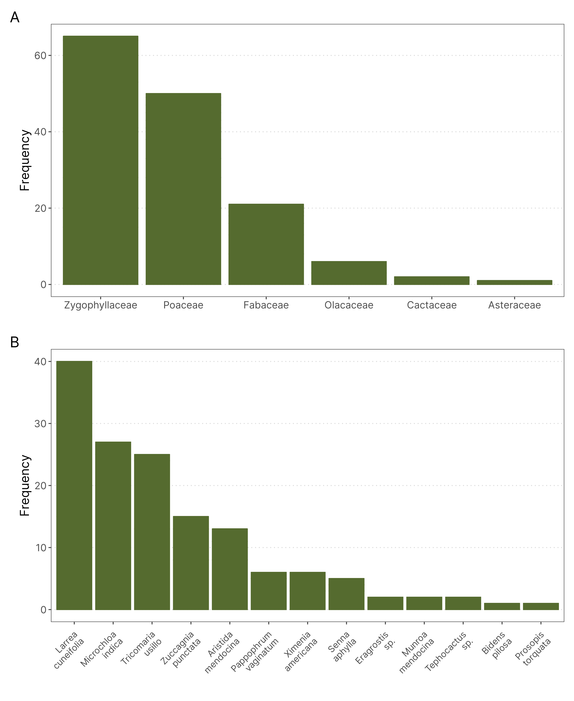
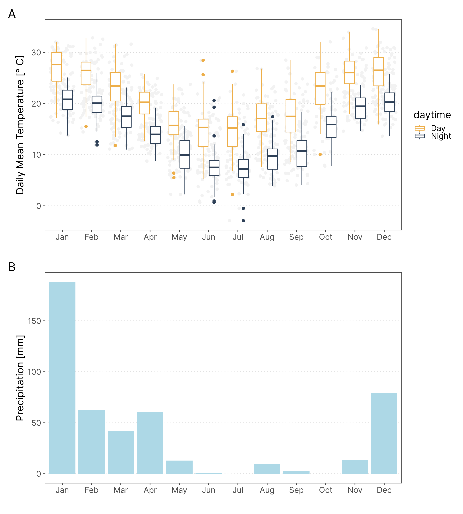
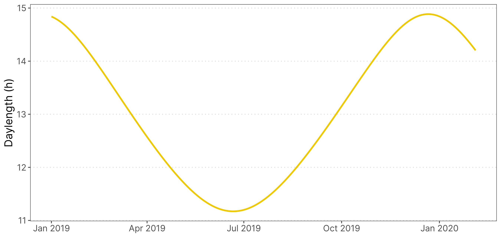
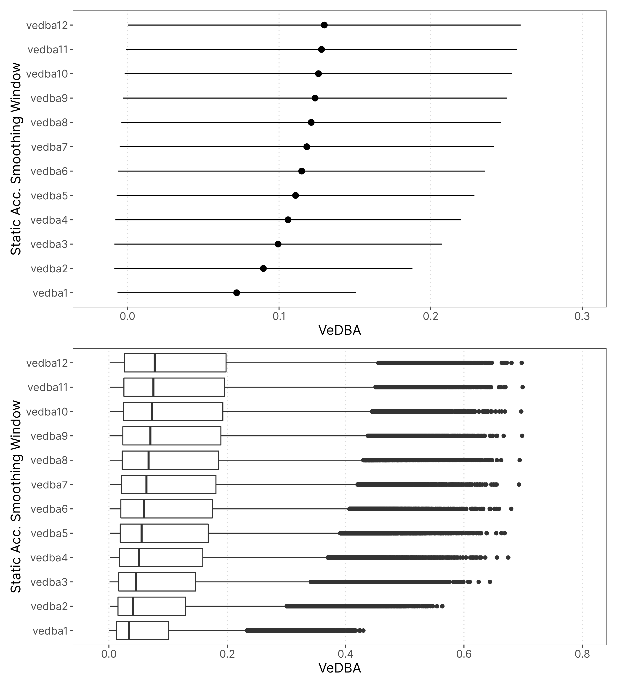
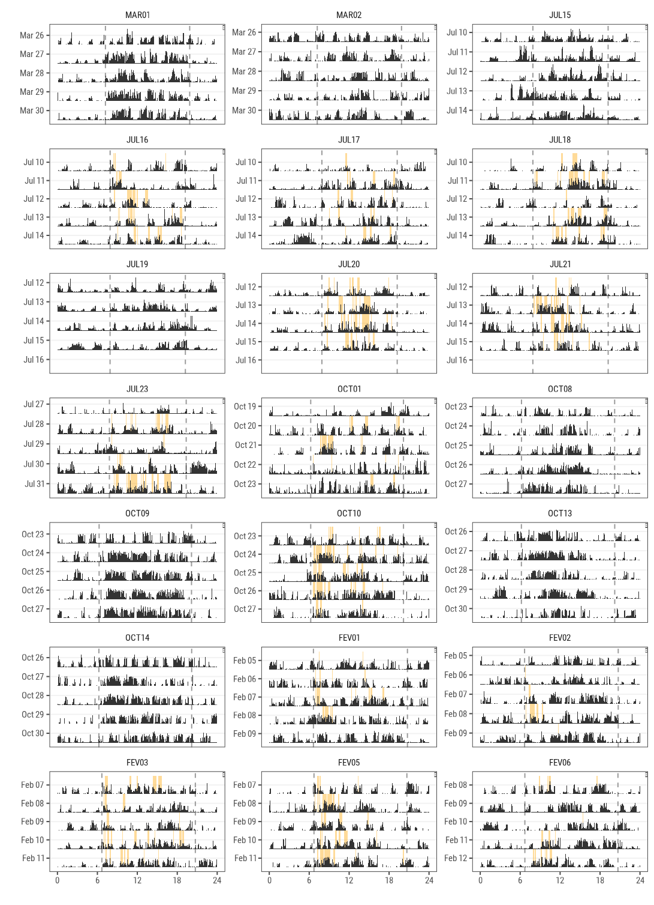
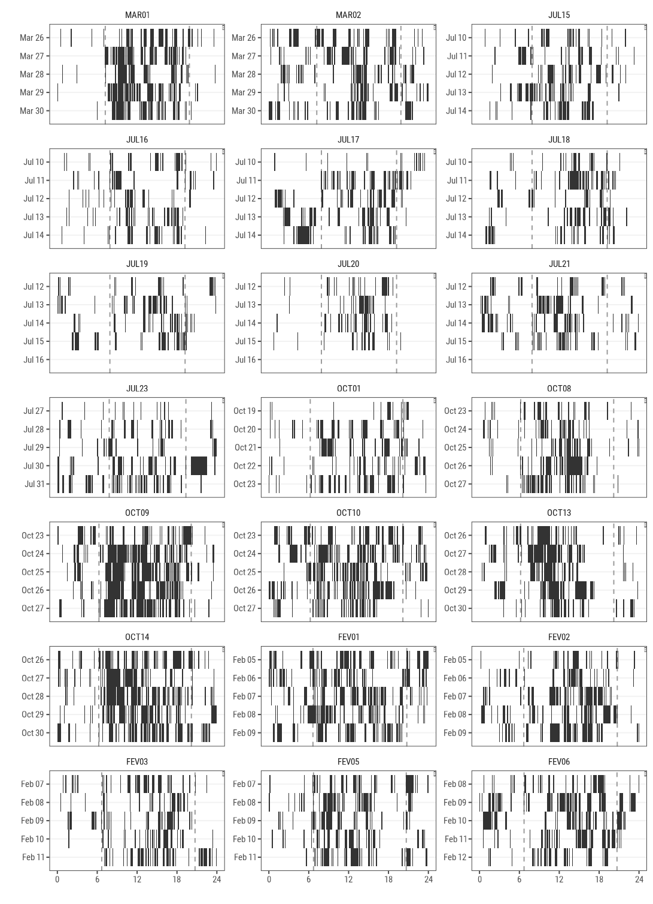
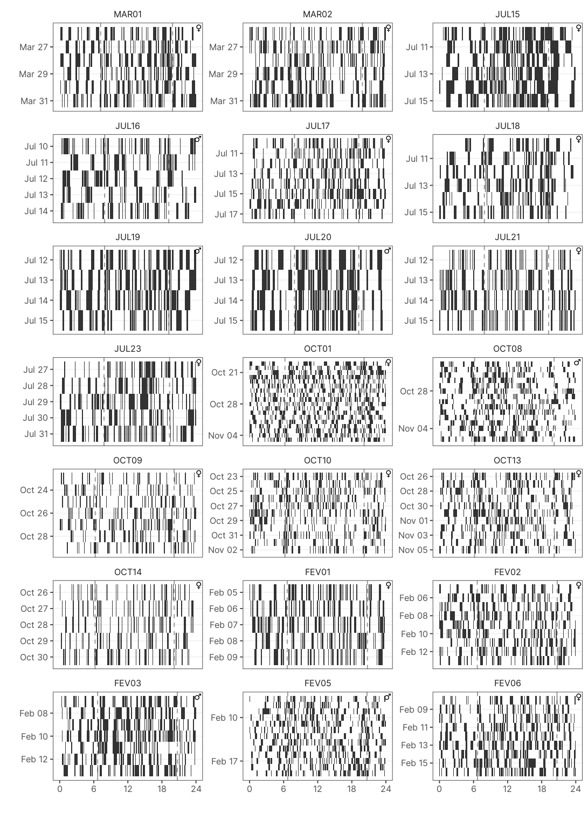
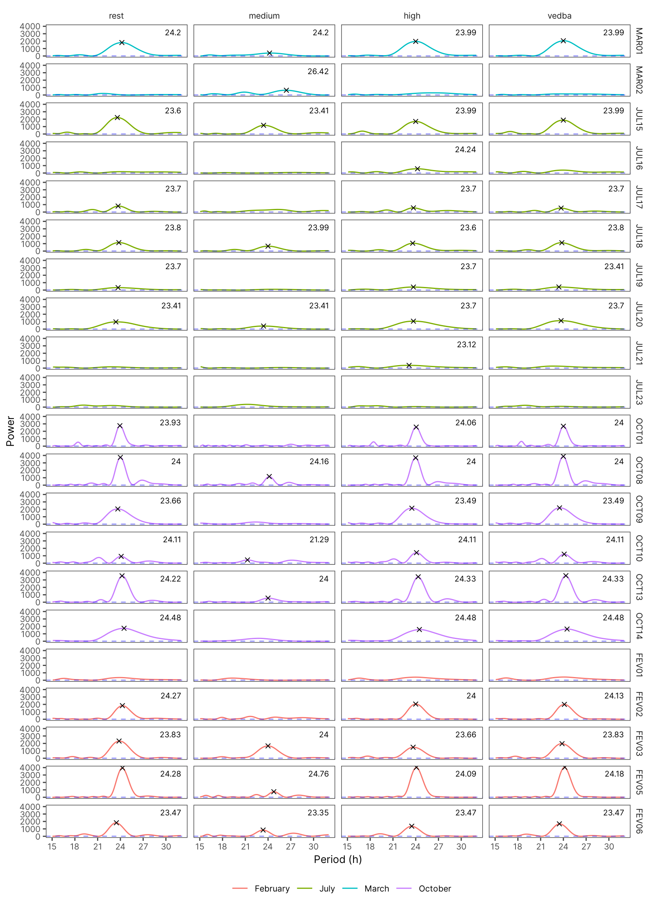

`r if(knitr:::is_latex_output()) "\\appendix"` `r if(knitr:::is_latex_output()) "# Apêndice {-}"`

# Anillaco's Plant Community

Following methods similar to [@aranda-rickert2014] a non-extensive survey of the plant community was done in May 2019. Three perpendicular 50m transects were defined near the study site (COORDINATES). A point-intercept method was used to record plant species present in the transects, species right below the sampling points were registered in the data. Sampling points were defined every 1m along the 50m transects. Plant species were identified in the field by a Botanist, except for a few members of the Poaceae family.

The results for the plant survey is in line with what has been described in the literature for the region [@abraham2009; @aranda-rickert2014; @fracchia2011]. The results show a dominance of Zygolhyllaceae, Poaceae and Fabaceae families. The relative frequency of plant families and species recorded in the area are shown in the graphs below (Fig. \@ref(fig:appendix-plants)).

```{r appendix-plants, out.width = "100%", fig.cap="Relative frequency of plants family (A) and species (B) in three transects near the Study Site. The plant community is dominated by members of the Zygolhyllaceae, Poaceae and Fabaceae families and is in accordance with what has been described in the literature. (n = 145)", echo=F}
    
```

# Anillaco's Weather

```{r appendix-weather, out.width = "100%", fig.cap="Temperature  and Rainfall yearly trends in Anillaco, Argentina. Data was collected in the years 2017 and 2019 from a weather Station (Vantage Pro 2, Davis Instuments. USA.) maintened in CRILAR, aproximately 5km away from the study site.", echo=F}
    
```

# Anillaco's Yearly Daylength Changes

- Adicionar tabela com duração do dia nas datas de coleta

```{r appendix-daylenght,  out.width = "100%", fig.cap = "Changes in daytime changes across the year in Anillaco, La Rioja. Maximum duration of daytime, during summer, is 14 hours and 53 minutes. Mininum duration of daytime, during winter, is 11 hours and 10 minutes."}
    
```

# Static Acceleration Smooth Window Assessment

\newpage

```{r appendix-smooth-window,  out.width = "100%", echo = FALSE}
    
```

# Exploratory VeDBA data Analysis

```{r appendix-eda, echo = FALSE, child = "../03_analysis/eda/eda.Rmd"}
```

# Models' AIC

-   Adicionar o LL

```{r table-aic}
#m1 = readRDS(paste0(dir, "/03_analysis/hmm/m1.rds"))  # Empty Model
#m2 = readRDS(paste0(dir, "/03_analysis/hmm/m2.rds"))  # Model with season covariate

mod_df = AIC(m1, m2)
mod_df = mod_df %>% 
    mutate(Formula = c("~season", "~1"), .after = 1)
kable(mod_df)
```

# Model's Estimated Parameters

```{r appendix-parameters}
#parameters_table = data.frame(Parameter = rep('par',9), Estimate = rep(0,9))
parameters_table = as_data_frame(m2$mle$vedba) %>% tidyr::pivot_longer(cols = 1:3, values_to = "Estimate", names_to = "Parameter")

parameters_table$Parameter = rep(c("mean","sd","zero-mass"), 3)
parameters_table$Parameter = parameters_table$Parameter[order(parameters_table$Parameter)]
parameters_table$Estimate = round(parameters_table$Estimate, 5)
parameters_table = parameters_table %>% mutate(State = rep(c("Rest", "Medium", "High"), 3), .after = Parameter)

ci_lower = as_tibble(m2$CIreal$vedba$lower) %>% tidyr::pivot_longer(cols = 1:3, values_to = "Estimate", names_to = "Parameter")
ci_lower$Parameter = rep(c("mean","sd","zero-mass"), 3)
ci_lower$Parameter = ci_lower$Parameter[order(parameters_table$Parameter)]

ci_upper = as_tibble(m2$CIreal$vedba$upper) %>% tidyr::pivot_longer(cols = 1:3, values_to = "Estimate", names_to = "Parameter")
ci_upper$Parameter = rep(c("mean","sd","zero-mass"), 3)
ci_upper$Parameter = ci_upper$Parameter[order(parameters_table$Parameter)]

parameters_table$CI = paste0("[", round(ci_lower$Estimate, 3),", ", round(ci_upper$Estimate, 3), "]")
parameters_table = parameters_table[1:6,]

kable(parameters_table, 
      caption = "Gamma State-dependent distribution parameters, mean and standard deviation, estimated by a three-state Hidden Markov Model.")
```

# Pseudo-residuals

```{r appendix-residuals, out.width="100%"}

```

# VeDBA Actograms

```{r vedba-actograms, out.width="95%"}

```

# High Activity Actograms

```{r high-actograms, out.width="95%"}

```

# Medium Activity Actograms

```{r medium-actograms, out.width="95%"}

```

# Rhythmicity

```{r}
include_graphics("../04_figures/ACF/acf_plot.png")
```

# Period Estimation

```{r}

```


