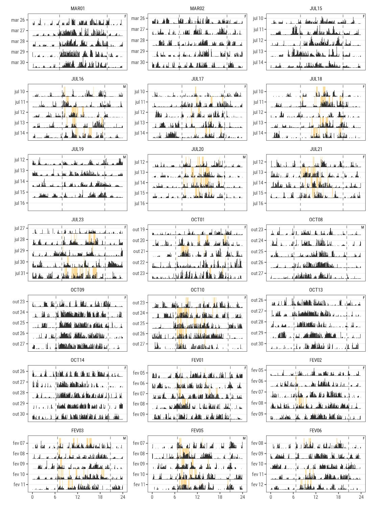
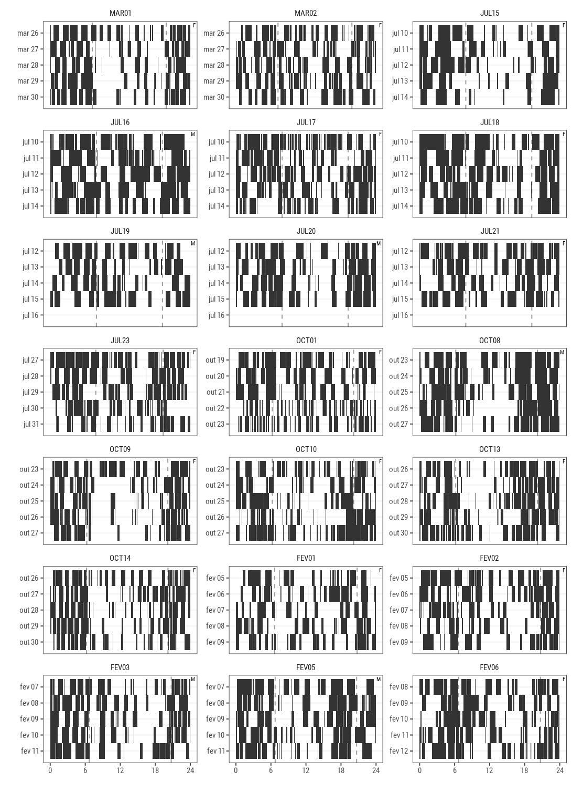

`r if(knitr:::is_latex_output()) "\\appendix"`
`r if(knitr:::is_latex_output()) "# Apêndice {-}"`
`r if(!knitr:::is_latex_output()) "# Apêndice"`

# Source Code

A complete version of this thesis and all related R code can be found at: https://github.com/jtsilverio/mestrado_tuco-tucos_chronobiology

# Animals

```{r animals-table-appendix}
tuco %>% 
    group_by(ID) %>% 
    summarise(`Total Days recorded` = max(day_number)) %>% 
    ungroup() %>% 
    left_join(tuco.metadata) %>%
    mutate(across(.cols = 6:9, .fns = function (x) if_else(x, "Yes", "No"))) %>% 
    rename(Season = season,
           Sex = sex,
           `Capture Weight (g)` = weight_cap,
           Lightlogger = lux,
           Accelerometer = acc,
           Recaptured = recaptured,
           `Collar Recovered` = collar_recovered
           ) %>% 
    kable(caption = "List of all tuco-tucos captured, the corresponding attached biologgers and the number of days recorded", scale = T)
```


# Anillaco's Enviroment

## Anillaco's Plant Community

Following methods similar to [@aranda-rickert2014] a non-extensive survey of the plant community was done in May 2019. Three perpendicular 50m transects were defined near the study site. A point-intercept method was used to record plant species present in the transects. Species right below the sampling points were registered in the data. Sampling points were defined every 1m along the 50m transects. Plant species were identified in the field by a Botanist, except for a few members of the Poaceae family.

The results for the plant survey is in line with what has been described in the literature for the region [@abraham2009; @aranda-rickert2014; @fracchia2011]. The results show a dominance of Zygolhyllaceae, Poaceae and Fabaceae families. The relative frequency of plant families and species recorded in the area are shown in the graphs below (Fig. \@ref(fig:appendix-plants)).

```{r appendix-plants, out.width = "100%", fig.cap="Relative frequency of plants family (A) and species (B) in three transects near the study site, measured in 2019. The plant community is dominated by members of the Zygolhyllaceae, Poaceae and Fabaceae families and is in accordance with what has been described in the literature. (n = 145)", echo=F, }
    include_graphics("../04_figures/appendix/plot_plants.png")
```

\pagebreak

## Anillaco's Weather

```{r appendix-weather, fig.pos="H", out.width = "100%", fig.cap="Temperature  and Rainfall yearly trends in Anillaco, Argentina. Data was collected in the years 2017 and 2019 from a weather Station (Vantage Pro 2, Davis Instuments. USA.) maintened in CRILAR, aproximately 5km away from the study site.", echo=F}
    include_graphics("../04_figures/appendix/plot_weather.png")
```

\pagebreak

## Anillaco's Yearly Daylength Changes

```{r appendix-daylength, fig.pos="H", out.width = "100%", fig.cap = "Changes in day length changes across the year in Anillaco, La Rioja. Maximum duration of daytime, during summer, is 14 hours and 53 minutes. Mininum duration of daytime, during winter, is 11 hours and 10 minutes."}
    include_graphics("../04_figures/appendix/plot_daylength.png")
```

\clearpage

# Individual Actograms

Individual VeDBA and behavioral states actograms show only the first five days of data. Surface emergence actograms show all days of recordings.

\pagebreak

## Surface Emergence Actograms

```{r lux-actograms, fig.pos = "H", out.width="95%"}
include_graphics("../04_figures/actograms/actograms_lux.jpeg")
```

## VeDBA Actograms

```{r vedba-actograms, out.width="95%", fig.pos = "H", fig.cap="VeDBA Actograms."}

```

## High Activity Actograms

```{r high-actograms, fig.pos = "H", out.width="95%"}

```

## Medium Activity Actograms

```{r medium-actograms, fig.pos = "H", out.width="95%"}
include_graphics("../04_figures/actograms/actograms_medium.jpeg")
```

## Low Activity Actograms

```{r low-actograms, fig.pos = "H", out.width="95%"}

```

\clearpage

# Accelerometer Data Exploration {#vedba-distribution}

## Assessment of Static Acceleration Smoothing Window 

```{r appendix-smooth-window,  out.width = "100%", echo = FALSE, fig.cap="Smoothing window assessment. We chose the 4-second moving average to proceed with analysis."}
    
```

\pagebreak

## VeDBA Summary and Distributions

```{r range-table, message=FALSE, warning=FALSE, out.width = "100%"}
range = tuco %>%
  group_by(ID, season, sex) %>%
  summarise(Mean = mean(vedba),
            Median = median(vedba),
            Max = max(vedba),
            Min = min(vedba),
            Range = Max - Min)

kable(range, caption = "Summary table of individual VeDBA data.")
```

---

```{r}
median_tuco = tuco %>% 
    group_by(season, sex) %>% 
    summarise(median = median(vedba),
              mean = mean(vedba),
              max = max(vedba),
              n.animals = length(unique(ID)),
              n.points = n())

kable(median_tuco, caption = "Summary table of VeDBA data grouped by season.")
```

---

```{r appendix-vedba-hist, fig.width=10, fig.asp=1.2, fig.cap="Individual density histogram of VeDBA data. Colors represents different seasons.", out.width = "100%", fig.pos="H"}
graph_hist = ggplot(tuco) +
  geom_histogram(aes(x = vedba, fill = season, y=..density..), bins = 40 ) +
  facet_wrap(~ID, ncol = 3) +
  theme(legend.position = "bottom") +
  theme(panel.grid.major.y = element_line(color = "grey95"))


sexlabels = unique(tuco %>% select(ID, sex) %>% mutate(sex = if_else(sex == "m", "♂", "♀"))) 
graph_hist = graph_hist +
            geom_text(x = Inf, y = Inf, 
                aes(label = sex), 
                data = sexlabels, vjust = 1.3, hjust = 1.3, 
                fontface = "bold", size = 5, color = "grey50") + 
            theme(legend.position = "none")+
            xlab("VeDBA") +
            ylab("Density")

graph_hist
```

---

```{r appendix-density, fig.width=8, fig.asp=0.8, out.width = "100%", fig.cap="Density plots of pooled VeDBA data."}
ggplot(tuco) +
    geom_density(aes(x = vedba, fill = sex, col = sex), alpha = 0.5)+
    facet_grid(season~.) +
    xlab("VeDBA")+
    ylab("Density")
```

\clearpage

# Hidden Markov Model

## AIC

```{r table-aic}
mod_df = AIC(m1, m2)
mod_df = mod_df %>% 
    mutate(Formula = c("~season", "~1"), .after = 1)
kable(mod_df, caption = "HMM models AIC table.")
```

## Estimated Parameters

```{r appendix-parameters}
#parameters_table = data.frame(Parameter = rep('par',9), Estimate = rep(0,9))
parameters_table = as_tibble(m2$mle$vedba) %>% tidyr::pivot_longer(cols = 1:3, values_to = "Estimate", names_to = "Parameter")

parameters_table$Parameter = rep(c("mean","sd","zero-mass"), 3)
parameters_table$Parameter = parameters_table$Parameter[order(parameters_table$Parameter)]
parameters_table$Estimate = round(parameters_table$Estimate, 5)
parameters_table = parameters_table %>% mutate(State = rep(c("Rest", "Medium", "High"), 3), .after = Parameter)

ci_lower = as_tibble(m2$CIreal$vedba$lower) %>% tidyr::pivot_longer(cols = 1:3, values_to = "Estimate", names_to = "Parameter")
ci_lower$Parameter = rep(c("mean","sd","zero-mass"), 3)
ci_lower$Parameter = ci_lower$Parameter[order(parameters_table$Parameter)]

ci_upper = as_tibble(m2$CIreal$vedba$upper) %>% tidyr::pivot_longer(cols = 1:3, values_to = "Estimate", names_to = "Parameter")
ci_upper$Parameter = rep(c("mean","sd","zero-mass"), 3)
ci_upper$Parameter = ci_upper$Parameter[order(parameters_table$Parameter)]

parameters_table$CI = paste0("[", round(ci_lower$Estimate, 3),", ", round(ci_upper$Estimate, 3), "]")
parameters_table = parameters_table[1:6,]

kable(parameters_table, 
      caption = "Gamma State-dependent distribution parameters, mean and standard deviation, estimated by a three-state Hidden Markov Model.")
```

\clearpage

## Pseudo-residuals

```{r appendix-residuals, fig.pos="H", out.width="100%", fig.cap="Model Residuals."}

```

\clearpage

## Stationary Probabilities

```{r appendix-stationary, out.width="100%"}
# get stationary probabilities
df = data.frame(
    March = momentuHMM::stationary(m2, covs = data.frame(season = "March")),
    July = momentuHMM::stationary(m2, covs = data.frame(season = "July")),
    October = momentuHMM::stationary(m2, covs = data.frame(season = "October")),
    February = momentuHMM::stationary(m2, covs = data.frame(season = "February"))
)
df = tidyr::pivot_longer(df, 1:ncol(df), names_to = c("season", "state"), values_to = "prob", names_sep = "([.])")
df$season = factor(df$season, levels = c("March", "July", "October", "February"))

# plot stationary prababilities
ggplot(df) +
    geom_point(aes(x = season, y = prob, color = state)) +
    #geom_line(aes(x = season, y = prob)) +
    scale_y_continuous(limits = c(0, 0.5)) +
    ylab("Stationary Probabilities") +
    xlab("") +
    scale_color_manual(values = tuco_pal[1:3])
```

## Transition Probabilities

```{r out.width="100%", fig.height=7, fig.width=8}
cov.index = 
    c(which(tuco$season == "March")[1],
      which(tuco$season == "July")[1],
      which(tuco$season == "October")[1],
      which(tuco$season == "February")[1])


df = as.data.frame(
    momentuHMM::getTrProbs(m2, covIndex = cov.index),
)


df$to_state = row.names(df)
df = tidyr::pivot_longer(df, 1:ncol(df)-1, names_to = c("from_state", "season"), values_to = "prob", names_sep = "([.])")
df$season = factor(df$season, levels = 1:4, labels = c("March", "July", "October", "February"))

df$to_state = factor(paste0("To:", df$to_state),
                     levels = c("To:Low","To:Medium","To:High"))
df$from_state = factor(paste0("From:", df$from_state),
                     levels = c("From:Low","From:Medium","From:High"))

df %>% 
    ggplot() +
        geom_point(aes(x = season, 
                       y = prob, 
                       )) + 
        geom_line(aes(x = season, 
                      y = prob,
                      group = from_state)) +
    facet_grid(from_state ~ to_state, switch = "y") +
    xlab("") +
    ylab("Transition Probabilities") +
    scale_y_continuous(position = "right") + 
    theme(panel.grid.major.y = element_line(color = "grey90")) 
```

\clearpage

# Individual Circadian Analysis

\pagebreak

## Individual Autocorrelation Plots

```{r appendix-acf, fig.pos = "H", out.width="95%", fig.cap = "Individual Autocorrelation plots."}
include_graphics("../04_figures/appendix/rhythmicity/acf_plot.png")
```

## Individual Period Estimation

```{r, fig.pos = "H", out.width="100%"}
include_graphics("../04_figures/appendix/periodogram/periodogram.png")
```


