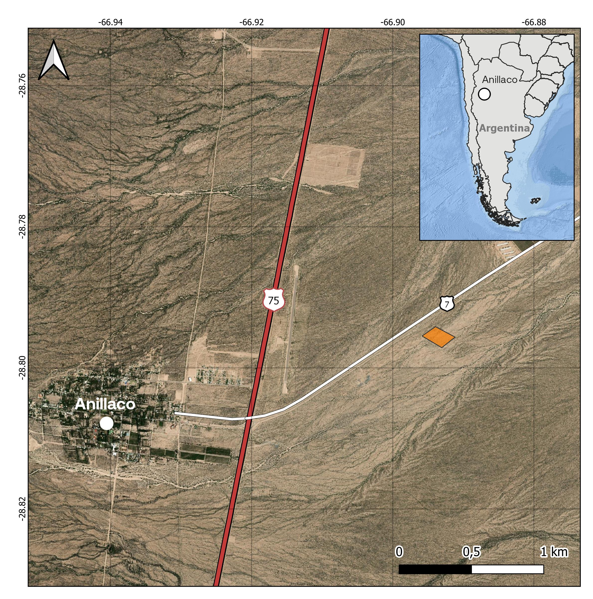
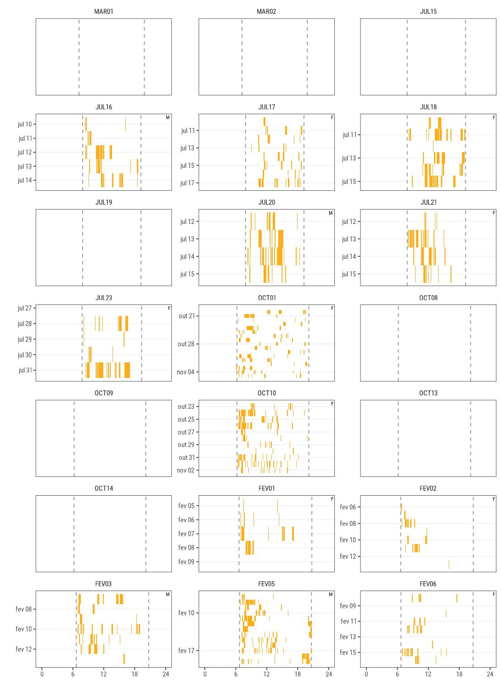
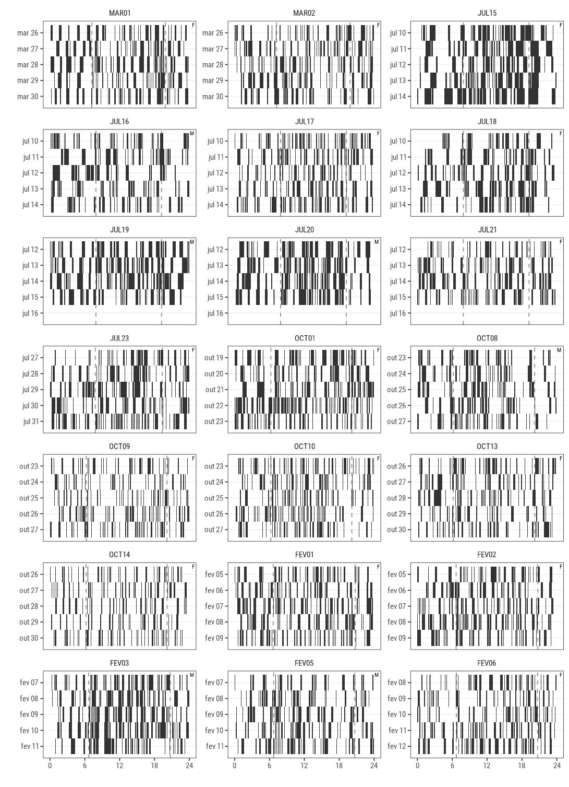
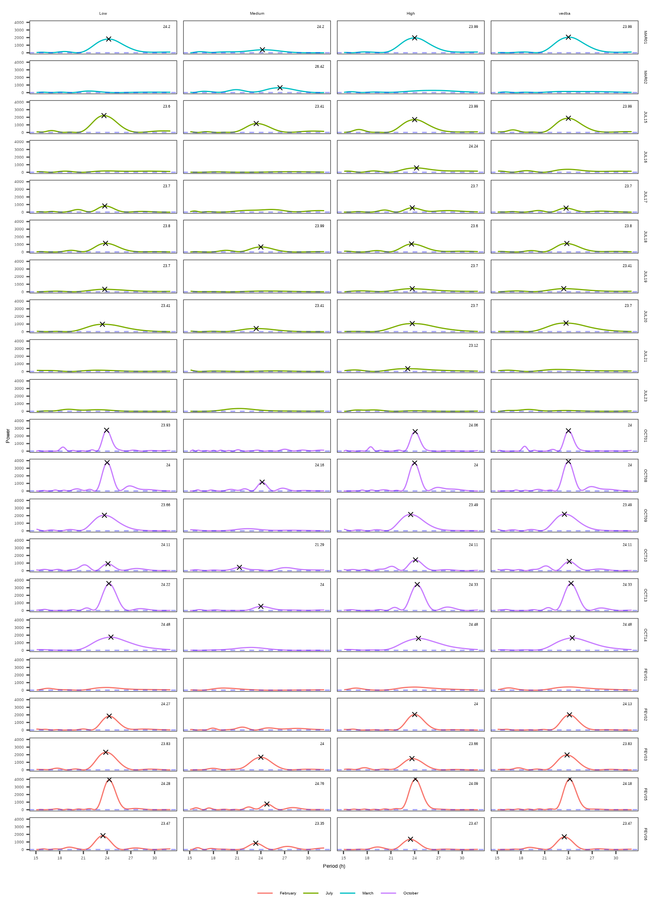

<!--
Above is the YAML (YAML Ain't Markup Language) header that includes a lot of metadata used to produce the document.  Be careful with spacing in this header!

If you'd prefer to not include a Dedication, for example, simply delete the section entirely, or silence (add #) them. 

If you have other LaTeX packages you would like to include, delete the # before header-includes and list the packages after hyphens on new lines.

If you'd like to include a comment that won't be produced in your resulting file enclose it in a block like this.

If you receive a duplicate label error after knitting, make sure to delete the index.Rmd file and then knit again.
-->


```{r include_packages, include = FALSE}
# This chunk ensures that the coppedown package is
# installed and loaded. This coppedown package includes
# the template files for the thesis.
if(!require(devtools))
  install.packages("devtools", repos = "http://cran.rstudio.com")
if(!require(coppedown))
  devtools::install_github("COPPE-UFRJ/coppedown")

# Set Global Chunk Options
knitr::opts_chunk$set(
    fig.align = "center",
    echo = FALSE, 
    message = FALSE,
    warning = FALSE,
    background = "white"
    )
```

<!-- On ordering the chapter files:
There are two options:
1. Name your chapter files in the order in which you want them to appear (e.g., 01-Inro, 02-Data, 03-Conclusions). 
2. Otherwise, you can specify the order in which they appear in the _bookdown.yml (for PDF only).

Do not include 00(two-hyphens)prelim.Rmd and 00-abstract.Rmd in the YAML file--they are handled in the YAML above differently for the PDF version.
-->

<!--chapter:end:index.Rmd-->

# Introdução Geral {-}

Quando olhamos ao nosso redor, é difícil não notar a existência de uma diversidade de ciclos ambientais: os ciclos diários, como o do claro/escuro associado ao dia e  noite; os ciclos anuais, como a  variação anual de temperatura, e outros ciclos, como o lunar e o ciclo das marés. Não é de se admirar, então, que ao longo da evolução tenham surgido mecanismos que possibilitaram aos organismos se adaptarem temporalmente a essas mudanças cíclicas e previsíveis do ambiente. Assim, a maioria dos organismos desenvolveu sistemas temporais endógenos, como o sistema circadiano, associado ao ciclo diário de 24 horas. Esse sistema é responsável pela geração e sincronização de diversos ritmos biológicos, alguns bastante perceptíveis, como o padrão diário de atividade. Outros ritmos biológicos, invisíveis aos olhos, controlam funções importantes na vida dos animais, é o caso da variação diária da concentração de diversos hormônios no plasma [@moore-ede1982]. 


## O oscilador circadiano e os ritmos endógenos {-}

A endogenicidade dos ritmos biológicos foi demonstrada pela primeira vez em 1729 pelo astrônomo Jean Jacques de Mairan. De Mairan investigava o movimento foliar de uma planta que fechava suas folhas durante a noite e realizou um experimento no qual colocou essa planta em uma caixa fechada, sem entrada de luz. Ele observou que, mesmo sem uma pista ambiental indicando quando era dia ou noite, o ritmo de abertura e fechamento das folhas se manteve. Desde então os ritmos biológicos vêm sendo estudados com mais atenção, levando ao estabelecimento da cronobiologia como disciplina a partir de 1960, com o propósito de investigar a origem e manutenção dos ritmos biológicos endógenos e como eles são sincronizados pelos ciclos ambientais [@moore-ede1982].

Em mamíferos, os ritmos circadianos são gerados por um oscilador endógeno central, localizado nos núcleos supraquiasmáticos do hipotálamo [@moore-ede1982]. Assim como no experimento de De Mairan, os ritmos biológicos endógenos em mamíferos se mantêm mesmo em condições laboratoriais constantes, com período próximo, mas não idêntico, ao do ciclo ambiental associado. Essa é uma propriedade importante dos ritmos biológicos, e mostra que esses ritmos são endógenos e possuem um período intrínseco. O período do ritmo em condições constantes é denominado período de livre curso ($\tau$), e corresponde ao período endógeno do oscilador circadiano na ausência de pistas temporais ambientais. O valor de $\tau$ se aproxima, mas não é igual ao valor do período do ciclo ambiental com o qual ele é associado. No caso de ritmos diários o valor do tau fica em torno de 24 horas, variando de espécie para espécie, e por isso esses ritmos são conhecidos como ritmos circadianos (Circa = cerca de, dien = dia) [@moore-ede1982].

Outra propriedade importante dos ritmos circadianos, além da endogenicidade, é a sua  sincronização por ciclos ambientais diários. Para grande parte dos animais, o principal agente sincronizador do oscilador circadiano é o ciclo claro-escuro. A sincronização acontece pela transmissão da informação temporal cíclica aos osciladores por meio de fotorreceptores, que compõem a via aferente do sistema circadiano (Figure \@ref(fig:intro-sincro)). Em mamíferos, particularmente, os fotorreceptores estão presentes exclusivamente na retina e a informação luminosa percebida pelas células retinianas é transmitida para o oscilador circadiano por meio  do trato retino hipotalâmico (Moore-Ede, Sulzman, and Fuller 1982). Assim, apesar do $\tau$ de um ritmo circadiano ser ligeiramente diferente de 24 horas, há um ajuste do período desse ritmo com o período do ciclo ambiental resultante do processamento da informação luminosa cíclica diária. Dessa maneira, o animal é capaz de manter um ritmo sincronizado, com período de 24 horas, mantendo também estável a relação de fase – que é a distância temporal entre duas fases de referência – desse ritmo com o ciclo ambiental.

```{r intro-sincro, echo=F, out.width = "100%", fig.cap="Figura esquemática do mecanismo de sincronização do oscilador circadiano. O ciclo claro-escuro é percebido por células fotorreceptoras presentes na retina. A informação luminosa é transmitida para o oscilador através das vias aferentes, que em mamíferos é o trato retino hipotalâmico. O oscilador circadiano se sincroniza ao ciclo luminoso por meio da informação nervosa proveniente das vias aferentes. O oscilador circadiano mantém uma marcação interna do tempo e transmite essa informação temporal para diversos orgãos e tecidos, o que resulta no ritmo que é observado em diversas variáveis fisiológicas e comportamentais."}

include_graphics("../04_figures/Intro/esquema-sincronizacao.pdf")
```

## Tuco-tucos como sistema cronobiológico {-}

A família Ctenomydae está presente em grande parte da América do Sul se estendendo desde o sul do Peru até Tierra del Fuego, Argentina, e do leste até o sudoeste do Brasil, ocupando uma diversidade de habitats, desde áreas florestais até regiões áridas [@lacey2000life]. A família apresenta apenas um gênero vivente, _Ctenomys_, que é o gênero de roedor subterrâneo com maior número de espécies descritas. Espécies desse gênero são tipicamente solitárias,  apresentam diversas adaptações morfológicas ao hábito de vida subterrâneo e são chamadas popularmente de tuco-tucos, pela semelhança desse nome com o som produzido pela vocalização desses animais [@freitas2021]. A natureza subterrânea, a grande distribuição geográfica e a relativa facilidade de manutenção em laboratório, tornam esses roedores sistemas muito atraentes para o estudo cronobiológico. A população de animais estudados pelo Laboratório de Cronobiologia Binacional é descrita em trabalhos anteriores como pertencentes à espécie _Ctenomys_ aff. _knight_ mas a descrição e nomenclatura específica está em andamento. Essa população ocorre na região em torno de Anillaco, La Rioja, Argentina, e possui o nome popular de tuco-tuco de Anillaco.

Em laboratório, o ritmo de atividade do tuco-tuco de Anillaco é sincronizado pelo ciclo diário de claro/escuro e apresenta padrão noturno [@flores2021; @valentinuzzi2009]. Estudos realizados em arenas seminaturais revelaram que os ritmos de atividade dessa espécie também se sincronizam com o ciclo claro-escuro ambiental, mesmo com os animais vivendo em galerias subterrâneas [@jannetti2019; @tomotani2012]. Durante esses estudos em arenas seminaturais, foi observado que a exposição natural à luz desses animais acontece principalmente quando os tuco-tucos saem de suas tocas para forragear ou escavar seus túneis. Embora essa exposição à luz seja irregular, ela já é suficiente para sincronizar o oscilador desses animais [@flores2013; @flores2021]. Um outro resultado importante observado nos trabalhos com tuco-tucos de Anillaco é a diferença entre as fases de atividade em laboratório e nas arenas seminaturais. No laboratório, os picos de atividade estão concentrados na fase de escuro e indicam um comportamento noturno [@tomotani2012]. Nas arenas, a situação é diferente, os picos de atividade estão mais concentrados durante o dia e indicam um comportamento diurno [@jannetti2019]. 

Os primeiros estudos de tuco-tuco em arenas seminaturais tinham como objetivo investigar a exposição à luz e os padrões de saídas dos tuco-tucos de suas galerias subterrâneas [@tomotani2012]. No entanto, a resposta a algumas perguntas demandava também o estudo da atividade dos tuco-tucos no subterrâneo. Esse tipo de investigação se tornou possível graças à miniaturização de sensores de movimento, que são pequenos o suficiente para serem usados em colares colocados em pequenos roedores. Esses tipos de sensores são conhecidos como _biologgers_ e seu uso como _biologging_. Um tipo de _biologger_ comumente utilizado para o registro de movimento é o acelerômetro, sensor que registra movimentos por meio de aceleração do corpo e que também estão presentes em celulares, sendo os responsáveis pela detecção da orientação do aparelho. Em animais, os acelerômetros são fixados em colares e registram o movimento do animal continuamente em alta frequência. Dessa forma, esses sensores são muito interessantes para os estudos de cronobiologia e de ritmos de atividade. Os primeiros registros de acelerômetro em tuco-tucos foram feitos em arenas seminaturais por @jannetti2019. Os resultados desse estudo apontam que em condições seminaturais os tuco-tucos são majoritariamente diurnos e passam por volta de 60% de seu dia ativos.

Apesar do conhecimento adquirido sobre a atividade dos tuco-tucos em laboratório e arenas seminaturais, essas condições não reproduzem totalmente a complexidade do ambiente natural em que os tuco-tucos vivem. Por esse motivo, não sabemos se os resultados em arenas seminaturais refletem os comportamentos naturais dos tuco-tucos na natureza, o que só pode ser explorado em estudos com animais em vida livre. Assim, esta dissertação se propõe a implementar uma metodologia de campo para o estudo dos ritmos de atividade de tuco-tucos na natureza. Também temos como objetivo investigar e identificar quais padrões de atividade os tuco-tuco de Anillaco apresentam em seu ambiente natural, dentro do contexto ecológico da espécie, e se existe alteração anual desses padrões. Além disso, é também proposto o uso de _Hidden_ _Markov_ _models_ para a classificação dos dados de acelerômetro, o que amplia de maneira significativa as interpretações que podemos fazer com esse tipo de dado.

O primeiro capítulo, intitulado “Chronobiology in the wild: toolkit to study daily rhythms in free-living animals”, foi publicado em uma edição especial da revista _Sleep Science_ como parte da premiação de melhores pôsteres apresentados durante o XV LASC (Latin American Symposium on Chronobiology, 2018). Esse artigo traça um panorama geral do estudo de ritmos biológicos, em especial de atividade, em animais de vida livre e as tecnologias que permitem que esses estudos sejam realizados atualmente. O segundo capítulo, no formato de artigo, ainda será submetido a uma revista da área. Neste capítulo, realizamos o primeiro estudo da atividade geral e da saída à superfície em tuco-tucos de vida livre. Esse trabalho foi feito com o objetivo de confirmar estudos e observações anteriores feitas em arenas seminaturais, além de investigar possíveis mudanças anuais na atividade dessa espécie dentro do seu contexto ecológico.


<!--chapter:end:00-intro.Rmd-->

# Chronobiology in the wild: toolkit to study daily rhythms in free-living animals

_Jefferson T. Silvério, Patricia Tachinardi_

\  

*Published in Sleep Science - Volume 13, Supplement 2. 2020.*

\  

Since chronobiology’s foundation has been laid out in the 60s, tremendous progress has been made regarding our knowledge about the nature of the circadian clock, its molecular bases and its synchronization by photic and non-photic stimuli. The majority of these studies have been done in laboratory settings, which, although important, lack information about the adaptive value, ecological significance and plasticity of the biological rhythms in the wild. This concern has been raised several times, along with the development of the field. Methodological difficulties have been the biggest challenges of field studies. However, the recent development of new techniques is opening a wide range of opportunities to investigate biological rhythms in free-ranging animals. In this review, we promote an ecological approach to biological clocks and highlight some methods and newer technologies that can be used to study biological clocks in the wild, along with some examples.

\  

_*Keywords:* biological rhythms; wild-clocks; field and laboratory; biologger; free-ranging; activity patterns._

## Introduction

Endogenous circadian clocks enable animals to anticipate changes in physiology and behavior to the daily changes in the environment synchronizing their internal state with the 24-hour environmental cycles. Our knowledge of the function and mechanism of these clocks has grown extensively in different levels of organizations such as molecular, cellular, tissue and organs. Most of the studies of the mechanisms and nature of the clock itself has been done in the laboratory, under controlled conditions [@enright1970; @morgan2004]. Using the laboratory approach, several endogenous circadian rhythms were described in a diverse range of organisms, from mammals to birds, insects and the molecular clocks of bacteria. However, the physiology and behavior of a laboratory animal can be unrepresentative of what happens in the field [@calisi2009; @willmer2005]. Several authors have brought the argument that we know very little about the ecological significance of circadian rhythms [@enright1970; @halle2000; @helm2017]. The central argument is that to understand the adaptive significance of circadian rhythms, the diversity of temporal strategies and how flexible circadian rhythms are, we must turn to ecological studies in free-living animals. To fill this gap, several recent studies on animal chronobiology have been carried out in free-living animals. These studies investigate the interplay between the endogenous circadian pacemaker and the biotic and abiotic stimuli acting on the plasticity of overt daily rhythms. These studies have suggested that biological rhythms in the wild are much more flexible than previously thought [@hut2012].

The advancement of chronobiological studies in the field has long been challenged by the difficulty of measuring biological rhythms in nature. In the laboratory, locomotor activity and body temperature (Tb) rhythms have been widely used due to ease of measurement and replicability. Commonly, activity is measured by counting running wheel revolutions, by detecting movement with an infrared motion sensor placed above the animal’s cage or by implanting a wireless activity sensor in the animal [@blanchong1999]. Measurements of Tb, in turn, are more invasive and can require more expensive equipment. Usually, Tb sensors are implanted surgically in the peritoneal cavity of the animal. These sensors can either be loggers, in which the data is stored in the device or transmitters, which send data to receivers outside the animal [@weinert1998]. When studying free-living animals, however, many of these commonly used methods to study locomotor activity and Tb rhythms are very difficult or simply impossible to be deployed, being it because of technical or financial drawbacks. 

Recent technological advances, such as the miniaturization of sensors and logging devices, have opened a wide variety of opportunities to study biological rhythms in free-living animals. In this mini-review, we will discuss some of the methods being used to assess behavioral and physiological rhythms of free-living animals in both populational and individual levels. We will focus on methods used in the research of terrestrial mammals, although many of them can also be deployed to other taxa and to aquatic and flying animals [@dominoni2017]. It is important to note that most methods require handling the animal for implanting or externally attaching a device. Thus, researchers should always take into account any possible effects this manipulation can have on the animals and on the data obtained [@chmura2018].

## Chronobiological studies in free-living animals

### Populational Rhythms

Most of the early investigations of clocks in the wild have been carried out focusing on populational rhythms, using observational and trapping methods [@daan1978; @halle2000; @kenagy1976]. Using live-traps to infer activity rhythms can be done setting a grid of traps in the study site and then counting the number of captures for a chosen time interval. For example, using hourly record of vole (_Microtus arvalis_) trappings in the wild it was possible to record the pattern of daily activity in these species and their ultradian components [@gerkema1985]. If a higher temporal resolution is required, it is possible to combine live-trapping and direct observations to record the exact time the animals were trapped. Using this approach it was shown that Kangaroo rats (genus Dipodomys) display seasonal change in their start and end time of activity, which might be related to the length changes of sunset [@kenagy1976]. Both observational and live-trapping methods are limited in the range of habitats and diversity of animals they can be applied to. Observational studies have to be done in diurnal species living in open habitats, otherwise, it becomes unfeasible to observe the study species. Small nocturnal animals and animals living in habitats with dense vegetation are not well suited for this technique. On the other hand, trapping studies face the problems of how easily individuals of the study species can be trapped [@kenagy1976]. Both of the above mentioned examples were done in species that are relatively easy to capture in live traps. Kangaroo rats, for example, do not exhibit an aversion to the traps and manipulation. Voles, in turn, leave recognizable tracks aboveground that can guide trap placement and increase trapping success.

More recently, the use of time-stamped camera-trap images has expanded the study of population activity rhythms to species that cannot be easily observed or captured [@frey2017; @rowcliffe2014]. Moreover, this non-invasive technique can be used to simultaneously monitor several species that occur in the same area. For example, Mendes and colleagues [@mendes2020] did an extensive camera-trap study to evaluate the changes in daily activity rhythms of 17 rainforest-dwelling mammal species in response to human disturbance. They found out that there was a shift in the timing of activity in highly disturbed areas, with some species becoming more nocturnal and others more diurnal. Species that were susceptible to preying or hunting were more likely to show activity time shifts. Possible drawbacks of using camera-traps are camera placement bias, detectability of the animals in the camera and the assumption that all individuals of the population will display peak activity at the same time [@frey2017; @rowcliffe2014].

### Individual behavioral rhythms

In general, to study individual daily activity patterns it is necessary to continuously follow and record movement and behavior of the same individual for many days [@daan1981], which can be very challenging in the field. Individual monitoring can be done using direct observations [@everts2004; @tomotani2012], but this method restricts the monitoring of the animal to the times when it is visible. For continuous measurements, it is usually required to attach a device to the animal. Among the earliest measurements of individual activity rhythms using animal-borne devices were those using radio telemetry [@ables1969; @hut1999]. When using this technique, the animal is equipped with a radio telemetry collar that continuously transmits a pulse in a certain radiofrequency that can be picked up by a radio receiver tuned to the same frequency. This way it is possible to locate the animal in the field during defined time intervals. Daily activity patterns are inferred by the size of spatial displacements between these time points throughout day and night. Due to the availability of small and lightweight transmitters, this technique can be used on mammals of nearly any size [@naef-daenzer2005]. Telemetry studies are often done manually, thus being very labor-intense and time-consuming. There are automated telemetry systems, which are a feasible alternative to measure activity patterns, as long as the technical and financial requirements to set up the system can be met and errors due to small body size and large home ranges are taken into account [@kays2011]. Another method that can be used to assess activity patterns based on animal movement are satellite trackers, which previously could only be used in large-sized animals, but are currently being miniaturized [@wikelski2006]. An important advantage of this technique is that data can be obtained remotely, with no need to locate the animal after the tag is deployed. 

Individual-level rhythms can also be measured with newer biologging devices, which are attached to the animal’s body and can record onboard physiological and behavioral parameters including activity, Tb, heart rate and skin humidity [@ropert-coudert2005; @rutz2009]. Given the advancements in the biologging technologies, devices are now smaller and capable of recording multiple parameters in a frequency of hundreds of points per second, providing insight into the details of the animal's life [@ropert-coudert2005]. Due to the onboard memory, the main drawback of biologgers is the need to recapture the animals to obtain the data.

Examples of biologging devices used to monitor animal behavior in chronobiological studies include lightloggers and accelerometers. Lightloggers are devices that were originally designed to be used in geolocation in bird migration studies but are particularly interesting for chronobiology. Lightloggers are being used to conduct research on a number of small rodents, recording their temporal patterns of exposure to light. Studies that are benefitted by the use of lightloggers include research on diurnal animals that retreat to nests, subterranean or semi-fossorial animals and hibernating animals in which exposure to light means the animals are active above ground. Accelerometers, in turn, are tri-axial devices that continuously record fine-scale movement. The data generated by accelerometers can be used to quantify gross activity timing, identify behaviors based on movement patterns, quantify time-activity budgets and indirectly derive energy expenditure [@brown2013; @rutz2009; @ropert-coudert2005].

Lightloggers were used to investigate the daily and seasonal patterns of activity in wild red squirrels (_Tamiasciurus hudsonicus_) and arctic ground squirrels (_Urocitellus parryii_) [@williams2014]. Using these devices, they could calculate the total time outside of the nest, the number of activity bouts per day, time of the first emergence in the morning and return to nest at night. They showed that the level of activity was flexible and correlated with changes in the thermoregulatory conditions of the environment. On a different rodent species, the tuco-tuco (genus Ctenomys), a combination of lightloggers and accelerometry was used to investigate the activity patterns of a subterranean rodent in outdoor enclosures [@jannetti2019]. In this study, accelerometers were used to record gross motor activity while lightloggers recorded time on surface. A combination of both methods, therefore, could discriminate levels of aboveground activity and below-ground activity when the animal is inside its burrow system. The study showed that time of day and temperature were the main environmental conditions modulating time spent on the surface [@jannetti2019] and that there was a shift from diurnal to nocturnal levels of activity when the same animals were transferred from outdoor enclosure to controlled laboratory conditions [@jannetti2019; @tachinardi2015]. Although this study was done in outdoor enclosures, this approach can also be used in free-ranging animals. Shifts in the timing of activity are also known to happen in other species of rodents besides _Ctenomys sp._ [@hut2012; @kronfeld-schor2017] and are among the most dramatic discrepancies between rhythms in the field and lab. Biologgers are a helpful addition to approach this phenomenon at the individual level and boost this investigation. The examples provided here highlight possible scenarios where the use of biologging devices can be used to reveal the intimacy and complexity of rhythms in the wild, investigating chronobiological questions and the flexibility of circadian and seasonal rhythms. 

Other alternative technologies can be used to assess rhythms in the wild, such as RFID (Radio Frequency Identification) and newly developed ones such as the BATS system. RFID are small tags that can be used to identify individuals in a population Passive RFID tags do not require their battery to operate and are powered by the energy from the reader's radio waves. They are largely used to identify farm and laboratory animals, being very small and attached either externally or subcutaneously. RFID tags can be used to record activity rhythms by placing readers in locations that the animals visit regularly, such as nests or feeders. This setup allows the recording of the rhythmicity of visits to a specific location where the reader is placed [@vinne2019]. Although this technique is usually deployed in outdoor enclosures it could be used in free-living animals that have fixed nests or feeding locations. The BATS system is an interesting technology that is fully automated [@duda2018; @ripperger2019a]. It is composed of small lightweight proximity sensors and a set of receiver stations that are distributed in the study site. The proximity sensors can record interactions between two animals in a sampling rate of seconds and then transmit these data to the base stations. This system can also be used to derive movement trajectory even in structurally complex habitats [@ripperger2019a]. Ripperger and colleagues have used this system to study the behavioral ecology of bats, such as the mother-offspring interactions in noctule bats (_Nyctalus noctule_) [@ripperger2019] and the social structure of the common vampire bats (_Desmodus rotundus_) [@ripperger2019b]. Although the BATS system was developed to investigate a different set of questions it seems to be a great new technology to assist in the study of reproduction, social synchronization and the social influences on biological rhythms.

### Physiological rhythms

Biologgers can also be used to assess daily rhythms of physiological variables, enabling the investigation of physiological adjustments to the changes in environmental conditions faced by free-living animals. Tb is the physiological variable most studied in wild chronobiology. It is usually measured and recorded by temperature loggers implanted into the abdomen. This method was used to monitor Tb in free-living arctic ground squirrels (_Urocitellus parryii_) throughout the year, showing that in these animals Tb is arrhythmic during hibernation but displays an entrained 24-hour rhythm in the active season even during the weeks of constant sun [@williams2011]. Monitoring of Tb was also used to record dramatic shifts from diurnally to nocturnality when golden spiny mice (_Acomys russatus_) are transferred from large outdoor enclosures to the laboratory [@levy2007]. This study is a clear example of how the assessment of physiological rhythms can be important in the investigation of the plasticity of biological rhythms, since the same physiological variable can be measured in both conditions, as opposed to measuring different types of behavioral rhythms under field and laboratory conditions (e.g. foraging in the field and wheel running in the laboratory).

In the laboratory, energy expenditure rhythms can be assessed by measuring hourly rates of oxygen consumption using respirometry chambers, for instance, which is not possible in free-living animals. Since heart rate can be a proxy to energy expenditure, it is a valuable physiological variable in chronobiological studies involving energetics. Heart rate sensors can be attached to the skin, implanted subcutaneously [@toien2011] or even placed non-surgically in the reticulum of ruminants [@signer2010]. These devices can either be loggers [@toien2011] or transmitters [@signer2010].

Brain electrical activity is also of interest to chronobiological studies since it can be used to investigate sleep patterns. Recently, miniature loggers have been developed to measure electrophysiological brain activity [@massot2019; @vyssotski2006]. Studies using these loggers have, for instance, provided insights into the ecology of sleep in sloths [@rattenborg2008] and even indicated that birds can sleep during flight [@rattenborg2016]. 

## Conclusion

In this mini-review, we highlighted some, but not all, methods that can be applied in chronobiological studies in the wild.  There is a range of new devices and techniques currently being developed that could be applied to free-living animals to assess biological rhythms. The combination of different devices can also be used to discriminate and investigate how some behaviors or physiology interact, even at the cellular and molecular levels [@jansen2016]. The fast methodological advancement and the increasing interest of chronobiologists in field studies are key aspects to narrow the gap between what we know about the circadian clocks in the lab and what we know about their functional significance in nature.

## Acknowledgements

We would like to thank Gisele Oda for the revision and suggestions that improved the manuscript; Danilo Flôres, Milene Jannetti and Giovane Improta for discussion of everything chronobiology; and the organizing committee of the XV Latin American Symposium on Chronobiology. JTS was funded in part by the Coordenação de Aperfeiçoamento de Pessoal de Nível Superior - Brasil (CAPES) - Finance Code 001, CAPES scholarship (88882.377383/2019-01) and additional grant from Fundação de Amparo à Pesquisa do Estado de São Paulo (FAPESP) (2017/19680-2). PT was funded by FAPESP fellowship 2017/22973-1.

<!--chapter:end:01-sleep-science.Rmd-->

# Changes in daily activity patterns throughout the year in free-living tuco-tucos (_Ctenomys_ sp.)

\renewcommand{\figurename}{Figure}
\renewcommand{\tablename}{Table}

```{r setup, include=FALSE}
library(coppedown)
library(knitr)
library(ggplot2)
library(patchwork)
library(data.table)
library(dplyr)
library(momentuHMM)
library(maptools)
library(showtext)
library(scales)
library(grid)
library(lubridate)
library(activity)
library(stringr)
library(egg)
library(gghalves)
library(tidyr)
library(ggforce)
library(zoo)
library(kableExtra)


# Set Global Chunk Options
knitr::opts_chunk$set(
    fig.align = "center",
    echo = FALSE, 
    message = FALSE,
    warning = FALSE
    )


# Read Data --------------------------------------------------------------------
tuco = readRDS("../01_data/activity_processed/tuco_processed.rds")
tuco.metadata = fread("../01_data/animals/animal_metadata.csv")
source("../03_analysis/plot_actogram/stat-bar-tile-etho.R") # From ggetho
source("../03_analysis/plot_actogram/stat-tile-etho.R") # From ggetho 

# Decode HMM state -------------------------------------------------------------
# Read Models 
m1 = readRDS("../03_analysis/hmm/m1.rds")  # modelo vazio
m2 = readRDS("../03_analysis/hmm/m2.rds") # modelo com 

# Viterbi State Decoding
decoded = viterbi(m2)
tuco$state = factor(decoded, labels = c("Low","Medium","High"))

# # Widen State Column, so its a little bit easier to index by state.
# tuco = tuco %>% 
#     mutate(rest = ifelse(state == "Rest", T, F),
#            medium = ifelse(state == "Medium", T, F),
#            high = ifelse(state == "High", T, F))


# Calculate Sunrise and Sunset Times -------------------------------------------
anillaco = matrix(c(-66.95, -28.8), nrow = 1) 
sunriset = tuco %>% dplyr::select(ID, season, datetime) %>%
  group_by(ID, season) %>% 
  summarise(datetime = median(datetime))

sunriset$dawn = maptools::crepuscule(crds = anillaco,
                                    dateTime = sunriset$datetime,
                                    solarDep = 6, 
                                    direction = "dawn", 
                                    POSIXct.out=TRUE)$day_frac  * 1440

sunriset$dusk = maptools::crepuscule(crds = anillaco,
                                    dateTime = sunriset$datetime,
                                    solarDep = 6,
                                    direction = "dusk",
                                    POSIXct.out=TRUE)$day_frac  * 1440

sunriset_season = sunriset %>%
  group_by(season) %>% 
  summarise(dawn = median(dawn), dusk = median(dusk), daytime_length = dusk - dawn)

# calculate daylength ----------------------------------------------------------
anillaco = matrix(c(-66.95, -28.8), nrow = 1) 
daylength = tuco[, .(datetime = median(datetime)), by = ID]

daylength$dawn = maptools::crepuscule(crds = anillaco,
                    dateTime = daylength$datetime,
                    solarDep = 6,
                    direction = "dawn",
                    POSIXct.out=TRUE)$day_frac  * 1440

daylength$dusk = maptools::crepuscule(crds = anillaco,
                                    dateTime = daylength$datetime,
                                    solarDep = 6,
                                    direction = "dusk",
                                    POSIXct.out=TRUE)$day_frac  * 1440

daylength = daylength[, .(daylength = dusk - dawn), by = ID]
tuco = left_join(tuco, daylength, by = "ID")

# Set Theme --------------------------------------------------------------------
font_add_google("Roboto Condensed", "roboto")
showtext_auto()

tuco_pal = c("Low" = "#66C2A5",
             "Medium" = "#5a69af",
             "High" = "#c25b67",
             "General Activity" = "#393939")

theme_tuco =
    egg::theme_article() +
    theme(text = element_text(size = 14,
                              family = "roboto")
          )

theme_set(theme_tuco)
```

```{r for-review-only, include=FALSE}
# Set LaTeX tables styling
if(knitr::is_latex_output()){
  kable = function(data, caption = NULL, scale = F){
    
    if(scale == F){
        knitr::kable(data,
                     booktabs = TRUE,
                     digits = 3,
                     align = "c",
                     caption = caption) %>% 
        kable_styling(position = "center", 
                      latex_options = c("hold_position")
                )
    }else{
               knitr::kable(data,
                     booktabs = TRUE,
                     digits = 3,
                     align = "c",
                     caption = caption) %>% 
        kable_styling(position = "center", 
                      latex_options = c("hold_position", "scale_down")
                ) 
    }
  }
}else{
    # library("magick")
    # library("webshot")
    # library(flextable)
    # kable = function(data, caption = "NULL", scale = F){
    #   flextable::flextable(data) %>% 
    #     flextable::set_caption(caption) %>% 
    #     colformat_double(digits = 2) %>% 
    #     plot(zoom = 2, expand = 10)
    # }
}
```

## Introduction

Many environmental factors, such as light, have cyclic 24-hour variations in the form of day-night cycles. These cyclic environmental changes can impose time-dependent restrictions and trade-offs on an animal's physiology and behavior. Animals have evolved an internal timekeeping system to cope with these daily environmental changes, which involves the circadian clock. The circadian clock generates a variety of physiological, metabolic, and behavioral daily rhythms — such as hormonal rhythms, body temperature rhythms, and activity rhythms [@moore-ede1982]. Rhythms driven by the circadian clock, and thus generated endogenously, are referred to as circadian rhythms (i.e., circa 24-hour). One main characteristic of the circadian clock is synchronization by daily environment cycles, acting as an internal timekeeper and maintaining a stable temporal relationship between the internal physiology and the external environmental cycle. The presence of circadian clocks is thought to enable organisms to anticipate daily environmental challenges [@Jabbur2021; @pittendrigh1993], so changes in physiology and behavior occur in anticipation of predictable environmental changes. The reactive response to environmental factors, not driven by the circadian clock, is also important in shaping activity rhythms. Animals are constantly interacting with multiple environmental cycles or non-cyclic challenges and, not surprisingly, can also respond acutely to these external stimuli by activity inhibition or stimulation. In nocturnal mammals, for example, light has both effects; the light-dark cycle synchronizes the circadian clock while light itself acutely inhibits the animals' activity. Consequently, in nature, the observed daily rhythm, such as the activity rhythm, is an outcome of the interaction of these two mechanisms: the synchronized circadian clock, driving endogenous rhythms, and the direct response to environmental stimulus.
 
Circadian clock and biological rhythms studies have been majorly conducted in laboratory conditions, which is a powerful approach that enabled the characterization of the clock and its mechanism of synchronization. Studies on circadian rhythms relied heavily on manipulating the light-dark cycle and controlling for other variables to investigate synchronization. However, there are limitations to laboratory approaches, especially when we want to extrapolate what we learned in the laboratory to an ecological context [@enright1970; @halle2000; @helm2017]. In nature, animals are exposed to multiple cyclic and non-cyclic environmental challenges, including biotic factors such as predation, competition, social interaction, and food availability; and abiotic factors such as temperature, humidity, and light. Consequently, the observed daily rhythm in nature has significantly more influence from direct responses to external stimuli than in the laboratory [@hut2012; @kronfeld-schor2003]. For example, interspecific competition between _Dypomys microps_ and _Dypomys merriami_ appears to drive activity of _D. merriami_ to the last part of the night [@kenagy1973]. Another more extreme example is the golden spiny mouse, _Acomys russatus_. This species completely changes its activity pattern from nocturnal to diurnal in areas where the common spiny mouse, _Acomys cahirinus_, is absent [@kronfeld-schor2003; @shkolnik1971]. A second aspect that hinders the understanding of the significance of circadian rhythms in nature is that the behavior and physiology of laboratory animals might be unrepresentative of those of wild animals [@calisi2009]. A growing number of rodents have completely different activity patterns between laboratory and nature. Some species exhibit nocturnal running wheel activity in the laboratory, but field observations reveal diurnal activity in nature [@hut2012]. There are also cases where the same animal transferred from the field to the laboratory completely changes its activity pattern, as is also the case for _Acomys russatus_. The reasons for this dramatic change in activity patterns are still unknown. Still, it is hypothesized that changes to a more diurnal activity pattern might have energetic advantages, helping reduce thermoregulatory costs [@hut2012]. There has also been a lot of effort in advancing the studies of chronobiology in the wild to understand better the ecology and adaptive significance of circadian rhythms [@dominoni2017; @helm2017; @kronfeld-schor2013]. Overall, these examples illustrate that it is hard to translate some aspects of chronobiology from the lab to the wild and that more field studies are still needed to better disentangle the influences and relevance of the endogenous clock and the direct responses to external stimulus in natural conditions.

Daily activity rhythms studies require a continuous recording of individual activity for a prolonged time; thus, it renders studies in the wild a practical and technological challenge [@silverio2020]. Recording individual fine-scale activity data on some species of animals is hard, especially because some species are difficult to capture, observe or record for extended periods. More recently, however, advancements and miniaturization of animal-borne sensors allowed researchers to investigate fine-scale activity and physiology in free-living animals [@rutz2009; @wilmers2015]. These sensors, also known as _biologgers_, have enabled the remote fine-scale measurements of animal activity with relatively low disturbance. Two kinds of biologgers widely used in ecological and, more recently, in chronobiological studies are lightloggers and accelerometers. Lightloggers, as the names imply, record the light exposure of animals; they are often used in migration studies when the timing of light exposure is of importance. Accelerometers, in turn, are devices that record animal movement in three dimensions, which can be used to calculate and quantify general activity, energy expenditure, and estimate movement paths [@brown2013]. Albeit fine-scale time-series data from biologgers is ecologically richer, it also requires more complex methods and techniques to be analyzed [@brown2013]. One analytical tool used to deal with such data type is the Hidden Markov Model (HMM), which can be used, for example, to model the dynamics between rest and active states [@mcclintock2020]. All in all, the possibility of recording individual fine-scale data and the current statistical methods available opens a lot of opportunities to study activity rhythms in free-living animals.

The Anillaco tuco-tuco (_Ctenomys_ aff. _knighti_) is an example of rodent species that has been studied in the laboratory and semi-natural enclosures and exhibit distinct activity patterns between these conditions. The genus _Ctenomys_ is endemic to South America, distributed in diverse habitats, from deserts to high altitudes [@freitas2021]. Species from this genus are subterranean and spend most of their time inside their tunnels, going out to forage and remove soil from their tunnel systems [@freitas2021]. The Anillaco tuco-tuco occurs around the village of Anillaco, in the province of La Rioja, a semi-arid region in the northwest of Argentina. In the laboratory, standard chronobiological experiments showed that their running wheel activity rhythm is driven by the circadian clock and synchronized by the light-dark cycle [@tachinardi2014; @valentinuzzi2009]. In these controlled settings, tuco-tucos are nocturnal, running on the wheel almost exclusively during the night [@valentinuzzi2009]. However, in semi-natural enclosures, visual observations and automated recordings of light exposure and activity show that the Anillaco tuco-tuco emerges to the surface during the day [@jannetti2019; @flores2016; @tomotani2012]. Hence, it is diurnal in semi-natural enclosures, as opposed to what is recorded in the laboratory. In semi-natural enclosures, it has also been shown that surface emergence is correlated with environmental temperature, changing seasonally. In winter, tuco-tucos generally go out of their tunnels during the middle of the day, in the warmest hours [@jannetti2019]. In contrast, the hottest hours of midday are avoided in the summer, and surface emergence occurs mainly at the beginning and end of the day [@flores2021]. Although laboratory and semi-natural enclosures have been crucial to understanding the chronobiology and activity patterns of tuco-tucos, they do not replicate the whole complexity of natural habitats. Using available _biologgers_ we can now record activity and surface emergence simultaneously in free-living tuco-tucos. Using such technologies in nature, we might shed light on the range of biotic and abiotic factors shaping tuco-tucos activity patterns in their complex natural habitat and validate the recorded activity patterns in semi-natural enclosures.

In the present work, our first aim is to develop a field methodology to study free-living tuco-tucos using _biologgers_. Our second aim is to describe the daily activity and surface emergence patterns in free-living Anillaco tuco-tucos using _biologgers_, additionally describing the annual changes in such patterns. To do this, we deployed animal-borne accelerometers and light loggers on 21 Anillaco tuco-tucos in different months of the year during 2019 and 2020. We used the collected data from these biologgers to describe tuco-tuco's daily activity and confirm whether they are diurnal in the field. We were also interested in establishing if tuco-tuco's daily activity patterns remain the same throughout the year. Lastly, we applied HMM to classify tuco-tucos activity and analyze any possible behavior change throughout the year.

## Methods

### Study Species

The studied *Ctenomys* population lacks a formal phylogenetic and taxonomic classification but there are some lines of evidence suggesting that the study area is occupied by a single unidentified species [@amaya2016]. In other studies, the studied *Ctenomys'* species has been referred informally as the Anillaco tuco-tuco [@amaya2016] and as *Ctenomys* aff. *knighti* [@tomotani2012] or *Ctenomys* cf. *knighti* [@valentinuzzi2009].

### Study Site

Fieldwork was conducted at a site located approximately 5km away from the village of Anillaco, in the province of La Rioja, Northwest Argentina. The study site (-66.95°, -028.80, 1325m, approximately 75m²; Figure \@ref(fig:methods-map)) is located within the Monte Desert biome and surrounded by the Velasco mountain range. This area has little human disturbance and no artificial light source. The Monte Desert is characterized as open shrubland dominated by Zygophyllaceae (*Larrea cuneifolia* Cav., *Tricomaria usillo*), Fabaceae (*Prosopis torquata*, *Senna aphylla*) and Cactaceae (*Trichocereus* spp, *Tephrocactus* spp) [@abraham2009; @fracchia2011; @aranda-rickert2011a]. At the study site, a non-extensive survey of the plant community divided into three transects showed a dominance of the families Zygophyllaceae (*Larrea cuneifolia*, *Tricomaria usillo*), Poaceae (*Microchloa indica*, *Aristida mendocina*) and Fabaceae (*Zuccagnia punctata*) (Appendix Figure \@ref(fig:appendix-plants)). The climate is arid with marked daily and seasonal cycles in temperature and rainfall (Appendix Figure \@ref(fig:appendix-weather)). The monthly mean temperature ranges from 12°C in the winter months to 23°C in the summer months, with a clear difference in the daily temperature range [@abraham2009]. The mean annual rainfall ranges from 145 to 380mm, concentrated almost exclusively in the summer months [@fracchia2011].

```{r methods-map, echo=F, out.width = "100%", fig.cap="Study site location (orange polygon) at the Monte Desert, approximately 5km away from the village of Anillaco, northwest of Argentina. Study site has an area of approximately 750000 m². Geographical information retrieved from ESRI satellites (Datum SIRGAS 2002 UTM 19s)."}


```

### Animal Capture and Handling

A total of 30 tuco-tucos were part of the present study and received _biologging_ collars. Trapping was conducted in four different campaigns to the study site. We made three campaigns in 2019 during March-April (Autumn), July (Winter), and October (Spring). A fourth campaign was made in February 2020 (Summer). A fifth campaign was planned to occur in May 2020 but was canceled due to the COVID-19 outbreak. Tuco-tucos were captured using a custom-made PVC pipe trap (35cm length, 10cm diameter) with a spring-loaded aluminum door at one end and a PVC-lid at the other. Before setting the traps, we scouted the study site for active tuco-tuco burrows. Active burrows could be identified by the presence of freshly excavated soil mounds at the burrow's entrance. Once found, burrows were excavated to open the access to the underground tunnels, and a trap was placed horizontally at the burrow's entrance following the tunnel's orientation. We placed traps at all active burrows found at the study site, limited to a max of 20 traps available. Traps were set in the field during the morning and checked every 2 hours. Traps were checked for the last time at dusk and then taken out if no animal had been caught.

After capture, adult tuco-tucos (>120g) were lightly anesthetized to be carefully examined and received a biologging collar. We used a clear plastic anesthesia chamber (318.5cm³) with a clip-on lid and a cotton ball affixed inside the chamber, out of the animal's reach. The cotton ball received approximately 0.5 mL of isoflurane before transferring the animal from the trap to the chamber. While in the chamber, we observed animals for breathing, blinking, and loss of righting reflex. Once the tuco-tucos could not right themselves, we removed them from the chamber. Anesthetized animals were weighted (CSseries, OHAUS, ± 1 g precision), sexed, assessed for reproductive status, marked with a subcutaneous identification PITTag (Passive Integrative Transponder. Allflex, Brasil), and fitted with a collar bearing biologgers (See Biologgers).

We released animals in the same burrow they were initially captured. Tuco-tucos were left in the field for 5-18 days before being recaptured for collar recovery. All animal captures, procedures and animal handling were authorized by the local authorities at *Dirección General de Ambiente y Desarrollo Sustentable -- Secretaría de Ambiente del Ministerio de Producción y Desarollo Local* -- La Rioja, Argentina (#00501-17). All procedures were also approved by the Ethics Committee at the *Instituto de Biociências* (#308-2018) and *Faculdade de Medicina Veterinária* (#2045300519) of the *Universidade de São Paulo*.

### Biologgers

Accelerometers (Axy-4, TechnoSmart, Italy) and lightloggers (W65, Migrate Technology, UK) were used to record the general motor activity and light exposure, respectively. These biologgers were attached to a collar made of a cable tie inserted through silicon tubing [Figure \@ref(fig:methods-collar), @jannetti2019; @williams2014]. A telemetry transmitter (SOM-2011. Wildlife Materials, USA) was also attached to the collar to assist animal with animal location during recapture and minimize sensor loss. The complete collar setup (accelerometer, lightlogger, and telemetry) weighted approximately 6g. Collars without the lightlogger weighted 5.3g. All accelerometers recorded tri-axial acceleration at a 10Hz sampling frequency and 4G sensitivity. Lightloggers were set to sample illuminance every minute but only registered the maximum sampled value every 5 minutes. The lightlogger recording range was 1-19000 lux.

```{r methods-collar, echo=F, out.width = "100%", fig.cap="Collar setup and example of field deployment. Upper photo shows the complete collar setup with accelerometer, lightlogger and the telemetry transmitter. Bottom photo shows a tuco-tuco wearing a collar. In the bottom photo it is possible to see the acceleromer and the lightlogger attached to the collar."}

include_graphics("../04_figures/collar/collar_tuco.png")
```

### Data Processing

Data were recorded on board of the sensors and later downloaded and converted to raw text files using software provided by the manufacturers. Acceleration data was used to measure general motor activity. Tri-axial acceleration data was first reduced to one dimension using the Vectorial Dynamic Body Acceleration (VeDBA, [@qasem2012]). VeDBA, measured in gravitational g, is commonly used as a proxy for the animal's activity level and energy expenditure [@williams2016]. VeDBA was calculated by: (i) Estimating the effect of the gravitational force over the accelerometer, also known as static acceleration. We can estimate the static acceleration by applying a moving average over the raw acceleration data. There is no consensus over the number of points used to calculate the moving average, which can depend on the study species and device's recording frequency. In this study, we used a 4-second moving average after following the methodology proposed by @shepard2008 (Appendix \@ref(assessment-of-static-acceleration-smoothing-window)). (ii) Calculating the dynamic acceleration corresponding to the animal's movement in each axis. We calculated the dynamic acceleration by subtracting the static acceleration from the raw data. (iii) Lastly, we calculate the VeDBA by the vectorial sum of the dynamic acceleration over the device's axes (1.1). Once VeDBA was calculated, we downsampled the 1Hz acceleration data by taking the median over a 1-minute non-overlapping sliding window. 

\begin{equation}
VeDBA = \sqrt{X^2 + Y^2 + Z^2} (\#eq:vedba)
\end{equation}

We used light exposure to analyze patterns of surface emergence, the time tuco-tucos spend on the surface and further classify VeDBA data points as above or below ground. We classified each 5-minutes data point as above or below ground using a 2 lux threshold [@jannetti2019].

We merged accelerometer and lightlogger data according to the date and times of recordings using purposely written R scripts [@rcoreteam2020]. Because we did not synchronize recording time between both devices to the minute, lightlogger recording times were rounded to the nearest 5 minutes to merge both data streams.

We classified animal's data points as occurring during the day or night based on the day length of the recording dates. We calculated day length with the _maptools_ package in R [@bivand2020], which uses the National Oceanic and Atmospheric Administration (NOAA) equations for estimating twilight times. We used civil twilight times, defined as the times in which the sun's center is 6° below the horizon, as thresholds to calculate day length and classify datapoints as occurring during the day or night time. Annual day length variation at the study site can be seen in the Appendix (Appendix Figure \@ref(fig:appendix-daylength)). Daytime and nightime intervals were defined from the estimated twilights for each day, using the same method.

To exclude any effects that capture and recapture can have on the animal's activity, we removed all datasets' first and last days. We also excluded the data corresponding to the days we were attempting to recapture the animal in cases where the recapture attempts took longer than one day. Animals that had data excluded due to recapturing efforts were FEV05 (5 days), JUL16 (5 days), and JUL23 (2 days).

### Surface Emergence & Time On Surface 

We visualized the daily temporal pattern of surface emergence using the 5-minute aboveground data (see Data Processing). We visually analyzed the temporal pattern of surface emergence by calculating the mean hourly number of surface emergences, which was calculated by binning the surface emergence data into 1-hour intervals for each animal and then calculating the mean number of emergences for each time interval, across all registered days for each animal.

To analyze tuco-tuco's daily time on surface, we calculated the mean time on surface per animal and the percentage of time on surface relative to daytime. Time on surface was calculated presuming that tuco-tucos spent each 5-minute data point classified as aboveground entirely outside the animal's burrow. Accordingly, we deduced the daily time on surface by summing the number of daily aboveground data points multiplied by 5 minutes and then calculating the mean daily time on surface per animal. In the same manner, we also calculated the percentage of the daytime spent on the surface per day and then calculated the mean percentage per animal across all registered days.

It is important to note that we are only able to record surface emergence during the daytime. The lightloggers were not sensitive enought to record low levels of light during the night. Therefore, we only have data on the surface emergence of tuco-tucos during the daytime.

### General Activity

General activity was analyzed using the calculated VeDBA (see Data Processing). We visually analyzed the general activity temporal patterns by calculating the mean hourly VeDBA. The mean hourly VeDBA was calculated by summing the hourly VeDBA for each animal and day of recording. Next, we calculated the mean of the VeDBA sum for each 1-hour bin.

Daily VeDBA levels were analyzed relative to the daily mean VeDBA and the percentage of VeDBA during the daytime. Daily mean VeDBA was calculated by: (1) grouping the data per animal and summing the total VeDBA of each day and; (2) for each animal taking the mean of the calculated total VeDBA per day. The mean percentage of VeDBA during the daytime was calculated in the same manner, but we divided the daily sum of VeDBA during the daytime by the total sum of VeDBA and then calculated the mean per animal.

### Behavioral State Classification

#### Hidden Markov Models

We used Hidden Markov Models (HMMs) to analyze further and classify the 1-minute VeDBA data. HMMs are a type of time series model; therefore, they take into account the temporal dependency of the observations [@leosbarajas2017]. HMMs are also well suited to model accelerometer data given their intrinsic temporal dependence [@leosbarajas2017; @patterson2019].

HMMs are composed of two time-series: the observable *state-dependent process* ($X_t$), VeDBA in our case, and an underlying, or hidden, *state process* ($S_t$). The *state process* drives the observations and what we are interested in estimating, which roughly corresponds to behavioral states.

The *state process* follows the Markov Property and takes temporal dependency into account [@zucchini2016]. The Markov property denotes that a state $S_t$ depends only on the previous state $S_{t-1}$ [@zucchini2016]. In the case of accelerometer and animal movement studies, the states are representations of the animals' behavior and can take on finite numbers ($N$) of possible values. The number of states can be chosen *a priori* or based on model selection [@pohle2017]. The changes in probabilities between states are also part of the HMM formulation, summarized by a Transition Probability Matrix that gives the probability of transitioning from the current state to a possible future state.

In the basic HMM formulation, the observable *state-dependent process* comes from a mixture of $N$ distributions, one for each state. These distributions come from a common distribution family (e.g., Normal, Weibull, or Gamma), and each one has its own set of parameter values. The active distribution is determined by the system's state at a given time $t$. Therefore, the observations are a realization from one of these distributions. The distribution parameters, state transition probabilities, and other model parameters can be estimated by numerical maximization of the Likelihood [@zucchini2016]. With the model parameters in hand, the most probable state sequence can be found by the Viterbi algorithm [@mcclintock2020; @zucchini2016].

```{tikz, hmm-formulation, fig.cap = "Basic dependence structure for a Hidden Markov Model. Hidden states sequence, or the state-process, is indicated by S. Observations, or the state-dependent process, are denoted by X.", fig.ext = "pdf", fig.width = 4, fig.height = 4, fig.align = 'center', echo = FALSE}
  \usetikzlibrary{automata,positioning}
  \begin{tikzpicture}
  \tikzstyle{main}=[circle, minimum size = 5mm, thick, draw =black!80, node distance = 10mm]
  \tikzstyle{connect}=[-latex, thick]
  \tikzstyle{box}=[rectangle, draw=black!100]
    \node[box,draw=white!100] (Observed) {\textbf{Observed}};
    \node[main] (X1) [right=of Observed] {$X_1$};
    \node[main] (X2) [right=of X1] {$X_2$};
    \node[main] (X3) [right=of X2] {$X_3$};
    \node[main] (Xt) [right=of X3] {$X_t$};
    \node[box,draw=white!100] (Latent) [below=of Observed] {\textbf{Hidden}};
    \node[main,fill=black!10] (S1) [right=of Observed,below=of X1] {$S_1$};
    \node[main,fill=black!10] (S2) [right=of X1,below=of X2] {$S_2$};
    \node[main,fill=black!10] (S3) [right=of X2,below=of X3] {$S_3$};
    \node[main,fill=black!10] (St) [right=of X3,below=of Xt] {$S_t$};
    \path (X3) -- node[auto=false]{\ldots} (Xt);
    \path (S1) edge [connect] (S2)
          (S2) edge [connect] (S3)
          (S3) -- node[auto=false]{\ldots} (St);
    \path (S1) edge [connect] (X1);
    \path (S2) edge [connect] (X2);
    \path (S3) edge [connect] (X3);
    \path (St) edge [connect] (Xt);
    \draw[dashed]  [below=of S1,above=of X1];
  \end{tikzpicture}
```

#### Model Formulation and State Classification

In our models, we have chosen VeDBA as our activity metric. We determined *a priori* a possible number of three different states ($N=3$). This decision was made based on our research question, in the VeDBA distributions (Appendix \@ref(vedba-distribution)) and in the states' biological interpretability. We labeled the states as roughly corresponding to low, medium, and high-intensity activity.

HMMs can be fitted individually [e.g., @vandekerk2015] or to a pool of animals [@langrock2012]. The models can also include covariate effects that modify either the *state-dependent* distribution parameters or the transition probabilities [@patterson2009; @langrock2012]. Using a "complete pooling" approach, we fitted a 3-state HMM to the 1-minute VeDBA data. Using complete pooling in our case means that the *state-dependent* distribution parameters are common to all animals. Therefore, we assume that individuals are independent, but behaviors are the same for all individuals and across the year. However, given that the season/month of the year seems to be an important feature influencing the VeDBA distribution (Appendix \@ref(vedba-distribution)), we included month as a covariate in the *state process*. Hence, we let the probability of changing from one state to another vary with the season/month of the year. We also fitted an empty model with no covariate effects and used Akaike's Information Criteria (AIC) to select the model with the best fit to the data.

Models were fitted using the _momentuHMM_ package in R [@mcclintock2021]. We used the gamma distribution, parametrized with mean and standard deviation, to model VeDBA. The gamma distribution is a flexible distribution that accommodates positive right-skewed data. Appropriate starting values for the likelihood maximization of the model's parameters were found following procedures suggested by @michelot2019. Season was included as a categorical variable; its influence over the transition probabilities was summarized using stationary probabilities plots [@leosbarajas2017]. The most probable state sequence was decoded using the Viterbi algorithm [@zucchini2016]. We checked model assumptions and goodness of fit by visual inspection of the pseudo-residuals [@zucchini2016]. The decoded sequence was used to conduct other _post-hoc_ analysis of time spent in each state, aboveground activity, diurnality and rhythmicity. 

### Daily Time-Activity Budgets & Behavioral States Patterns

We used the labeled behavioral state data to visually analyze how the behaviors are organized in time. We visualize the temporal patterns in behavioral states using the same methods we used in the surface emergence patterns. We visualized the temporal pattern in each behavioral state by using a Von Mises circular kernel density estimate [@rowcliffe2014]. The kernel density estimate was done at the population level, using the pooled data from all animals of each month of the year.

To analyze tuco-tuco's behavioral states, we calculated their mean daily time and the mean daily proportion spent in each behavioral state (i.e., time-activity budget). Similar to what was done in the general activity, we summarized and reduced the VeDBA data to one point estimate per animal. The mean daily time in a state was calculated by first grouping the data per animal and calculating the daily time spent in each state by summing the labeled data points of each state. Since the data has 1-minute intervals, we take that the number of labeled points per day corresponds to the time spent in each behavioral state. Then, we calculated the mean daily time in each state per animal by taking the mean of the previously calculated daily time in each state. We also calculated the time-activity budget per animal in the same manner, except we divided the time spent in each state by 1440 minutes.

### Aboveground Activity

We calculated the prevalence of each behavioral state when animals were aboveground, outside of their tunnels. The aboveground activity was defined as any activity in which animals were exposed to light with intensity greater than 2 lux (see Data Processing). Using the combined state-labeled and light logger data, we calculated the total time spent in each state on the surface and the percentage relative to the total time spent aboveground. Similar to the procedures used in the general activity analysis, we also calculated only one point estimate per animal. The mean time spent in each state was calculated by first summing the time spent in each state per day and then taking the mean per animal. We calculated the percentage of time spent in each state in the same manner by calculating the percentage of time spent in each state relative to the total time aboveground and then taking the mean of these percentages per animal.

### Diurnality Index

We defined diurnality index (DI) as the percentage of daytime the animals spent in one of the states relative to the total time spent in the same state during both daytime and night-time, corrected by the daylength of each month [@halle2000; @jannetti2019]. The DI ranges from 0 to 1, with 0 meaning that all activity happens during the night and 1 meaning the opposite, that all activity happens during the day.

Diurnality calculation is shown in equation \@ref(eq:diurnality), where $ts_{day}$ and $ts_{night}$ are the time spent in the state during the day and night respectively. $L_{day}$ and $L_{night}$ are the day length and night length, determined by the civil twilight, calculated using the _maptools_ package in R [@bivand2020].

\begin{equation}
Diurnality = \frac{ts_{day}/L_{day}}{ts_{day}/L_{day} + ts_{night}/L_{night}} (\#eq:diurnality)
\end{equation}

### Circadian Rhythmicity and Period Estimation

We used autocorrelation analysis [@levine2002; @dowse2009] and Lomb-Scargle periodograms to assess the robustness and periodicity of activity rhythms. The autocorrelation was calculated by comparing the data to itself lagged by a unit of time. The autocorrelation coefficient ranges from 0 to 1, and it is higher as both time series are more similar. When visually analyzing the autocorrelation plot, recurring peaks indicate periodic data. The height of the peak shows how robust the rhythms are [@dowse2009]. The rhythm's robustness, also referred to as the Rhythmicity Index (RI), is defined as the autocorrelation coefficient at the third peak of the autocorrelation plot (i.e., the height of the third peak).

Before estimating the RI, we applied a 3-hour low-pass Butterworth filter to remove periodicity lower than 3 hours in the data. Autocorrelation plots were first visually analyzed and labeled as rhythmic if they showed recurring peaks in the 24-hour range. We classified animals with no recurring peaks as arrhythmic in the circadian range. Next, we estimated each behavioral state's period for animals classified as rhythmic using the Lomb-Scargle periodogram [@leise2017]. For comparison with the labeled data, we also calculated the RI for the unlabeled VeDBA data

All analyses were done in R [@rcoreteam2020]. Butterworth filtering was done using the the *dlpR* package [@bunn2008]. We did autocorrelation function, and plots in base R. The peaks in the autocorrelation plots were found using the *pracma* package [@hansw.borchers2019]. Lomb-Scargle periodograms were calculated using the *lomb* package [@ruf1999].

### Statistical tests

We used ANOVA and post-hoc Tukey’s HSD to test for differences between month-groups in time on surface, general activity levels, time spent on behavioral states, time spent on aboveground activity, and diurnality. Rhythmicity was compared only between behavioral states; we did not perform a month-group comparison given that, as we classified some animals as arrhythmic, the sample number for each month-group was too low to perform a meaningful statistical analysis. We checked for normality before conducting the ANOVA tests by visual plots and with Shapiro-Wilk test.

We also visually compared daily patterns of general activity levels, time on surface, and behavioral states based on the temporal distributions along the 24-hours. We visualized the daily temporal distribution for general activity and surface emergence patterns by calculating the hourly mean. On the other hand, we visualized behavioral states' daily patterns using Von Mises circular kernel density estimates. All analyses were done in R using the base packages (R Core Team 2020). 

\newpage

## Results

We captured and deployed collars to 20 females and 10 males; 13 collars had both sensors. We were able to recapture 24 tuco-tucos and recover 21 collars (Table \@ref(tab:table-captures)), a total of 70% of success rate in collar recovery. One collar was found malfunctioning because one animal got predated. The other two lost collars fell or were taken out of the tuco-tuco's neck between the time of capture and recapture. A complete list of the number of recorded days per animal can be seen in the Appendix Table \@ref(tab:animals-table-appendix).

```{r calculate-captures, include=FALSE}
# Since the tables have nested columns I couldn't generate them using R and opt to generated in LaTeX.
# The code to calculate the sums are the following:
tuco.metadata %>%
          group_by(Month = season) %>%
          summarise("Captured" = length(ID),
                    "Recaptured" = sum(recaptured),
                    "Collar Recovered" = sum(collar_recovered))
          #bind_rows(colSums(.[2:4]))

tuco.metadata %>%
          group_by(Month = season) %>%
          summarise(Females = sum(sex == "f" & collar_recovered),
                    Males = sum(sex == "m" & collar_recovered),
                    Accelerometers = sum(acc & collar_recovered),
                    Lightloggers = sum(lux & collar_recovered))
```

```{=latex}
\begin{table}[h]
\centering
\caption{Number of captured animals and sensors deployed in the field. There was a higher number of females captured independent of the season. Not all recaptured tucos still had their collars. Some collar were taken out by the animals between the time of captured and recaptured. One tuco was predated and the collar was found 1km away from the initial capture burrow malfunctioning.}
\label{tab:table-captures}
\resizebox{\textwidth}{!}{%
\begin{tabular}{llllllll} 
\toprule
         & \multicolumn{2}{c}{Captured}                            & \multicolumn{2}{c}{Recaptured}                          &                                       &                                    &                                   \\ 
\cmidrule{2-5}
    & \multicolumn{1}{c}{Males} & \multicolumn{1}{c}{Females} & \multicolumn{1}{c}{Males} & \multicolumn{1}{c}{Females} & \multicolumn{1}{c}{Recovered Collars} & \multicolumn{1}{c}{Accelerometers} & \multicolumn{1}{c}{Lightloggers}  \\ 
\midrule
February (Summer) & 3                         & 7                           & 2                         & 5                           & 5                                     & 5                                  & 5                                 \\
July (Winter)     & 4                         & 5                           & 4                         & 5                           & 8                                     & 8                                  & 6                                 \\
March (Autumn)    & 0                         & 2                           & 0                         & 2                           & 2                                     & 2                                  & 0                                 \\
October (Spring) & 3                         & 6                           & 1                         & 5                           & 6                                     & 6                                  & 2                                 \\
\bottomrule
\end{tabular}
}
\end{table}
```

### Time On Surface

```{r}
# Calculate Above ground activity
tuco_luximeter = tuco.metadata %>% filter(lux, recaptured, collar_recovered) %>% dplyr::select(ID)    

# calculate percentage of daylenght seen per animal
time_aboveground = tuco %>% 
    filter(ID %in% tuco_luximeter$ID) %>% 
    group_by(ID, season, date = lubridate::date(datetime)) %>% 
	summarise(daylength = sum(daytime),
	          time_aboveground = sum(aboveground, na.rm = T) * 5,
	          perc_aboveground = time_aboveground/daylength) %>% 
    group_by(ID, season) %>% 
    summarise(mean_t_aboveground = mean(time_aboveground),
              sd_t_aboveground = sd(time_aboveground),
              mean_p_aboveground = mean(perc_aboveground),
              sd_p_aboveground = sd(perc_aboveground),
              daylength = median(daylength)) %>% 
    ungroup()
```

Surface emergence shows a changing daily temporal pattern along the year. In July, the peak of surface emergence is concentrated in the middle of the day. In other months the peak of surface emergence shifts to the first hours of daylight (Figure \@ref(fig:plot-light-exposure)A). Individual surface emergence actograms can be seen in appendix \@ref(surface-emergence-actograms).

The total time on surface shows no difference along the year. The overall mean and standard deviation of daily time on surface was `r time_aboveground %>% summarise(mean = mean(mean_t_aboveground), sd = sd(mean_t_aboveground)) %>% summarise(mean = paste0(round(mean,2)," ± ", round(sd, 2)))`, with no significant differences among month groups (ANOVA, F = 2.148, p = 0.167). In contrast, the daily percentage of the time on surface relative to day length was significantly different between groups (ANOVA; F = 4.38, p = 0.0429). Post hoc Tukey’s HSD shows a significant difference between July-February (p = 0.035). For these groups the mean daily percentage of time on surface is `r time_aboveground %>% filter(season == "July") %>% summarise(mean = mean(mean_p_aboveground), sd = sd(mean_p_aboveground)) %>% summarise(mean = paste0(scales::percent(round(mean,2)), " ± ", scales::percent(round(sd, 2))))` for July, and `r time_aboveground %>% filter(season == "February") %>% summarise(mean = mean(mean_p_aboveground), sd = sd(mean_p_aboveground)) %>% summarise(mean = paste0(scales::percent(round(mean,2)), " ± ", scales::percent(round(sd, 2))))` for February.\newline

```{r daily-lux-density, fig.pos = "H",fig.asp=0.6, fig.width=9, out.width="100%"}
# Auxiliar function to extract data from the object returned by the activity::fitact as a data.frame
# Daily VeDBA Patterns ----------------------------------
tuco_hourly = tuco %>%
    filter(ID %in% tuco_luximeter$ID) %>%
    mutate(time = floor_date(datetime,
                             unit = "hour")) %>%
    mutate(time = lubridate::hour(time)*60+lubridate::minute(time)) %>% 
    group_by(ID, season, time, date = date(datetime)) %>% 
    summarize(sum = sum(aboveground, na.rm = T)) %>% 
    group_by(ID, season, time) %>% 
    summarise(sum = mean(sum))

tuco_hourly_mean = tuco_hourly %>%
    group_by(season, time) %>% 
    summarize(mean = mean(sum)) %>% 
    ungroup()

light_patterns = ggplot(data = tuco_hourly_mean,
           aes(x = time,y = mean)) +
    geom_line(data = tuco_hourly,
              aes(x = time, y = sum, fill = ID),
              size = 0.4,
              alpha = 0.1) +
    geom_point(size = 0.9, color = "orange") +
    geom_line(size = 0.9, color = "orange") +
    geom_vline(data = sunriset_season,
               aes(xintercept = dawn), 
               linetype = "dotted",
               color = "grey70") +
    geom_vline(data = sunriset_season,
               aes(xintercept = dusk),
               linetype = "dotted",
               color = "grey70") +
    scale_x_continuous(breaks = c(0,360,720,1080,1440),
                       labels = c(0,6,12,18,24))+
    facet_wrap(~season, ncol = 2) +
    theme(legend.position = "none") +
    xlab("Time (h)") +
    ylab("Mean number of\nsurface emergences")
```

```{r plot-aboveground}
# Plots ---------------------------------------------------------
graph_t_aboveground = ggplot(data = time_aboveground, aes(x = season, y = mean_t_aboveground)) +
    gghalves::geom_half_point(color = "orange") +
    gghalves::geom_half_boxplot(nudge = 0.05, outlier.alpha = 0, color = "orange") +
	xlab("") +
	ylab("Mean daily\ntime on surface (min)")

graph_p_aboveground = ggplot(data = time_aboveground, aes(x = season, y = mean_p_aboveground)) +
    gghalves::geom_half_point(color = "orange") +
    gghalves::geom_half_boxplot(nudge = 0.05, outlier.alpha = 0, color = "orange") +
	xlab("") +
	ylab("Mean time on surface\nrelative to daylength (%)") +
    scale_y_continuous(labels = scales::percent_format(accuracy = 1),
                       breaks = c(0, 0.05, 0.1, 0.15, 0.20, 0.25),
                       limits = c(0, 0.25))

df1 = data.frame(x = c("February", "July"), y = c(0.21,0.21))
graph_p_aboveground = graph_p_aboveground +
   geom_line(data = df1, mapping = aes(x,y, group = 1), color = "grey60") +
   annotate("text", x = "October", y = 0.22, label = "*", size = 4, color = "grey60")
```

```{r plot-light-exposure, fig.pos="H",fig.height=7, fig.width= 8, out.width="100%", fig.cap="Tuco-tuco's daily patterns of surface emergence and average time on surface. (A) Daily temporal pattern of surface emergence. X-axis is time of the day in Anillaco, La Rioja (UTC-3). Light grey lines show individual temporal pattern of surface emergence. Orange line shows the mean of all animals. Dotted vertical lines show times of civil twilights. Despite showing 24-hours in the daily plot we do not have data on the surface emergence of tuco-tucos during the night. (B) Mean daily time on surface per animal. Each point is an animal's mean daily time on surface on registered days (ANOVA; p = 0.167). (C) Mean daily percentage of time on surface in relation to the daylength. Each point is an animal’s mean daily percentage of time on surface across registered days (ANOVA; p = 0.043). Asterisks indicates pairwise significant statistical difference (Tukey’s HSD; p < 0.05)."}
 light_patterns / (graph_t_aboveground + graph_p_aboveground) + 
#light_patterns / (graph_t_aboveground) +
    plot_annotation(tag_levels = "A") + 
    plot_layout(heights = c(1.8,1))
```

\clearpage

### General Activity

Tuco-tuco's general activity follows a typical diurnal pattern. Hourly mean VeDBA is lower during the night time, rises just before dawn, remains generally higher during the daytime and falls just after dusk. The average daily VeDBA is significantly different among month-groups (ANOVA; F = 7.182, p = 0.002; Figure \@ref(fig:vedba-boxplot)). There is a significant month-group difference between July-October and July-February (Tukey’s HSD, p < 0.05). In both pairwise comparisons July's average daily VeDBA is lower, with a difference in means of 0.029 g in comparison to October and 0.019 g in comparison to February. Individual surface emergence actograms can be seen in appendix \@ref(vedba-actograms).

The percentage of daytime VeDBA is also significantly different between months (ANOVA; F = 8.288, p = 0.001; Figure \@ref(fig:vedba-boxplot)). There is a significant difference between July-October and July-February (Tukey's HSD, p < 0.05), with a lower July VeDBA level and mean difference of 13%.\newline

```{r vedba-boxplot, fig.width=9, fig.asp = 0.8, out.width="100%", fig.pos="H", fig.cap="Tuco-tuco's daily temporal pattern of VeDBA and Mean daily VeDBA. (A) Daily temporal pattern of VeDBA binned by hour. Light gray horizontal lines show individual patterns. Black lines show hourly mean VeDBA of all animals. (B) Mean daily VeDBA. Each point is an animal’s Mean daily VeDBA. There is a significant difference between month-groups (ANOVA, p = 0.002). In July tuco-tucos exhibited lower average daily VeDBA than October and February (Tukey’s HSD; Jul-Oct = 0.002, Jul-Feb = 0.049). (C) Percentage of daytime VeDBA relative to total daily VeDBA. Points show mean daytime percentage of VeDBA in relation to the total VeDBA during the day.  There is a significant group difference (ANOVA; p = 0.013). In July animals show lower VeDBA during the day than October and February (Tukey’s HSD; Jul-Oct = 0.001, Jul-Feb = 0.006). Vertical dotted lines show time of civil twilights."}

# Daily VeDBA Patterns ----------------------------------
tuco_hourly = tuco %>%
    mutate(time = floor_date(datetime,
                             unit = "hour")) %>%
    mutate(time = lubridate::hour(time)*60+lubridate::minute(time)) %>% 
    group_by(ID, season, time, date = date(datetime)) %>% 
    summarize(vedba = sum(vedba)) %>% 
    group_by(ID, season, time) %>% 
    summarize(mean_vedba = mean(vedba)) %>% 
    ungroup()

tuco_hourly_mean = tuco_hourly %>%
    group_by(season, time) %>% 
    summarize(mean_vedba = mean(mean_vedba)) %>% 
    ungroup()

vedba_hourly = 
    ggplot(data = tuco_hourly_mean,
           aes(x = time,y = mean_vedba)) +
    geom_line(data = tuco_hourly,
              aes(x = time, y = mean_vedba, fill = ID),
              size = 0.4,
              alpha = 0.1) +
    geom_point(size = 0.9) +
    geom_line(size = 0.9) +
    geom_vline(data = sunriset_season,
               aes(xintercept = dawn), 
               linetype = "dotted",
               color = "grey70") +
    geom_vline(data = sunriset_season,
               aes(xintercept = dusk),
               linetype = "dotted",
               color = "grey70") +
    # geom_text(data = data.frame(x = 65, y = 0.29),
    #           aes(x,y, label = c("n = 2","n = 8","n = 6","n = 5")),
    #           size = 3,
    #           color = "grey60") +
    scale_x_continuous(breaks = c(0,360,720,1080,1440),
                       labels = c(0,6,12,18,24))+
    facet_wrap(~season, ncol = 2) +
    theme(legend.position = "none") +
    xlab("") +
    ylab("Hourly mean VeDBA (g)")

# BOXPLOT 01 -----------------------------------
vedba_daily = tuco %>% 
    group_by(ID, season, date = lubridate::date(datetime)) %>% 
    summarise(vedba = sum(vedba)) %>% 
    group_by(ID, season) %>% 
    summarise(vedba = mean(vedba))

bx_daily_vedba = ggplot(data = vedba_daily,
                       aes(x = season,
                           y = vedba)) +
    gghalves::geom_half_point() +
    gghalves::geom_half_boxplot(nudge = 0.05,
                              outlier.color = NA) +
    scale_x_discrete(labels = c("Mar","Jul","Oct","Feb")) +
    xlab("Time (h)") +
    ylab("Mean daily VeDBA (g)") +
    theme(legend.position = "none")

df1 = data.frame(x = c(1.9, 3), y = c(230,230))
df2 = data.frame(x = c(1.9, 4), y = c(240, 240))

bx_daily_vedba = bx_daily_vedba +
   geom_line(data = df1, mapping = aes(x,y, group = 1), color = "grey60") +
   annotate("text", x = 2.5, y = 232, label = "*", size = 4, color = "grey60") +
   geom_line(data = df2, mapping = aes(x,y, group = 1), color = "grey60") +
   annotate("text", x = 3, y = 242, label = "*", size = 4, color = "grey60")


# BOXPLOT 02 -----------------------------------
vedba_daytime = tuco %>%
    group_by(ID, season, date = lubridate::date(datetime)) %>% 
    summarise(vedba = sum(vedba[daytime])/sum(vedba)) %>% 
    group_by(ID, season) %>% 
    summarise(vedba = mean(vedba))

bx_daytime_vedba = ggplot(data = vedba_daytime,
                       aes(x = season,
                           y = vedba)) +
    gghalves::geom_half_point() +
    gghalves::geom_half_boxplot(nudge = 0.05,
                              outlier.color = NA) +
    scale_x_discrete(labels = c("Mar","Jul","Oct","Feb")) +
    scale_y_continuous(breaks = seq(0.5, 1, 0.1), labels = scales::percent, limits = c(0.5, 0.85)) +
    xlab("") +
    ylab("Mean percentage of daytime VeDBA (%)") +
    theme(legend.position = "none")


df1 = data.frame(x = c(1.9, 3), y = c(0.8,0.8))
df2 = data.frame(x = c(1.9, 4), y = c(0.825, 0.825))
bx_daytime_vedba = bx_daytime_vedba +
   geom_line(data = df1, mapping = aes(x,y, group = 1), color = "grey60") +
   annotate("text", x = 2.5, y = 0.809, label = "*", size = 4, color = "grey60") +
   geom_line(data = df2, mapping = aes(x,y, group = 1), color = "grey60") +
   annotate("text", x = 3, y = 0.835, label = "*", size = 4, color = "grey60")


# Compose Plot
vedba_hourly / (bx_daily_vedba + bx_daytime_vedba) +
    plot_annotation(tag_levels = "A") +
    plot_layout(ncol = 1, height = c(2,1))
```

\clearpage

### Behavioral State Classification

We fitted two different HMMs to VeDBA data, one empty model with no covariates and a second one with *'season'* as a covariate in the transition probability matrix. The second model was selected based on informational criterion ($\Delta$AIC > 2; Appendix \@ref(hidden-markov-model)).

The estimated state-dependent distributions are shown in Figure \@ref(fig:hmm-plot). We interpreted and labeled these states as low, medium, and high-intensity activity. The marginal distribution (Figure \@ref(fig:hmm-plot); dashed line) has good correspondence to the empirical VeDBA distribution. A visual analysis of the Pseudo-residuals (Appendix \@ref(hidden-markov-model)) shows that the residuals deviate from the expected normal distribution, especially in the lower-end values. Still, there is significant residual autocorrelation. Nevertheless, the overall fitting seems to be reasonable. The estimated state-dependent parameters are shown in Appendix \@ref(hidden-markov-model). \newline

```{r hmm-plot, echo=FALSE, fig.asp=0.5, fig.width=9, out.width="100%",warning=FALSE, fig.pos = "H", fig.cap="State-dependent distributions of the selected Hidden Markov model fitted to the VeDBA acceleration metric. Histogram, in grey, shows the empirical VeDBA from the pooled data of 21 Anillaco's tuco-tuco. State-dependent gamma distributions are shown above the histograms. These distributions are weighted according to the proportion of observations assigned to each state."}

params = list()
params[["mean"]] = unname(m2$mle$vedba[1,])
params[["sd"]] = unname(m2$mle$vedba[2,])
params[["weight"]] = as.numeric(momentuHMM::timeInStates(m2)[1,])

# Plot Histogram + density curves. Gamma density curves are weighted by
# the time spent in each viterbi state sequence. 
# This is is accordance with what is done in the momentuHMM:::plot. I just wanted to plot things in ggplot2.

for(i in 0:3){
    x = seq(from = 0, to = round(max(tuco$vedba),2), length.out = 1000)
    d = data.frame(
        mapply(
            function(rate, shape, weight){
                dgamma(x, rate, shape) * weight
            },
            rate   = (params$mean/params$sd)^2,
            shape  = params$mean/(params$sd^2),
            weight = params$weight))
    
    if(i == 3){
        d = data.frame(d)
        names(d) = c("Low","Medium","High")
        d$Marginal = d$Low + d$Medium + d$High
        d$x = x
        d = tidyr::pivot_longer(d, 1:4, names_to = "state", values_to = "density")
    }
}

ggplot(tuco, aes(x = vedba)) +
    geom_histogram(data = tuco, 
                   aes(x = vedba, y = ..density..), 
                   alpha = 0.2, 
                   binwidth = 0.015, 
                   color = "white") +
    scale_colour_manual(name = "States", values = c(tuco_pal[1:3], Marginal = "grey40")) +
    #theme_article() +
    xlab("VeDBA (g)") +
    ylab("Density") +
    geom_line(data = d[d$state != "Marginal",], aes(x = x, y = density, color = state), size = 1.2) +
    geom_line(data = d[d$state == "Marginal",], aes(x = x, y = density, color = state), size = 0.5, linetype = "dashed")
```

With the state-labeled data, we could dissociate and visualize the daily patterns of each different state. An example of how VeDBA levels and the behavioral states are related is shown in Figure \@ref(fig:actograms-results). 

A visual inspection of all individual actograms (Appendix \@ref(individual-actograms)) indicates that the high activity state rhythm is more robust than the Medium Activity rhythm. Nonetheless, neither of these behavioral states occurs exclusively during the daytime. Despite being more concentrated during the daylight hours, the high-intensity state also occurs sporadically during the night. Medium-intensity state, in turn, is spread throughout the day and night. 

```{r}
# Do Running Length Decoding to get Start and End of Activity/Sleep
act_rle = tuco %>%
    group_by(ID) %>%
    summarise(status = rle(as.vector(state))$values,
              length = rle(as.vector(state))$lengths) %>%
    ungroup() %>% 
    mutate(end = cumsum(length),
           start = end - length + 1)

act_rle = act_rle %>% 
    group_by(ID) %>% 
    summarise(
        status = status,
        start = start,
        end = end,
        start_datetime = (tuco$datetime[start]),
        end_datetime = (tuco$datetime[end]))

# For plotting segments that cross the boundary between days we need to split
# these segments into two smaller segments, one for each day. 
across_index = which(as_date(act_rle$start_datetime) != as_date(act_rle$end_datetime),)

first_segment = 
    act_rle[across_index,] %>% 
    mutate(old_end_datetime = end_datetime,
           end_datetime = as_datetime(paste0(as_date(start_datetime), "23:59:59"),
                                      tz = "America/Argentina/La_Rioja"),
           old_end_datetime = NULL)

second_segment = 
    act_rle[across_index,] %>% 
    mutate(old_start_datetime = start_datetime,
           start_datetime = as_datetime(paste0(as_date(end_datetime), "00:00:00"),
                                        tz = "America/Argentina/La_Rioja"),
           old_start_datetime = NULL)

# Join new segments into previous dataframe
# Create new columns splitting date and time
act_rle = act_rle[-across_index,] %>% 
    rbind(first_segment) %>%
    rbind(second_segment) %>%
    group_by(ID) %>%
    mutate(start_date = lubridate::as_date(start_datetime),
           end_date = lubridate::as_date(end_datetime),
           start_time = lubridate::hour(start_datetime) * 60 + lubridate::minute(start_datetime),
           end_time =  lubridate::hour(end_datetime) * 60 + lubridate::minute(end_datetime),
           day_number = data.table::frank(start_date, ties.method = "dense")
    ) %>% 
    ungroup()


actograms_low = act_rle %>%
    filter(ID == "OCT09" & status == "Low" & day_number <= 5) %>% 
    ggplot() +
    geom_vline(data = sunriset %>% filter(ID == "OCT09"), 
               aes(xintercept = dawn), color = "grey60", linetype = 2, size = 0.5) +
    geom_vline(data = sunriset %>% filter(ID == "OCT09"),
               aes(xintercept = dusk),  color = "grey60", linetype = 2, size = 0.5) +
    geom_linerange(aes(y = day_number,
                       xmin = start_time,
                       xmax = end_time,
                       color = status),
                   size = 7) +

    scale_y_continuous(trans = "reverse", breaks = 1:5, expand = c(0.1, 0.1)) +
    scale_x_continuous(breaks = c(0, 360, 720, 1080, 1440), 
                       labels = c(0, 6, 12, 18, 24)) +
    scale_color_manual(values = tuco_pal) +
    #facet_wrap(vars(ID), ncol = 4) +
    theme(legend.position = "none") +
    ggtitle("Low Activity") +
    xlab("Time (h)") +
    ylab("")

actograms_medium = act_rle %>%
    filter(ID == "OCT09" & status == "Medium" & day_number <= 5) %>% 
    ggplot() +
    geom_vline(data = sunriset %>% filter(ID == "OCT09"), 
               aes(xintercept = dawn), color = "grey60", linetype = 2, size = 0.5) +
    geom_vline(data = sunriset %>% filter(ID == "OCT09"),
               aes(xintercept = dusk),  color = "grey60", linetype = 2, size = 0.5) +
    geom_linerange(aes(y = day_number,
                       xmin = start_time,
                       xmax = end_time,
                       color = status),
                   size = 7) +
    scale_y_continuous(trans = "reverse", breaks = 1:5, expand = c(0.1, 0.1)) +
    scale_x_continuous(breaks = c(0, 360, 720, 1080, 1440), 
                       labels = c(0, 6, 12, 18, 24)) +
    scale_color_manual(values = tuco_pal) +
    #facet_wrap(vars(ID), ncol = 4) +
    theme(legend.position = "none") +
    ggtitle("Medium Activity") +
    xlab("Time (h)") +
    ylab("")

actograms_high = act_rle %>%
    filter(ID == "OCT09" & status == "High" & day_number <= 5) %>% 
    ggplot() +
    geom_vline(data = sunriset %>% filter(ID == "OCT09"), 
               aes(xintercept = dawn), color = "grey60", linetype = 2, size = 0.5) +
    geom_vline(data = sunriset %>% filter(ID == "OCT09"),
               aes(xintercept = dusk),  color = "grey60", linetype = 2, size = 0.5) +
    geom_linerange(aes(y = day_number,
                       xmin = start_time,
                       xmax = end_time,
                       color = status),
                   size = 7) +
    scale_y_continuous(trans = "reverse", breaks = 1:5, expand = c(0.1, 0.1)) +
    scale_x_continuous(breaks = c(0, 360, 720, 1080, 1440), 
                       labels = c(0, 6, 12, 18, 24)) +
    scale_color_manual(values = tuco_pal) +
    #facet_wrap(vars(ID), ncol = 4) +
    theme(legend.position = "none") +
    ggtitle("High Activity") +
    xlab("Time (h)") +
    ylab("")


actograms_vedba = tuco %>% filter(ID == "OCT09" & day_number <= 5) %>% 
        ggplot(aes(x = time, y = day_number)) +
            geom_vline(data = sunriset %>% filter(ID == "OCT09"), 
            aes(xintercept = dawn), color = "grey60", linetype = 2, size = 0.5) +
            geom_vline(data = sunriset %>% filter(ID == "OCT09"),
            aes(xintercept = dusk),  color = "grey60", linetype = 2, size = 0.5) +
            geom_bar_tile(mapping = aes(height = vedba), width = 1, color = "black") +
            scale_x_continuous(limits = c(0, 1440), breaks = c(0,360,720,1080,1440), labels = c(0,6,12,18,24)) +
            scale_y_continuous(trans = "reverse", breaks = 1:5) +
            facet_wrap(~ID, scales = "free_y", ncol = 3) +
            ggtitle("General Activity") +
            xlab("Time (h)") +
            ylab("")+
            theme(panel.grid.major.y = element_line(color = "grey95"))
```

```{r actograms-results, fig.pos = "H", out.width = "100%", fig.width = 9, fig.height= 6 ,fig.cap = "Actograms and time series plots of general activity, measured by VeDBA, and state-labelled data of a representative animal (\\#OCT09). The 5-day actograms show daily patterns of VeDBA (A) and of Low, Medium and High State occurrences (B, C and D) classified using HMM. X-axis represent time of day and each line on the Y-axis represents a day. Dashed lines show time of dawn and dusk. Medium Activity State shows no clear pattern of a daily rhythm, with episodes spread throughout the day. High Activity, on the other hand, has a higher concentration during daylight hours. The time series (D) shows 1-minute VeDBA measures colored by behavioral state. Light orange background shows daytime."}
# Select one tuco
tuco_selected = tuco %>% filter(ID == "OCT09")
remove_facet = theme(strip.text.x = element_blank(),
                     plot.title = element_text(size=12))

# Time Series ------------------------------------------------------------------
tuco_selected = tuco_selected[day_number <= 5]
sunriset_oct09 = data.frame(date = unique(as_date(tuco_selected$datetime))) %>% 
    mutate(dawn = sunriset %>% filter(ID == "OCT09") %>% pull(dawn),
           dusk = sunriset %>% filter(ID == "OCT09") %>% pull(dusk),
           dawn = lubridate::ymd_hm(paste0(date,
                            " ",
                            stringr::str_pad(dawn %/% 60, 2, pad = "0"),
                            ":",
                            stringr::str_pad(as.integer(dawn %% 60), 2, pad = "0"))
                    ),
           dusk = lubridate::ymd_hm(paste0(date,
                            " ",
                            stringr::str_pad(dusk %/% 60, 2, pad = "0"),
                            ":",
                            stringr::str_pad(as.integer(dusk %% 60), 2, pad = "0"))
                    )
           )

ts_vedba_zoom =
    ggplot(tuco_selected) +
    geom_rect(data = sunriset_oct09,
      aes(xmin = dusk,
          xmax = dawn,
          ymin = -Inf,
          ymax = Inf),
      fill = "orange",
      alpha = 0.09) +
    geom_point(aes(datetime, vedba, color = state), size = 0.3) + 
    xlab("") +
    ylab("VeDBA (g)") +
    scale_x_datetime(date_breaks = "1 day") +
    scale_color_manual(values = tuco_pal[1:3],
                       labels = c("Low", "Medium", "High")) +
    labs(color = "State") +
    guides(colour = guide_legend(override.aes = list(size=1.5))) +
    ggforce::facet_zoom(zoom.size = 1,
                        show.area = F,
                        horizontal = FALSE,
                        xlim = c(ymd_hm("2019-10-24 00:00"),
                                 ymd_hm("2019-10-24 23:59"))) +
    theme_bw() +
    theme(strip.background = element_rect(fill = "white"))


# Organize Plot ----------------------------------------------------------------
design = "
112334455
666666666
666666666
666666666
"

actogram_results = actograms_vedba +
                    wrap_elements(grid::textGrob(" ⇒",
                                  gp = gpar(fontsize=35, col="#2F4F4F", 
                                            fontfamily = "Sans")), 
                                            ignore_tag = T) +
                    actograms_low +
                    actograms_medium + 
                    actograms_high +
                    wrap_elements(ts_vedba_zoom) +                 
                    plot_layout(design = design, heights = c(3, 1.8)) + 
                    plot_annotation(tag_levels = 'A') +
                    theme(plot.tag.position = c(0, 1),
                          plot.tag = element_text(hjust = 0, vjust = 0))

actogram_results
```

\clearpage

### Daily Behavioral States Patterns

Daily activity patterns for each behavioral state are shown in Figure \@ref(fig:plot-patterns). These plots show that the timing of high-intensity activity follows a diurnal pattern. Medium-intensity activity, in contrast, is spread out along the 24h and does not follow a daily (24-hour) rhythm. It is important to note that the timing of peak occurrence of high-intensity activity does not appear to change dramatically along the year; in all the sampled Months, the peak of High Activity is around 14:00.

\newpage

```{r plot-patterns, fig.height = 9, fig.width=10, out.width="95%", fig.cap="Density estimates of daily activity patterns of tuco-tucos’ behavioral states. Solid lines indicate the Von-Mises circular kernel density estimates. Light-colored bars show observed distribution of each behavioral state occurrence. The x-axis is hour of the day in Anillaco, La Rioja (UTC-3). Dotted vertical lines show time of civil twilights. Visually, the low activity state is not exclusive of one phase of the day, occurring both during day and night, although, more concentrated during the night. Medium activity visually shows no clear daily rhythms, with medium activity occurring during day and night. High activity state shows a clear diurnal pattern independent of the time of the year, peaking at around 14:00. "}

get_pdf = function(x){
    m = fitact(x$radians, adj = 0.3)
    data = data.frame(m@data)
    pdf  = data.frame(m@pdf)
    return(list(data, pdf))
}

tuco_fit = tuco %>% 
    dplyr::select(ID, sex, season, time, state) %>% 
    mutate(radians = time * ((2*pi)/1440)) %>% 
    tidyr::nest(cols = -c(season, state)) %>% 
    mutate(fit = purrr::map(cols, get_pdf)) %>% 
    dplyr::select(-cols)

kernel_data = tuco_fit %>% 
    mutate(data = purrr::map(fit, function(x) x[[1]])) %>% 
    select(-fit) %>% 
    tidyr::unnest(data)

kernel_pdf = tuco_fit %>% 
    mutate(pdf = purrr::map(fit, function(x) x[[2]])) %>% 
    select(-fit) %>% 
    tidyr::unnest(pdf)
    
patterns_state = ggplot() +
    geom_histogram(data = kernel_data,
                   aes(x = m.data,
                           y = ..density..,
                           fill = state),
                   color = "white",
                   alpha = 0.2,
                   bins = 24) +
    #geom_ribbon(aes(x, ymin = lcl, ymax = ucl), fill = "grey70") +
    geom_density(data = kernel_pdf,
                 aes(x, y, color = state),
                 stat = "identity",
                 size = 0.8) +
    scale_x_continuous(limits = c(0, 2*pi),
                       breaks = c(0, pi/3, 2*pi/3, pi, 4*pi/3, 5*pi/3, 2*pi),
                       labels = c(0, 4, 8, 12, 16, 20, 24)) +
    facet_grid(season~state) +
    scale_color_manual(values = tuco_pal) +
    scale_fill_manual(values = tuco_pal) +
    theme(legend.position = "none")+
    xlab("Time (h)") +
    ylab("Density") +
    geom_vline(data = sunriset_season,
               aes(xintercept = dawn * ((2*pi)/1440)), 
               linetype = "dotted",
               color = "grey70") +
    geom_vline(data = sunriset_season,
               aes(xintercept = dusk * ((2*pi)/1440)),
               linetype = "dotted",
               color = "grey70") 
patterns_state
```

\clearpage

### Diurnality

High-intensity state is predominately diurnal (DI \> 0.5). The average diurnality for the high-intensity state is higher than 0.7 for all month-groups. However, the medium-intensity state has a diurnality index that ranges from 0.5 in March to 0.56 in July and February. The low activity state is predominantly nocturnal, with Diurnality lower than 0.38 in all months. There is no statistical difference between months (ANOVA; p \> 0.05 for all states; Figure \@ref(fig:diurnality-plot)). \newline

```{r calculate-diurnality}
diurnality_vedba = tuco %>% 
    group_by(ID, season, daylength, daytime) %>%
    summarise(vedba_sum = sum(vedba)) %>% 
    group_by(ID, season) %>% 
    summarise(diurnality = (vedba_sum[daytime]/daylength)/
                           (vedba_sum[daytime]/daylength + vedba_sum[!daytime]/(1440 - daylength)) ) %>% 
    unique()
diurnality_vedba$state = "General Activity"

    
diurnality = tuco %>% 
    group_by(ID, date(datetime), season) %>% 
    mutate(daylength = sum(daytime)) %>% 
    group_by(ID, date(datetime), season, state) %>% 
    summarise(daylength = median(daylength),
              nighttime = sum(!daytime),
              daytime = sum(daytime),
              diurnality = (daytime/daylength)/
                  (daytime/daylength + nighttime/(1440 - daylength))) %>% 
    group_by(ID, season, state) %>% 
    summarise(diurnality = mean(diurnality))

diurnality = dplyr::full_join(diurnality, diurnality_vedba)
diurnality$state = factor(diurnality$state, levels = c("Low","Medium","High","General Activity"))
```

```{r diurnality-plot, fig.pos = "H", out.width="100%", fig.width=8, fig.asp=0.4, fig.cap = "Distribution of calculated diurnality index (DI). Each point represents the DI of an animal. Values above the horizontal dashed line indicates that there is more activity during the day than during the night, while values below this line indicates that activity is more nocturnal. High Activity State is predominantly diurnal, with diurnality greater than 0.7 across all month-groups. General activity, measured by the unlabelled VeDBA, is also predominantly diurnal. Medium state is spread almost evenly between day and night. Low activity is concentated during the night."}

ggplot(diurnality,
      aes(x = season,
          y = diurnality,
          color = state)) +
    geom_hline(yintercept = 0.5, linetype = "dashed", color = "grey90") +
    gghalves::geom_half_boxplot(nudge = 0.05,
                                outlier.color = NA) +
    gghalves::geom_half_point() +
    scale_color_manual(values = tuco_pal) +
    scale_x_discrete(labels = c("Mar","Jul","Oct","Feb")) +
    scale_y_continuous(limits = c(0,1))+
    facet_wrap(~state, ncol = 4) +
    xlab("") +
    ylab("Diurnality Index (DI)") +
    theme(legend.position = "none")
```
\newpage

### Daily Time-Activity Budgets

On average, tuco-tucos spent 680 ± 67 minutes per day in the low activity state, with no statistical difference between month-groups (ANOVA; F = 1.93, p = 0.163).

In contrast, there is a significant difference in the percentage of time spent in Medium and High Activity States (Medium: ANOVA, F = 4.457, p = 0.0175; High: ANOVA, F = 13.62, p = < 0.001). In the medium state there is a significant difference between July-October (Tukey's HSD, p < 0.05). In July, the mean time spent in the medium state was 491 ± 89.3 minutes, and in October, 357 ± 61.2 minutes. The high activity states show a significant difference between October-July and February-July (Tukey's HSD, p < 0.01). The daily mean time spent in high activity was: July, 227 ± 43.7 minutes; October, 424 ± 82 minutes; February, 355 ± 52.2 minutes.

```{r calculate-time-state}
daily_budget_id = tuco %>% 
    group_by(season, ID, date = lubridate::date(datetime), state) %>%
    summarise(
        time = n(),
        perc = n()/1440 
    ) %>% 
    group_by(ID, season, state) %>% 
    summarise(
        time = mean(time),
        perc = mean(perc)
    )
```

```{r plot-activity-budget, fig.asp=1, fig.width=9, out.width="100%", fig.cap = "Time spent in each behavioral state and corresponding individual time-activity budgets. (A) Time-activity budget of the allocation of behavioral states per animal. (B) Mean daily time in each behavioral state per animal. Asterisks show statistical significance in pairwise comparison between Months. The mean percentage of time spent in the Medium Activity State, however, is higher in July in comparison with October (Tukeys’s HSD, p < 0.05). The mean percentage of time spent in the High Activity State is lower in July in comparison to October and February (Tukeys’s HSD, p < 0.05)."}

daily_budget_id$ID = paste0("#", daily_budget_id$ID)

bar_time = ggplot(daily_budget_id, aes(perc, ID, fill = state, group = season)) +
              geom_bar(position = "stack",
                       stat = "identity") +
              geom_text(aes(label = round(perc, 3) * 100), 
                        position = position_stack(vjust = 0.5), 
                        color = "grey98", size = 2.8) +
              scale_fill_manual(values = tuco_pal[1:3]) +
              #scale_x_continuous(expand = c(0.02, 0)) +
              facet_grid(season~.,
                         scales = "free",
                         space = "free_y") +
              xlab("Mean percentage of the day in state") +
              ylab("") +
              theme(panel.border = element_rect(colour = NA, fill=NA),
                    axis.ticks.y = element_blank()) +
              labs(fill = "State") +
              scale_x_continuous(labels = scales::percent_format())


bxp_time = ggplot(daily_budget_id,
                  aes(x = season,
                      y = time,
                      color = state)) +
            gghalves::geom_half_boxplot(nudge = 0.05,
                                        outlier.color = NA) +
            gghalves::geom_half_point() +
            scale_color_manual(values = tuco_pal) +
            scale_x_discrete(labels = c("Mar","Jul","Oct","Feb")) +
            facet_wrap(~state) +
            xlab("") +
            ylab("Mean daily\ntime in state (min)") +
            theme(legend.position = "none")

df1 = data.frame(x = c(1.9, 3), 
                 y = c(750, 750), 
                 state = factor("Medium", "Medium"))
df2 = data.frame(x = c(1.9, 3), 
                 y = c(750, 750), 
                 state = factor("High", "High"))
df3 = data.frame(x = c(1.9, 4), 
                 y = c(800, 800), 
                 state = factor("High", "High"))

bxp_time = bxp_time +
   geom_line(data = df1,
             mapping = aes(x,y, group = 1),
             color = "grey60") +
   geom_line(data = df2,
             mapping = aes(x,y, group = 1),
             color = "grey60") +
   geom_line(data = df3,
             mapping = aes(x,y, group = 1),
             color = "grey60") +
  geom_text(data = data.frame(x = c(2.5, 2.5, 3),
                       y = c(760,760,820),
                       state = factor(c("Medium", "High", "High"),),
                       label = rep("*",3)),
            aes(x,y,label = label),
            color = "grey60")

bar_time + bxp_time +
  plot_layout(ncol = 1,
              heights = c(2.5,1)) +
  plot_annotation(tag_levels = "A")
```
\newpage

### Aboveground Activity

```{r}
tuco_luximeter = tuco.metadata %>% 
    filter(lux, recaptured, collar_recovered) %>% 
    dplyr::select(ID)

tuco_abv_act = tuco %>% 
    filter(ID %in% tuco_luximeter$ID, daytime == T) %>%
    group_by(ID) %>% 
    mutate(lux_filled = zoo::na.locf(lux, fromLast = T, na.rm = F),
           aboveground = ifelse(lux_filled >= 2, T, F)) %>% 
    ungroup()

aboveground_activity = tuco_abv_act %>%
    group_by(ID, date = lubridate::date(datetime), season) %>% 
    mutate(total_t_aboveground = sum(aboveground, na.rm = T)) %>%
    group_by(ID, date = lubridate::date(datetime), season, state) %>% 
    summarise(time = sum(aboveground, na.rm = T),
              total_t_aboveground = total_t_aboveground,
              perc = time/total_t_aboveground) %>% 
    unique() %>% 
    group_by(ID, season, state) %>% 
    summarise(
        time = mean(time),
        perc = mean(perc, na.rm = T)
    ) %>% 
    ungroup()
```

Outside of their tunnels, when exposed to light, tuco-tucos are mostly in an active state, either high or medium state (Figure \@ref(fig:aboveground-activity)). There is no significant difference between month-groups within any state (Kruskal-Wallis, p > 0.05). The overall mean daily time on surface spent on the high activity state is `r aboveground_activity %>% filter(state == "High") %>% summarise(mean = round(mean(time), 2)) %>% dplyr::select(mean)` minutes, whether for the medium state it is `r aboveground_activity %>% filter(state == "Medium") %>% summarise(mean = round(mean(time), 2)) %>% dplyr::select(mean)` minutes. Low activity, in contrast, is the behavioral state that happens the least on the surface with a mean daily time of `r aboveground_activity %>% filter(state == "Low") %>% summarise(mean = round(mean(time), 2)) %>% dplyr::select(mean)` minutes, considering all month-groups together. \newline

```{r aboveground-activity,  fig.asp=0.8, fig.width=9, out.width="100%", fig.pos="H", fig.align='center', fig.cap = "Mean time per animal and individual percentages of behavioral states exhibited on the surface. (A) Percentage of aboveground time spent in each behavioral state per animal in relation to the total time on surface. (B) Mean daily time of behavioral states exhibited aboveground per animal. There is no significant difference between month-groups within any state (Kruskal-Wallis, p > 0.05)."}

abvg_bar = ggplot(aboveground_activity, aes(perc, ID, fill = state, group = season)) +
    geom_bar(position = "stack",
             stat = "identity") +
    geom_text(aes(label = round(perc, 3) * 100), 
              position = position_stack(vjust = 0.5), 
              color = "grey98", size = 2.8) +
    scale_fill_manual(values = tuco_pal[1:3]) +
    #scale_x_continuous(expand = c(0.02, 0)) +
    facet_grid(season~.,
               scales = "free",
               space = "free_y") +
    theme(panel.border = element_rect(colour = NA, fill=NA),
          axis.ticks.y = element_blank()) +
    labs(fill = "State") +
    scale_x_continuous(labels = scales::percent_format()) +
    ylab("") +
    xlab("Mean percentage of time on surface")

plot_abvact_time = ggplot(aboveground_activity, aes(season, time, color = state)) +
    gghalves::geom_half_point() +
    gghalves::geom_half_boxplot(nudge = 0.05, outlier.alpha = 0) +
    ylab("Mean daily time in\naboveground activity (min)") +
    xlab("") +
    scale_color_manual(values = tuco_pal[1:3]) +
    theme(legend.position = "none") + 
    facet_wrap(vars(state))

# plot_abvact_perc = ggplot(aboveground_activity, aes(state, perc, color = state)) +
#     gghalves::geom_half_point() +
#     gghalves::geom_half_boxplot(nudge = 0.05, outlier.alpha = 0) +
#     ylab("Percentage of\nAboveground Activity") +
#     xlab("") +
#     scale_color_manual(values = tuco_pal[1:3]) +
#     theme(legend.position = "none") +
#     scale_y_continuous(labels = scales::percent_format())

abvg_bar + plot_abvact_time+
  plot_layout(ncol = 1,
              heights = c(1.8,1)) +
  plot_annotation(tag_levels = "A")
```

\newpage

### Circadian Rhythmicity

```{r read-rhythmicity, message=FALSE, warning=FALSE, include=FALSE}
acf_peaks = readRDS("../03_analysis/rhythmicity/rhythmicity_classified.rds") %>% ungroup()
period_peaks = readRDS("../03_analysis/periodogram/peaks_period.rds") %>% ungroup()

levels(acf_peaks$state) = c("Low", "Medium", "High", "General Activity")
levels(period_peaks$state) = c("Low", "Medium", "High", "General Activity")
```

Circadian rhythms are present in all states, as seen in the visual analysis of the autocorrelation plots (Appendix \@ref(individual-circadian-analysis)). The percentage of animals classified as rhythmic is higher for the high activity state, where a total of 18 animals were classified as rhythmic (85.7%). In contrast, we classified 11 animals (52.4%) as rhythmic for the medium activity state (Table  \@ref(tab:rhymicity-table)).

```{r rhymicity-table, dpi=200, fig.width=6, fig.height=3, fig.cap="Percentage of animals classified as rhythmic for a circadian component (~24h). Classification of rhythmic animals was done visually using Autocorrelation plots. Animals that showed a rhythmic autocorrelation plot was classified as rhythmic."}
#  --------------------------------!!
#  TRANSFORMAR EM GRAFICO ---------!!
# ---------------------------------!!
# ---------------------------------!!
acf_summary = acf_peaks %>%
group_by(State = state) %>%
summarise(Animals = length(rhythmic),
         Rhythmic = sum(rhythmic),
         Percentage = round(sum(rhythmic)/length(rhythmic)*100, 1)
         )

kable(acf_summary, caption = "Number and percentage of animals classified as rhythmic.")
```

We calculated the RI only for animals classified as rhythmic (Figure \@ref(fig:plot-ri-and-period)A), which is why there is a different number of samples between each category. Nonetheless, the Medium Activity State is significantly different from the other states and VeDBA (Figure \@ref(fig:plot-ri-and-period)A; Kruskal-Wallis; p \< 0.05). We did not test for differences between month-groups (See Methods).

We used Lomb-Scargle periodograms to estimate the periodicity of each state (Figure \@ref(fig:plot-ri-and-period)B). All estimated periods, independent of state, were in the 24-hour range. We also estimated RI and periodicity for unlabelled VeDBA. In comparison with state-labelled data VeDBA analysis are more similar to the high activity state. The number of animals classified as rhythmic based on the autocorrelation plot is similar between VeDBA and high activity state data. The distribution of RI shows no difference between High state and VeDBA (Figure \@ref(fig:plot-ri-and-period) A).

```{r plot-ri-and-period, fig.width=9, fig.height=3, fig.pos = "H", out.width="100%", fig.align='center', fig.cap = "Rhythmicity metrics for estimated behavioral estates and unlabelled VeDBA. (A) Rhythmicity Index calculated per animal for state-labelled data and VeDBA. The distribution of the Medium State is statistically different from all other states and VeDBA (Kruskal-Wallis, p > 0.05). (B) Period estimation for behavioral states and VeDBA. "}
acf_dist_plot = ggplot(acf_peaks %>% filter(rhythmic == T),
                       aes(x = state,
                           y = acf,
                           color = state)) +
    gghalves::geom_half_boxplot() +
    gghalves::geom_half_point(transformation = position_jitter(width = 0.05, height = 0)) +
    scale_y_continuous(n.breaks = 8) +
    ylab("Rhythmicity Index (RI)") +
    xlab("") +
    scale_color_manual(values = tuco_pal) +
    geom_text(data = data.frame(state = "Medium", acf = 0.3), aes(state, acf), label = "*", color = "grey60", size = 5) +
    theme(legend.position = "none")

period_dist_plot = ggplot(period_peaks %>% filter(rhythmic == T)) +
    geom_histogram(aes(x = peak/60,
                      fill = state), 
                      alpha = 0.3,
                      bins = 14,
                   position = "identity") +
    scale_y_continuous(n.breaks = 10) +
    scale_x_continuous(breaks = seq(21,27), limits = c(21,27)) +
    xlab("Period") +
    ylab("Count") +
    scale_color_manual(values = tuco_pal) +
    scale_fill_manual(values = tuco_pal)

acf_dist_plot + period_dist_plot + patchwork::plot_annotation(tag_levels = "A") + patchwork::plot_layout(widths = c(2,1))
```

\newpage

## Discussion

In the present study, we aimed to establish a field methodology to use biologgers to assess daily activity rhythms in tuco-tucos and describe changes in these rhythms throughout the year. Regarding the field methodology, biologging studies in Anillaco's tuco-tucos are feasible and bear good recapture rates and recovery of the deployed sensors (Table \@ref(tab:table-captures)). Our accelerometer data shows that tuco-tucos are diurnal, allocating the bulk of their movement during the daytime (Figure \@ref(fig:vedba-boxplot)). In terms of the daily temporal pattern, the daily pattern of general activity was the same during all sampled months (Figure \@ref(fig:vedba-boxplot)A), peaking at the middle of the day. Meanwhile, the temporal pattern of surface emergence had a clear difference along the year (Figure \@ref(fig:plot-light-exposure)A). Using HMMs to classify the acceleration data, we found that high-intensity activities have a more robust diurnal pattern than the medium and low-intensity activities (Figure \@ref(fig:plot-patterns)). Furthermore, time allocated in different behavioral states seems to change annually. In July, tuco-tucos decreased their time in high-intensity activities, replaced by medium-intensity activities (Figure \@ref(fig:plot-activity-budget)). Taken together, the results show that free-living tuco-tucos are diurnal and display annual changes in total activity and time-activity budget.

The daily pattern of surface emergence showed changes throughout the year, even though the daily time on surface remained the same (Figure \@ref(fig:plot-light-exposure)). The peak of surface emergences changed from the middle of daytime in July (Winter) to the first hours of the day in other months (Figure \@ref(fig:plot-light-exposure)A). These pattern changes were also described in previous studies in semi-natural enclosures [@jannetti2019], where surface emergence patterns of tuco-tucos were different between summer and winter. It is proposed that part of these changes are endogenous due to seasonal synchronization to photoperiodic changes [@flores2021]. Aditionally, environmental temperature also modulates these pattern changes due to thermoregulatory constraints [@jannetti2019; @flores2021]. Our results revealed that tuco-tucos, on average, spend the same amount of daily time on the surface in all months (Figure \@ref(fig:plot-light-exposure)B). However, the percentage of time relative to day length showed changes between July and February (Figure \@ref(fig:plot-light-exposure)C). This means that tuco-tuco extend or compress the range of their surface time as the day length changes. Overall, we have confirmed that free-living Anillaco tuco-tucos exhibit changes in their daily surface emergence patterns and, additionally, that they do not change the total time on the surface throughout the year. Moreover, we showed that the surface emergence patterns in October are similar to what we see in February, which was not yet documented.

General activity patterns, differently from surface emergence, showed no changes in daily patterns throughout the year. In all months, general activity peaked around the middle of the day (Figure \@ref(fig:vedba-boxplot)A). There was, however, a reduction in the total level of daily activity in July (Figure \@ref(fig:vedba-boxplot)B), which might be related to the energetic challenges tuco-tucos face during winter [@tachinardi2017; @antinuchi2007; @jannetti2019]. Two factors related to energetic constraints might play a role in this observed reduction in general activity: the environmental temperature and food. In July, the mean environmental temperature (Appendix Figure \@ref(fig:appendix-weather)A) is below the estimated thermo-neutral zone (TNZ: ~24°C-32°C) for the Anillaco tuco-tuco [@tachinardi2017]. Additionally, July is also the month of the year with the lowest rainfall in Anillaco (Appendix Figure \@ref(fig:appendix-weather)B), which reduces primary productivity in the Monte Desert [@bisigato2009; @paruelo2001] and might affect tuco-tucos food quality and availability. Lower food quality, in particular, has been shown to reduce the resting metabolic rate in _Ctenomys talarum_ [@antinuchi2007]. Therefore, reducing activity might be energetically beneficial when facing challenging conditions, such as food reduction and lower temperatures. Interestingly, general activity patterns showed contrasting results to the ones in surface emergence. For the surface emergence, there was no difference in the amount of time spent on the surface but we did observe a change in its daily temporal pattern (Figure \@ref(fig:plot-light-exposure)A). For general activity, on the other hand, we observed a reduction in total daily activity with no significant difference in daily temporal patterns (Figure \@ref(fig:vedba-boxplot)). These results suggest that general activity and surface emergence might respond differently to environmental factors, or the interaction between direct response and the circadian clock might differ between these types of activity.

Using HMMs, we classified VeDBA into three distinct behavioral modes (low, medium, and high). It is essential to note that the states do not correspond directly to specific behaviors (e.g., feeding, foraging, or digging). However, they can be assumed to roughly correspond to behavioral states that can encompass a range of different behaviors [@leosbarajas2017; @papastamatiou2018]. Given that our approach is unsupervised, meaning that we did not match behavioral states with observations, we are limited in the biological interpretation of the classified states. The medium and high states are probably a good example of such limitation; despite knowing each state's intensity, we cannot pinpoint these states to any specific behavior. We believe, however, that the low-intensity state is majorly, but not exclusively, composed of resting behavior when the animal is generally in a low movement state. In general, the used HMMs had a good fit to our data. They allowed us to more thoughtfully analyze the observed reduction in daily general activity levels (Figure \@ref(fig:vedba-boxplot)B). Due to the scope of this study, we opted for the simplest HMM model, using only season as a covariate. However, numerous extensions to HMMs might be interesting to answer other ecological questions [e.g., @patterson2009 and @mcclintock2021].

We analyzed the daily pattern and the time allocated for each state using the behavioral state's data. Our results show different daily activity patterns between states (Figure \@ref(fig:plot-patterns)). Not surprisingly, the high-intensity state also showed a diurnal pattern, given the observed results in the general activity analysis. High-intensity activity had more than 70% of its occurrences during the daytime (Figure \@ref(fig:plot-patterns) and  \@ref(fig:diurnality-plot)). Low-intensity, on the other hand, showed a nocturnal pattern, which is compatible with our interpretation of the low-intensity state as a resting state if we consider tuco-tucos to be diurnal (Figure \@ref(fig:plot-patterns) and \@ref(fig:diurnality-plot)). Unexpectedly, the medium-intensity state was distributed evenly between day and night (Figure \@ref(fig:diurnality-plot)), even though a few animals had a 24-hour rhythm in this state (Figure \@ref(fig:plot-ri-and-period)). Since we were only interested in the daily patterns in the present study, we did not test for periodicity in the ultradian range (periods much shorter than 24h). However, the observed pattern, lower rhythmicity index, and individual actograms (Appendix \@ref(individual-actograms)) for the medium-intensity state might indicate an ultradian rhythm, a behavior that is commonly observed in small rodents [@bloch2013; @gerkema1993; @vanrosmalen2021].

An advantage of using HMM to classify the VeDBA data is that it allowed us to extend our general activity analysis. The behavioral state data shows that despite animals displaying lower levels of general activity in July, they are not spending more time resting (Figure \@ref(fig:vedba-boxplot) and Figure \@ref(fig:plot-activity-budget)). During July, tuco-tucos spent less time in a high-intensity state, substituted by more time in medium-intensity activities (Figure \@ref(fig:plot-activity-budget)B). Although the meaning of such behavioral change is not clear, the reduction in high-intensity activity may also be related to a decrease in energy expenditure as discussed for general activity [@tachinardi2017; @antinuchi2007]. Other than that, the increase in high-intensity activity in October and February (Figure \@ref(fig:plot-activity-budget)B) might be related to tuco-tucos reproduction. Different species from the genus _Ctenoyms_ have a seasonal reproduction that generally occurs during Spring and Summer and sometimes extends to Autumn [@fanjul2006; @malizia2009]. The seasonal reproductive behavior of Anillaco tuco-tuco is under description (Tachinardi, in prep). Still, we believe that the Anillaco tuco-tuco follows a similar reproduction pattern to other species of the genus _Ctenomys_. Therefore, seasonal reproduction might be another factor contributing to the observed increase in high-intensity activity, especially in October, during Spring.

Lastly, tuco-tucos are mainly in a high-intensity state on the surface, which does not change throughout the year (Figure \@ref(fig:aboveground-activity)). The lack of annual change in the aboveground states is surprising (Figure \@ref(fig:aboveground-activity)B), given that the underlying total time spent in each state does change throughout the year (Figure (\@ref(fig:plot-activity-budget)). During visual observations, tuco-tucos spent their time aboveground foraging and, mostly, maintaining their tunnels [@tomotani2012], which includes opening plugged entrances and taking sand out of the underground tunnel system. We can speculate that this observed behavior might correspond to high-intensity behavioral states and that these might be activities that are needed year-round. However, we can not confirm such correspondence without grounding truth the models used in the present study. Tuco-tucos in nature, however, seems to be spend less time in a low activity behavior in the surface than tuco-tucos in semi-natural arenas [@jannetti2019]. However, this difference between animals in different conditions could be a rouding error in our calculation and still need to be quantified to confirm. Overall, we observe that the aboveground activity of free-living tuco-tucos is majorly composed of high-intensity activity.

In conclusion, our results show that free-living Anillaco tuco-tucos change their general activity levels and daily patterns of surface emergence throughout the year. The use of HMM enabled us to extend our analysis of general activity. It showed that the reduction in general activity in July is due to tuco-tucos reducing their time spent in high-intensity activities and increasing their time in medium-intensity activities. Overall, we validated, in nature, previous observations done in semi-natural enclosures showing that tuco-tucos are diurnal. We also showed that, throughout the year, Anillaco tuco-tucos exhibit changes in their daily activity levels, surface emergence patterns, and time-activity budgets.


<!--chapter:end:02-tese.Rmd-->

# Considerações Finais {-}

Um dos objetivos principais desta dissertação era criar uma metodologia de campo para o estudo dos ritmos diários de atividade dos tuco-tuco de Anillaco na natureza, utilizando biologgers. Nesse sentido, consideramos que tivemos sucesso e que a metodologia de captura e recaptura apresentada no Capítulo 2 rendeu ótimos resultados, com um sucesso de recaptura e recuperação de dados maior do que 70%. Essa foi a primeira tentativa de estudo em campo de tuco-tucos no Laboratório de Cronobiologia Binacional e, além dos resultados discutidos no Capítulo 2, também possibilitou coleta de dados sobre a reprodução dessa espécie que serão publicados futuramente (Tachinardi et al., in prep.).

Os resultados discutidos no Capítulo 2, bem como, o uso de _biologging_ (Capítulo 1) para investigar a atividade de tuco-tucos na natureza ainda pode responder muitas novas questões. Por exemplo, os resultados do Capítulo 2 mostram que as mudanças ao longo do ano entre saída à superfície e atividade geral são distintas. Então, novos estudos em campo e em arenas seminaturais podem elucidar de maneira mais clara a origem dessas diferenças e se esses atividade geral e saída à superfície respondem diferentemente aos desafios ambientais. Além disso, há uma redução na atividade geral dos tuco-tucos no Inverno, que volta a aumentar em outubro, na primavera. Como foi discutido no Capítulo 2, essas mudanças ao longo do ano podem estar relacionadas ao início da estação reprodutiva, assim como acontece em outras espécies. Portanto, futuros estudos de _biologging_ focados no inverno e primavera e na diferença entre machos e fêmeas podem elucidar se essas mudanças anuais se repetem em outros anos e se elas estão relacionadas a comportamentos sexuais e reprodutivos.

O uso de _Hidden_ _Markov_ _models_ (HMM) na análise dos dados de acelerometria possibilitou entender melhor as mudanças na atividade geral dos tuco-tucos. Anteriormente, os estudos com acelerômetros em tuco-tucos usaram um valor de limiar baseado na média diária da atividade para definir o que era atividade ou repouso [@jannetti2019]. Esse método, apesar da simplicidade, limita os tipos de análise ou de comportamentos que podemos extrair dos dados, já que a definição de um limiar não é tão simples para mais do que dois comportamentos. Os HMM, em contrapartida, já são bastante utilizados para a análise de dados de acelerometria em animais [@mcclintock2020; @leosbarajas2017]. No nosso caso, apesar de algumas limitações, o uso de HMMs permitiu, a partir da distribuição dos próprios dados, classificar três estados comportamentais utilizando a atividade geral (Capítulo 2). O uso futuro desse tipo de modelo nos permitirá explorar ainda mais a fundo como os comportamentos dos tuco-tucos mudam em diferentes estações ou quando submetidos a diferentes desafios ambientais. Outro dado inédito (Capítulo 2) foi o cruzamento dos dados de saída à superfície e dos estados comportamentais, que revelou diferenças comportamentais entre tuco-tucos de Anillaco em condição de vida-livre e semi-natural. Nesses resultados, vimos que os tuco-tucos passam relativamente pouco tempo em repouso quando estão na superfície quando comparados a  tuco-tucos em arenas seminaturais [@jannetti2019], os quais apresentam maior tempo diário na superfície. Esses resultados apontam o uso dos HMMs como uma importante ferramenta em estudos cronobiológicos de campo, permitindo explorar as diferenças nos padrões diários de diferentes comportamentos. Além disso, a possibilidade de utilizarmos HMMs de forma supervisionada nas arenas e em laboratório pode permitir a identificação de comportamentos específicos, algo que não é possível com os dados atuais.

<!--chapter:end:03-conclusion.Rmd-->

`r if(knitr:::is_latex_output()) "\\appendix"`
`r if(knitr:::is_latex_output()) "# Apêndice {-}"`
`r if(!knitr:::is_latex_output()) "# Apêndice"`

# Animals

```{r animals-table-appendix}
tuco %>% 
    group_by(ID) %>% 
    summarise(`Total Days recorded` = max(day_number)) %>% 
    ungroup() %>% 
    left_join(tuco.metadata) %>%
    mutate(across(.cols = 6:9, .fns = function (x) if_else(x, "Yes", "No"))) %>% 
    rename(Season = season,
           Sex = sex,
           `Capture Weight (g)` = weight_cap,
           Lightlogger = lux,
           Accelerometer = acc,
           Recaptured = recaptured,
           `Collar Recovered` = collar_recovered
           ) %>% 
    kable(caption = "List of all tuco-tucos captured, the corresponding attached biologgers and the number of days recorded", scale = T)
```


# Anillaco's Enviroment

## Anillaco's Plant Community

Following methods similar to [@aranda-rickert2014] a non-extensive survey of the plant community was done in May 2019. Three perpendicular 50m transects were defined near the study site. A point-intercept method was used to record plant species present in the transects. Species right below the sampling points were registered in the data. Sampling points were defined every 1m along the 50m transects. Plant species were identified in the field by a Botanist, except for a few members of the Poaceae family.

The results for the plant survey is in line with what has been described in the literature for the region [@abraham2009; @aranda-rickert2014; @fracchia2011]. The results show a dominance of Zygolhyllaceae, Poaceae and Fabaceae families. The relative frequency of plant families and species recorded in the area are shown in the graphs below (Fig. \@ref(fig:appendix-plants)).

```{r appendix-plants, out.width = "100%", fig.cap="Relative frequency of plants family (A) and species (B) in three transects near the study site, measured in 2019. The plant community is dominated by members of the Zygolhyllaceae, Poaceae and Fabaceae families and is in accordance with what has been described in the literature. (n = 145)", echo=F, }
    include_graphics("../04_figures/appendix/plot_plants.png")
```

\pagebreak

## Anillaco's Weather

```{r appendix-weather, fig.pos="H", out.width = "100%", fig.cap="Temperature  and Rainfall yearly trends in Anillaco, Argentina. Data was collected in the years 2017 and 2019 from a weather Station (Vantage Pro 2, Davis Instuments. USA.) maintened in CRILAR, aproximately 5km away from the study site.", echo=F}
    include_graphics("../04_figures/appendix/plot_weather.png")
```

\pagebreak

## Anillaco's Yearly Daylength Changes

```{r appendix-daylength, fig.pos="H", out.width = "100%", fig.cap = "Changes in day length changes across the year in Anillaco, La Rioja. Maximum duration of daytime, during summer, is 14 hours and 53 minutes. Mininum duration of daytime, during winter, is 11 hours and 10 minutes."}
    include_graphics("../04_figures/appendix/plot_daylength.png")
```

\clearpage

# Individual Actograms

Individual VeDBA and behavioral states actograms show only the first five days of data. Surface emergence actograms show all days of recordings.

\pagebreak

## Surface Emergence Actograms

```{r lux-actograms, fig.pos = "H", out.width="95%"}

```

## VeDBA Actograms

```{r vedba-actograms, out.width="95%", fig.pos = "H", fig.cap="VeDBA Actograms."}
include_graphics("../04_figures/actograms/actograms_vedba.jpeg")
```

## High Activity Actograms

```{r high-actograms, fig.pos = "H", out.width="95%"}
include_graphics("../04_figures/actograms/actograms_high.jpeg")
```

## Medium Activity Actograms

```{r medium-actograms, fig.pos = "H", out.width="95%"}

```

## Low Activity Actograms

```{r low-actograms, fig.pos = "H", out.width="95%"}
include_graphics("../04_figures/actograms/actograms_low.jpeg")
```

\clearpage

# Accelerometer Data Exploration {#vedba-distribution}

## Assessment of Static Acceleration Smoothing Window 

```{r appendix-smooth-window,  out.width = "100%", echo = FALSE, fig.cap="Smoothing window assessment. We chose the 4-second moving average to proceed with analysis."}
    include_graphics("../04_figures/appendix/plot_smoothing_window.png")
```

\pagebreak

## VeDBA Summary and Distributions

```{r range-table, message=FALSE, warning=FALSE, out.width = "100%"}
range = tuco %>%
  group_by(ID, season, sex) %>%
  summarise(Mean = mean(vedba),
            Median = median(vedba),
            Max = max(vedba),
            Min = min(vedba),
            Range = Max - Min)

kable(range, caption = "Summary table of individual VeDBA data.")
```

---

```{r}
median_tuco = tuco %>% 
    group_by(season, sex) %>% 
    summarise(median = median(vedba),
              mean = mean(vedba),
              max = max(vedba),
              n.animals = length(unique(ID)),
              n.points = n())

kable(median_tuco, caption = "Summary table of VeDBA data grouped by season.")
```

---

```{r appendix-vedba-hist, fig.width=10, fig.asp=1.2, fig.cap="Individual density histogram of VeDBA data. Colors represents different seasons.", out.width = "100%", fig.pos="H"}
graph_hist = ggplot(tuco) +
  geom_histogram(aes(x = vedba, fill = season, y=..density..), bins = 40 ) +
  facet_wrap(~ID, ncol = 3) +
  theme(legend.position = "bottom") +
  theme(panel.grid.major.y = element_line(color = "grey95"))


sexlabels = unique(tuco %>% select(ID, sex) %>% mutate(sex = if_else(sex == "m", "♂", "♀"))) 
graph_hist = graph_hist +
            geom_text(x = Inf, y = Inf, 
                aes(label = sex), 
                data = sexlabels, vjust = 1.3, hjust = 1.3, 
                fontface = "bold", size = 5, color = "grey50") + 
            theme(legend.position = "none")+
            xlab("VeDBA") +
            ylab("Density")

graph_hist
```

---

```{r appendix-density, fig.width=8, fig.asp=0.8, out.width = "100%", fig.cap="Density plots of pooled VeDBA data."}
ggplot(tuco) +
    geom_density(aes(x = vedba, fill = sex, col = sex), alpha = 0.5)+
    facet_grid(season~.) +
    xlab("VeDBA")+
    ylab("Density")
```

\clearpage

# Hidden Markov Model

## AIC

```{r table-aic}
mod_df = AIC(m1, m2)
mod_df = mod_df %>% 
    mutate(Formula = c("~season", "~1"), .after = 1)
kable(mod_df, caption = "HMM models AIC table.")
```

## Estimated Parameters

```{r appendix-parameters}
#parameters_table = data.frame(Parameter = rep('par',9), Estimate = rep(0,9))
parameters_table = as_tibble(m2$mle$vedba) %>% tidyr::pivot_longer(cols = 1:3, values_to = "Estimate", names_to = "Parameter")

parameters_table$Parameter = rep(c("mean","sd","zero-mass"), 3)
parameters_table$Parameter = parameters_table$Parameter[order(parameters_table$Parameter)]
parameters_table$Estimate = round(parameters_table$Estimate, 5)
parameters_table = parameters_table %>% mutate(State = rep(c("Rest", "Medium", "High"), 3), .after = Parameter)

ci_lower = as_tibble(m2$CIreal$vedba$lower) %>% tidyr::pivot_longer(cols = 1:3, values_to = "Estimate", names_to = "Parameter")
ci_lower$Parameter = rep(c("mean","sd","zero-mass"), 3)
ci_lower$Parameter = ci_lower$Parameter[order(parameters_table$Parameter)]

ci_upper = as_tibble(m2$CIreal$vedba$upper) %>% tidyr::pivot_longer(cols = 1:3, values_to = "Estimate", names_to = "Parameter")
ci_upper$Parameter = rep(c("mean","sd","zero-mass"), 3)
ci_upper$Parameter = ci_upper$Parameter[order(parameters_table$Parameter)]

parameters_table$CI = paste0("[", round(ci_lower$Estimate, 3),", ", round(ci_upper$Estimate, 3), "]")
parameters_table = parameters_table[1:6,]

kable(parameters_table, 
      caption = "Gamma State-dependent distribution parameters, mean and standard deviation, estimated by a three-state Hidden Markov Model.")
```

\clearpage

## Pseudo-residuals

```{r appendix-residuals, fig.pos="H", out.width="100%", fig.cap="Model Residuals."}
include_graphics("../04_figures/appendix/residuals/m2_PR.png")
```

\clearpage

## Stationary Probabilities

```{r appendix-stationary, out.width="100%"}
# get stationary probabilities
df = data.frame(
    March = momentuHMM::stationary(m2, covs = data.frame(season = "March")),
    July = momentuHMM::stationary(m2, covs = data.frame(season = "July")),
    October = momentuHMM::stationary(m2, covs = data.frame(season = "October")),
    February = momentuHMM::stationary(m2, covs = data.frame(season = "February"))
)
df = tidyr::pivot_longer(df, 1:ncol(df), names_to = c("season", "state"), values_to = "prob", names_sep = "([.])")
df$season = factor(df$season, levels = c("March", "July", "October", "February"))

# plot stationary prababilities
ggplot(df) +
    geom_point(aes(x = season, y = prob, color = state)) +
    #geom_line(aes(x = season, y = prob)) +
    scale_y_continuous(limits = c(0, 0.5)) +
    ylab("Stationary Probabilities") +
    xlab("") +
    scale_color_manual(values = tuco_pal[1:3])
```

## Transition Probabilities

```{r out.width="100%", fig.height=7, fig.width=8}
cov.index = 
    c(which(tuco$season == "March")[1],
      which(tuco$season == "July")[1],
      which(tuco$season == "October")[1],
      which(tuco$season == "February")[1])


df = as.data.frame(
    momentuHMM::getTrProbs(m2, covIndex = cov.index),
)


df$to_state = row.names(df)
df = tidyr::pivot_longer(df, 1:ncol(df)-1, names_to = c("from_state", "season"), values_to = "prob", names_sep = "([.])")
df$season = factor(df$season, levels = 1:4, labels = c("March", "July", "October", "February"))

df$to_state = factor(paste0("To:", df$to_state),
                     levels = c("To:Low","To:Medium","To:High"))
df$from_state = factor(paste0("From:", df$from_state),
                     levels = c("From:Low","From:Medium","From:High"))

df %>% 
    ggplot() +
        geom_point(aes(x = season, 
                       y = prob, 
                       )) + 
        geom_line(aes(x = season, 
                      y = prob,
                      group = from_state)) +
    facet_grid(from_state ~ to_state, switch = "y") +
    xlab("") +
    ylab("Transition Probabilities") +
    scale_y_continuous(position = "right") + 
    theme(panel.grid.major.y = element_line(color = "grey90")) 
```

\clearpage

# Individual Circadian Analysis

\pagebreak

## Individual Autocorrelation Plots

```{r appendix-acf, fig.pos = "H", out.width="95%", fig.cap = "Individual Autocorrelation plots."}
include_graphics("../04_figures/appendix/rhythmicity/acf_plot.png")
```

## Individual Period Estimation

```{r, fig.pos = "H", out.width="100%"}

```


<!--chapter:end:04-appendix.Rmd-->

<!--
The bib chunk below must go last in this document according to how R Markdown renders.  More info is at http://rmarkdown.rstudio.com/authoring_bibliographies_and_citations.html
-->

\backmatter
\bibliography{thesis}

# Referências {-}
\markboth{Referências}{Referências}
<!--
To create a hanging indent and spacing between entries.  These three lines may need to be removed for styles that don't require the hanging indent.
-->
\noindent
\setlength{\parindent}{-0.20in}
\setlength{\leftskip}{0.20in}
\setlength{\parskip}{8pt}

<div id="refs"></div> <!-- This is needed so the refs do not go into the end of the document https://bookdown.org/yihui/rmarkdown-cookbook/bibliography.html-->

---
nocite: | 
  @geissmann2019
---

<!--chapter:end:99-references.Rmd-->

