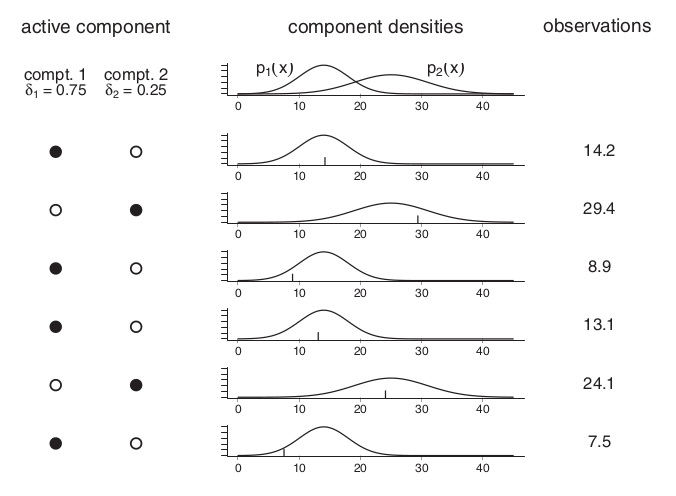
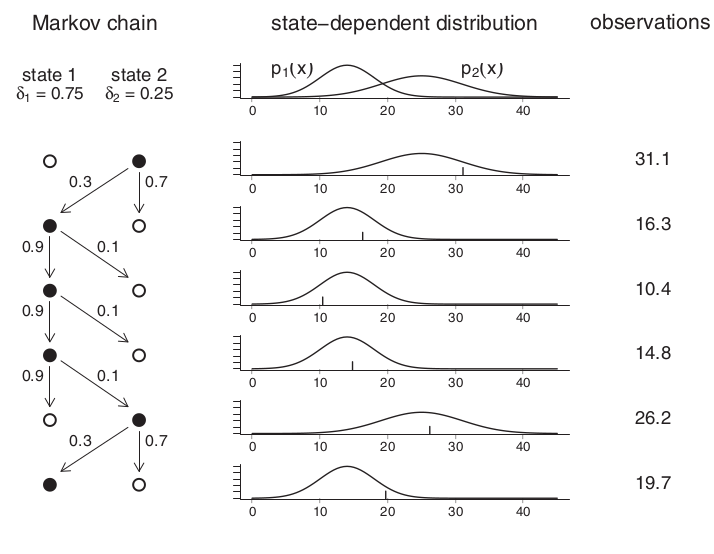

```{r setup, include=FALSE}
knitr::opts_chunk$set(
    echo = FALSE, 
    dpi = 100, 
    fig.align = "center", 
    #fig.pos = 'H',
    message = FALSE
    )

library(ggplot2)
library(knitr)
library(data.table)
library(dplyr)
library(cowplot)
library(maptools)
library(egg)
library(ggridges)

dir = "/home/jeff/Documents/TESE"
tuco = readRDS(paste0(dir,"/01_data/activity_processed/tuco_preprocessed.rds"))
tuco_states = readRDS(paste0(dir,"/01_data/activity_processed/tuco_states.rds"))
tuco.metadata = fread(paste0(dir,"/01_data/animals/animal_metadata.csv"))

tuco = merge.data.table(tuco, tuco_states, by = c("ID","datetime"))
```

# Cadeia de Markov e Misturas de distribuições

Antes de definir o que são os Modelos de Markov Ocultos (HMM) vou definir os seus componentes: as Cadeias de Markov e os Modelos de Misturas de Distribuições, seguindo o livro @zucchiniHiddenMarkovModels2016 .

## Misturas de distribuições

Os Modelos de Misturas são modelos estatísticos que representam distribuições multimodais. Normalmente essas distribuições multimodais são na verdade uma uma mistura de múltiplas distribuições. Isso pode acontecer por diversas razões mas geralmente estamos lidando com grupos diferentes ou muito heterogêneos. Por exemplo, se coletarmos a temperatura de São Paulo no inverno e de Anillaco no Verão mas nos esquecermos de identificar de onde é cada amostra a mistura dessas amostras provavelmente será bimodal, como no gráfico do exemplo abaixo.

```{r histogram-temp-mixture, fig.width=5, fig.asp=0.9}
library(ggplot2)
library(MASS)
library(ISLR)
library(patchwork)

set.seed(53)
x = data.frame("temp" = c(rnorm(90, 18, 5), rnorm(90, 30, 3)))
ggplot(x) + geom_histogram(aes(temp), binwidth = 2) +
    theme_article() +
    xlab("Temperatura") +
    ylab("Frequência")
```

Vou descrever um outro exemplo que foi tirado [desse site](https://stephens999.github.io/fiveMinuteStats/intro_to_mixture_models.html). Vamos imaginar que coletamos as alturas de estudantes de uma universidade. Vamos assumir que a altura média dos homens é de 175cm e das mulheres 162cm, ambas distribuições com desvio padrão de 6.5cm. Porém, nessa universidade a proporção de homens na população é de 25% e de mulheres 75%. 

Podemos simular a coleta desses dados. Para isso, primeiro sorteamos se a pessoa amostrada é homem ou mulher. Para cada pessoa a chance de ser homem é de 75% e mulher 25%. Depois disso, sorteamos o valor da altura dessa pessoa. Se for homem sorteamos um número dentro da distribuição normal $N(175cm, 6.5cm)$ caso contrário a amostra será sorteada da distribuição normal $N(162cm, 6.5cm)$. 

Uma amostra de 5000 pessoas nos dá o gráfico A abaixo. A mistura dessas distribuições ainda é unimodal porque existe uma sobreposição grande entre a altura de homens e mulheres. No entanto, ainda á possível notar que a distribuição da amostra não é simétrica e portanto não é normal. No gráfico B podemos ver a densidade probabílistica dessa distribuição sobreposta às densidades das distribuições das alturas de homens e mulheres, o que deixa um pouco mais claro como acontece a mistura de distribuições.

```{r simulation-mixture, fig.width=5, fig.asp = 1.5}
# Histogramas
set.seed(420)
NUM.SAMPLES <- 5000
heights      <- numeric(NUM.SAMPLES)
for(i in seq_len(NUM.SAMPLES)) {
  z.i <- rbinom(1,1,0.75)
  if(z.i == 0) heights[i] <- rnorm(1, mean = 175, sd = 6.5)
  else heights[i] <- rnorm(1, mean = 162, sd = 6.5)
}

hist = ggplot(data.frame(h = heights)) +
    geom_histogram(aes(h)) +
    theme_article() +
    xlab("Altura (cm)") +
    ylab("Frequência") +
    ggtitle("Amostra de 5000 pessoas")

# Densidade
mu.male   <- 175
sd.male   <- 6.5
mu.female <- 162
sd.female <- 6.5

sample.pts     <- seq(140, 200, by=0.1)
density_male   <- dnorm(sample.pts, mean=mu.male, sd=sd.male)
density_female <- dnorm(sample.pts, mean=mu.female, sd=sd.female)

h = data.frame(sample.pts, density_male, density_female)

density = ggplot(h, aes(x =  sample.pts)) +
    geom_line(aes(y = density_male), col = "blue", linetype = 3) +
    geom_line(aes(y = density_female), col = "red", linetype = 3) +
    geom_line(aes(y = 0.25*density_male +  0.75*density_female), size = 1.25) +
    theme_article() +
    xlab("Altura (cm)")+
    ylab("Densidade Prob.") +
    ggtitle("Gráfico de Densidade")

hist / density + plot_annotation(tag_levels = "A")
```

Esse último exemplo dá uma noção do que são os modelos de mistura de distribuições. Basicamente esse modelos são compostos por um conjunto de distribuições e uma chance de sortearmos uma dessas distribuições. No exemplo dos estudantes temos uma mistura composta de duas distribuições normais, com chances de 75% e 25% de cada uma delas ser amostrada.

A ilustração abaixo, retirado de @zucchiniHiddenMarkovModels2016, mostra como é o processo de geração de dados nesse modelo. No lado esquerdo temos quais distribuições, ou estados, estão ativos naquele momento. No meio está estão as curvas de densidade das distribuições correspondentes a cada estado. Por fim, à direita estão os valores observados em cada momento, que são provenientes da distribuição ativa naquele momento. Podemos pensar nesse processo como uma lançamento de uma moeda combinado à um sorteio de um número de um saco. Nesse caso temos dois sacos, com números diferentes dentro de cada um. O saco do qual vamos sortear um número vai depender do resultado do lançamento da moeda. Se tirarmos Cara sorteamos um número do primeiro saco mas se tirarmos Coroa sorteamos um número do segundo saco.

```{r, mixture-zucchini, out.width="95%"}

```

## Cadeias de Markov

O segundo componente de um HMM é uma Cadeia de Markov. Uma cadeia de markov é um modelo estocástico (ou aleatório) que descreve como uma sequência de estados ao longo do tempo. Nesse modelo as mudanças de um estado para outro possuem probabilidades definidas.

```{tikz, markov-chain, fig.ext=if (knitr:::is_latex_output()) 'pdf' else 'svg', fig.width = 3, fig.height = 4}
 \usetikzlibrary{automata, positioning}
 \usetikzlibrary{arrows, automata}

    \begin{tikzpicture}
        % Draw the states
        \node[state]             (s) {Atividade};
        \node[state, right=of s] (r) {Repouso};

        % Connect the states with arrows
        \draw[every loop]
        (s) edge[bend right, auto=left]  node {0.6} (r)
        (r) edge[bend right, auto=right] node {0.7} (s)
        (s) edge[loop left]             node {0.4} (s)
        (r) edge[loop right]             node {0.3} (r);
    \end{tikzpicture}
```

Como cada ponto da sequência está ligado no tempo eles formam uma 'corrente'. Uma característica importante desse modelo é que cada transição de estado é dependente *apenas* do estado que o sistema estava antes da transição. Isso significa que a o caminho do sistema até um estado não influencia no seu próximo estado. Essa propriedade é conhecida como Propriedade de Markov e é um relaxamento do princípio da independência.

### Simulando Cadeias de Markov no R

Para simularmos uma cadeia de Markov precisamos definir nossa matriz de transição. Essa matriz mostra as probabilidades de transições entre os estados. As linhas da matriz representam o estado atual e as colunas o próximo estado na cadeia. Vamos simular as transições entre repouso e atividade de um animal, assumindo que esse animal é arritmico. Esse animal quando em repouso tende a permanecer em repouso 90% das vezes. Agora, se esse animal está em atividade a chance dele entrar em repouso ou permanecer em atividade é a mesma: 50%. Com esses dados, nossa matriz de transição fica assim: 

```{r echo=TRUE}
states = c("repouso", "atividade")
(transition_matrix = matrix(c(0.9, 0.1, 0.5, 0.5), byrow = T, nrow = 2, dimnames = list(states,states)))
```

O próximo passo é simular as mudanças de estado a partir de um estado inicial. Para isso vamos definir também uma matriz 1x2 com as probabilidades do sistema começar em cada um dos estado. Nesse exemplo a probabilidade do animal iniciar em atividade ou repouso é a mesma, 50% para cada.

```{r echo=TRUE}
(initial_prob = matrix(c(0.5, 0.5), nrow = 1, dimnames = list(c(),states)))
```

Com essas probabilidades inicias e a matriz de transição podemos simular algumas cadeias de Markov.
Vamos simular 9 cadeias de Markov com 500 transições cada. Cada transição é correspondente a uma unidade de tempo em que estamos coletando os dados, o que poderia corresponder a minutos ou horas dependendo do tipo de coleta.

```{r echo=TRUE}
set.seed(53)

# Quantas simulações e probabilidades iniciais
nchains  = 9
niter = 500

# Function that simulates a Markov Chain given a 
# vector containing the starting state in position 1
markov_chain_sim = function(transition_matrix, initial_prob, niter = 50){
    nstates = nrow(transition_matrix)
    chain = numeric(niter)
    
    #Sorteia os estados iniciais de acordo com a matriz de prob.
    chain[1] = sample(1:nstates, 1, prob = t(initial_prob))
    
    for(t in 2:niter){
        chain[t] = sample(1:nstates, 1, prob = transition_matrix[chain[t-1],])
    }
    
    return(chain)
}

#' Criando uma matrix que conterá todas simulações
#' Cada coluna é uma simulação diferente.
#' O número de linhas corresponde à quantidade de transições que queremos simular
sim = matrix(NA, niter, nchains)
colnames(sim) = paste0("sim", 1:nchains) 

# Repetimos a função markov_chain_sim para cada coluna
for(i in 1:nchains){
    sim[,i] = markov_chain_sim(transition_matrix, initial_prob, niter) 
}

tail(sim)
```

### Visualizando os resultados

Vamos plotar esses os resultados de algumas simulaçoes para entendermos como o sistema está mudando no tempo. Podemos ver no gráfico abaixo que pela Cadeia de Markov ser um processo estocástico nenhuma das simualções é igual a outra.

```{r line-plot}
library(ggplot2)
library(tidyr)
library(dplyr)

sim_df = pivot_longer(data.frame(time = 1:nrow(sim), sim), cols = 2:(ncol(sim)+1), names_to = "sim", values_to = "state")

ggplot(sim_df) +
    geom_line(aes(x = time, y = state)) +
    scale_y_continuous(breaks = unique(sim_df$state), labels = states) +
    facet_wrap(vars(sim)) +
    theme_minimal()
```

Ou seja, não é possível prever com certeza a sequência de estados. Porém, o que é interessante é que se calcularmos a proporção de repouso e atividade sobre o total de observações, que no nosso caso são 500, vamos obter um resultado muito próximo entre as simulações.

```{r}
sim_perc = sim_df %>% 
    group_by(sim, state) %>% 
    summarise(perc = n()/niter)
```

```{r bar-plot}
ggplot(sim_perc, aes(y = perc, x = factor(state), fill = factor(state))) +
    geom_bar(stat = "identity") +
    scale_x_discrete(breaks = unique(sim_df$state), labels = states) +
    facet_wrap(vars(sim)) +
    theme_minimal() +
    xlab("") +
    ylab("Porcentagem no Estado")
```

O fato das simulações se estabilizarem em certas proporções não é uma coindicência. Essa era justamente a propriedade que Markov queria demonstrar. Dado algumas condições para a cadeia e um número de observações suficientes as proporções vão se estabilizar ao redor de algum valor mesmo que as observações não sejam totalmente independentes entre si.

### Usando Matrizes

Ao invés de simularmos uma sequência de transições e só depois calcularmos as proporções dos estados podemos fazer isso com matrizes. Para isso multiplicamos a matriz de transição pela matriz de probabilidades iniciais. O resultado é então multiplicado pela matriz de transição. Esse processo é repetido até o número de iterações, ou tempo, que queremos que a cadeia tenha.

```{r echo=TRUE}
niter = 500

step =  initial_prob %*% transition_matrix
for (i in 1:niter){
    step = step %*% transition_matrix
}

step
```

### Aplicações

Usando Modelos de Markov podemos investigar perguntas como:

- Como o sistema muda no tempo: Qual o estado o sistema vai estar em $x$ tempo?
- Traçar as possibilidades de caminhos entre o estado atual do sistema e um estado inicial
- Caso tenhamos os dados coletados: Quais as probabilidade de mudança de estados (REF). 

# Hidden Markov Models

Assim como as Cadeias de Markov os _Hidden Markov Models_ também são modelos estocásticos. Os HMM descrevem a mudança de eventos que dependem de algum fator interno, que não pode ser observado, ao longo do tempo. Esse modelo é dividido em dois componentes: (i) uma Mistura de Distribuições e (ii) uma Cadeia de Markov. A cadeia de Markov é a parte oculta do modelo, que representa o seu estado interno. Cada um dos estados dessa cadeia está conectado a uma distribuição com diferentes parâmetros. Assim, as observações são exatamente as realizações dessas diferentes distribuições, o que forma uma mistura de distribuições, como no exemplo das alturas.

De uma forma mais formal o HMM consiste de dois processos distintos. Um 'parameter proccess' que satisfaz as propriedas de Markov e um 'state-dependet proccess' que depende apenas do estado que está ativo num dado momento. Nossas observações fazem parte do _state-dependent proccess_ e podem se  denominadas por $X_1,...,X_t$, o que representa uma sequência da observação da variável $X$ no tempo 1 até a observação de $X$ no tempo $t$. A cadeia de Markov é o _parameter proccesses_, denominada $C_t$. Essa cadeia pode ter $m$ estados, e assim vamos chamar $X_t$ de um HMM de $m$ estados.

A figura abaixo mostra uma sequência de estados $C_t$ e o processo dependente do estados $X_t$ que é emitido pelo estado que está ativo em cada momento.

```{tikz, hmm01, fig.ext=if (knitr:::is_latex_output()) 'pdf' else 'svg', fig.width = 4, fig.height = 4}
\usetikzlibrary{automata,positioning}
\begin{tikzpicture}
\tikzstyle{main}=[circle, minimum size = 5mm, thick, draw =black!80, node distance = 10mm]
\tikzstyle{connect}=[-latex, thick]
\tikzstyle{box}=[rectangle, draw=black!100]
  \node[box,draw=white!100] (Observed) {\textbf{Observed}};
  \node[main] (X1) [right=of Observed] {$X_1$};
  \node[main] (X2) [right=of X1] {$X_2$};
  \node[main] (X3) [right=of X2] {$X_3$};
  \node[main] (Xt) [right=of X3] {$X_t$};
  \node[box,draw=white!100] (Latent) [below=of Observed] {\textbf{Hidden}};
  \node[main,fill=black!10] (C1) [right=of Observed,below=of X1] {$C_1$};
  \node[main,fill=black!10] (C2) [right=of X1,below=of X2] {$C_2$};
  \node[main,fill=black!10] (C3) [right=of X2,below=of X3] {$C_3$};
  \node[main,fill=black!10] (Ct) [right=of X3,below=of Xt] {$C_t$};
  \path (X3) -- node[auto=false]{\ldots} (Xt);
  \path (C1) edge [connect] (C2)
        (C2) edge [connect] (C3)
        (C3) -- node[auto=false]{\ldots} (Ct);
  \path (C1) edge [connect] (X1);
  \path (C2) edge [connect] (X2);
  \path (C3) edge [connect] (X3);
  \path (Ct) edge [connect] (Xt);
  \draw[dashed]  [below=of C1,above=of X1];
\end{tikzpicture}
```

Podemos voltar ao exemplo de @zucchiniHiddenMarkovModels2016 mas agora esquematizá-lo como um HMM. Vamos tomar as probabilidades iniciais da Cadeia de Markov como $(0.75, 0.25)$ e a matriz de transição:  $\begin{bmatrix}0.9 & 0.1 \\0.3 & 0.7\end{bmatrix}$.


```{tikz, hmm02, fig.ext=if (knitr:::is_latex_output()) 'pdf' else 'svg', fig.width = 3, fig.height = 4}
\usetikzlibrary{automata, positioning}
 \usetikzlibrary{arrows, automata}

    \begin{tikzpicture}
        % Draw the states
        \node[state]             (s1) {Estado 1};
        \node[state, right=of s1] (s2) {Estado 2};

        % Connect the states with arrows
        \draw[every loop]
        (s1) edge[bend right, auto=left]  node {0.1} (s2)
        (s2) edge[bend right, auto=right] node {0.3} (s1)
        (s1) edge[loop left]              node {0.9} (s1)
        (s2) edge[loop right]             node {0.7} (s2);
    \end{tikzpicture}
```

Com essas probabilidades de transição podemos esquematizar como é o processo de geração dos dados sob um HMM com dois estados. Nesse exemplo, a escolha da distribuição ativa é coordenada por uma Cadeia de Markov e, diferentemente do exemplo de Misturas de Distribuições, as probabilidades de mudança de estado dependem do estado anterior. Esse é o princípio dos HMMs, de uma maneira simples (que não sei se é correta) estamos tentando identificar a distribuições que compõe essa mistura, onde cada distribuição é representada por um estado levando em conta a dependência temporal que existe entre as observações. As perguntas que podem ser respondidas por esse modelos são diversas e dependem do tipo de dados que temos.

```{r, hmm-proccess-zucchini, out.width="95%"}

```

No nosso caso temos as observações mas não sabemos nada sobre os estados. Assim, queremos usar as observações para tentar agrupar os dados em um número de estados escolhidos à priori. Assim, estamos usando o HMM de uma maneira não supervisionada. Um caso diferente, ou supervisionado, seria se tivessemos tanto os dados de atividade quanto os estados correspondentes a esses dados em alguns momentos. Isso aconteceria se, por exemplo, conseguissemos filmar o comportamento dos Tucos em alguns momentos do dia. Dessa maneira podemos classificar os dados que não foram filmados e compará-los com os dados que foram filmados.

# Referências
- https://willhipson.netlify.app/post/markov-sim/markov_chain/
- https://a-little-book-of-r-for-bioinformatics.readthedocs.io/en/latest/src/chapter10.html
- http://recologia.com.br/2013/03/13/um-exemplo-de-markov-chain/
- https://towardsdatascience.com/markov-models-and-markov-chains-explained-in-real-life-probabilistic-workout-routine-65e47b5c9a73
- https://www.stat.auckland.ac.nz/~fewster/325/notes/ch8.pdf


