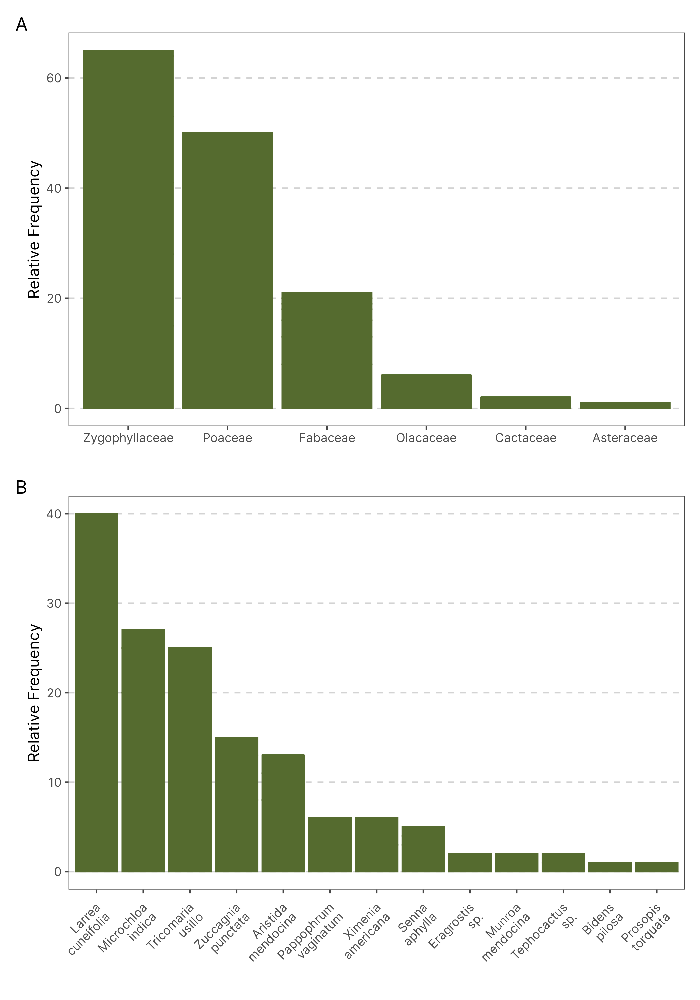

`r if(knitr:::is_latex_output()) '\\appendix'`
`r if(!knitr:::is_latex_output()) '# (APPENDIX) Appendix {-}'` 

<!--
If you feel it necessary to include an appendix, it goes here.
-->


# The First Appendix

This first appendix includes all of the R chunks of code that were hidden throughout the document (using the `include = FALSE` chunk tag) to help with readibility and/or setup.

**In the main Rmd file**

```{r ref.label='include_packages', results='hide', echo = TRUE}
```

**In Chapter \@ref(ref-labels):**

```{r ref.label='include_packages_2', results='hide', echo = TRUE}
```

# The Second Appendix, for Fun

# Plant Community

Following methods similar to @aranda-rickertExtrafloralNectarFuels2014 a non-extensive survey of the plant community was done in May 2019. Three perpendicular 50m transects were defined near the study site (COORDINATES). A point-intercept method was used to record the plant species present in the transects. Sampling points were defined every 1m along the transects, the plant species right below the sampling points were recorded. Plant species were identified in the field by a Botanist, except for a few members of the Poaceae family. The results for the plant survey is in line with what has been described in the literature for the region [@abrahamOverviewGeographyMonte2009, @aranda-rickertExtrafloralNectarFuels2014, @fracchiaDispersalArbuscularMycorrhizal2011]. The relative frequency of plant families and species are shown in the graphs below. 

```{r appendix-plants, fig.cap="Frequency of plants family and species in three transects near the Study Site. The plant community is dominated by members of the Zygolhyllaceae, Poaceae and Fabaceae families. (n = 145)"}

```

# Weather 


